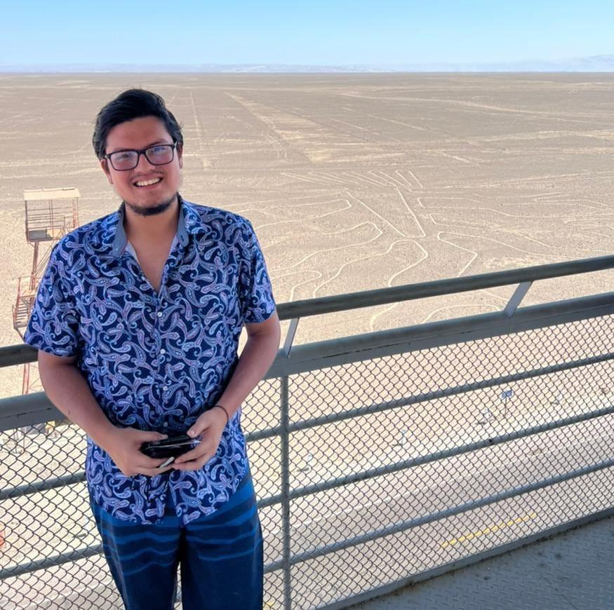
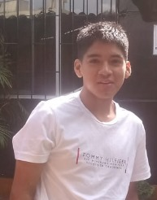
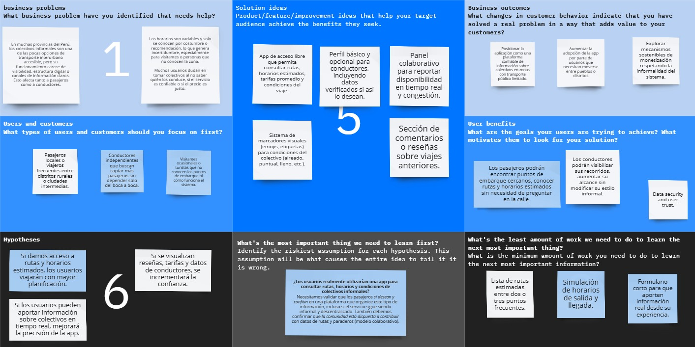

# Capítulo I: Introducción

## 1.1. Startup Profile

### 1.1.1. Descripción del startup
Somos Frock, un startup que busca modernizar y organizar el transporte colectivo informal a través de la tecnología. Nuestra plataforma, llamada Chapaturuta, tiene como objetivo mejorar la conexión entre ciudades, distritos y pueblos mediante una solución digital que brinde información clara y accesible sobre las rutas, paraderos y horarios del servicio de colectivos.

Este servicio, aunque muy utilizado, suele operar sin información pública ni estructuras formales. Con Chapaturuta, queremos aportar orden y visibilidad a este sistema, facilitando la experiencia tanto para usuarios como para conductores.

Asimismo, proporcionaremos mayores facilidades a los usuarios, haciendo su día a día más cómodo y eficiente. Sin perder la esencia flexible del servicio colectivo, buscamos fomentar una movilidad más accesible, eficiente y alineada con las verdaderas necesidades de los usuarios.

### 1.1.2. Perfiles de integrantes del equipo

<table>
  <tr>
    <th colspan="2"> Yasser Renteria Palacios </th>
  </tr>
  <tr>
    <td>  </td>
    <td>Estudio en la carrera de Ingeniería de Software en la UPC. Tengo conocimientos en C++, Python, Angular, Vue, C#, Unity, Soy una persona que ama la tecnología y crecí en un ambiente de pura tecnología y videojuegos desde pequeño. Siempre he deseado con desarollar mi propio videojuegos. Considero que la comunicación y el aprendizaje constante son las claves que me permitirán progresar en el estudio y el trabajo en equipo.  </td>
  </tr>
  <tr>
    <th colspan="2">Jesús Castillo Vidal</th>
  </tr>
  <tr>
    <td>  </td>
    <td>Actualmente estudiante de la carrera de Ingeniería de Software. Me gusta mucho explorar mi creatividad, los temas de desarrollo de producto, creación de startUps, son los que me llaman mucho la atención en el mundo de la tecnología. Programar para mí es un arte, siento que cada día lo voy perfeccionando poco a poco. La gran satisfacción la obtengo cuando logro poder resolver problemas del mundo que puedan ayudar a personas. Tengo vocación por enseñar, constantemente me estoy retando para mejorar y seguir ofreciendo valor a la comunidad durante mi existencia.</td>
  </tr>
<tr>
    <th colspan="2"> Amir Gabriel Castro Sanchez </th>
  </tr>
  <tr>
    <td>  </td>
    <td> Hola, me llamo Amir Castro, estudiante universitario de la UPC de la carrera de Ingeniería de Software, apoyaré y colaborare en este trabajo grupal, siempre intento ser un poco mejor cada día y espero llegar muy lejos. En cuanto a mis conocimientos, siempre estoy en constante aprendizaje y reforzarmiento de lo que ya conozco. </td>
  </tr>
<tr>
<tr>
    <th colspan="2"> Adrian Emanuel Valerio Garcia</th>
  </tr>
  <tr>
    <td>  </td>
    <td> Mi nombre es Adrián, tengo 20 años y estudio la carrera de Ingeniería de Software. Me considero una persona honesta, responsable, siempre buscando soluciones creativas y fomentando el trabajo en equipo para alcanzar objetivos comunes. Estoy comprometido con mi desarrollo profesional y siempre busco nuevas oportunidades para crecer y aportar a proyectos innovadores. </td>
  </tr>
</table>

## 1.2. Solution Profile

### 1.2.1. Antecedentes y problemática
En muchas regiones del Perú, especialmente en provincias y zonas rurales, los colectivos (autos compartidos que cubren rutas fijas entre pueblos o distritos) representan un medio de transporte esencial. Estas unidades operan de forma semi-informal, sin horarios estrictos ni plataformas digitales que informen sobre sus rutas, tarifas o paraderos.

A pesar de su utilidad, la informalidad del servicio genera desinformación, falta de confianza y dificultad para planificar los viajes, especialmente para personas no familiarizadas con la zona. Es común que los pasajeros deban preguntar a transeúntes o esperar en puntos conocidos sin certeza del tiempo de espera o del costo del servicio.

Por otro lado, los conductores de colectivos enfrentan problemas para captar nuevos pasajeros, organizar eficientemente sus recorridos y diferenciarse en un mercado competitivo e informal. Esta situación genera ineficiencias tanto para usuarios como para operadores del servicio.

En este contexto, surge la necesidad de una solución digital accesible que brinde visibilidad, organización y confianza al sistema informal de colectivos interurbanos, sin perder su flexibilidad, adaptándose a la realidad tecnológica y cultural de estas zonas.

La problemática se puede resumir en los siguientes puntos:

1. **Desinformación sobre rutas y paraderos**  
   Los pasajeros no tienen acceso a información clara sobre las rutas disponibles, ubicación de los paraderos, horarios aproximados o tarifas. Esta falta de visibilidad dificulta la planificación del viaje y desalienta el uso del servicio, especialmente entre personas que no conocen la zona o viajan por primera vez.

2. **Dependencia de canales informales**  
   En ausencia de señalización oficial o plataformas digitales, los usuarios deben confiar en el “boca a boca” o el conocimiento local para encontrar un colectivo. Esto limita el acceso al servicio y excluye a quienes no dominan estas redes informales, como turistas, personas mayores o nuevos residentes.

3. **Falta de herramientas para conductores**  
   Los conductores operan sin apoyo tecnológico para anunciar su disponibilidad, comunicar sus rutas o gestionar sus viajes. Esto reduce su eficiencia, genera tiempos muertos y limita su capacidad para captar más pasajeros.

4. **Baja percepción de seguridad**  
   La falta de perfiles visibles y verificables de los conductores, así como la ausencia de información sobre los vehículos y las rutas, genera desconfianza. Esto impacta directamente en la decisión de uso del servicio, especialmente entre mujeres o personas en situación vulnerable.

5. **Barreras tecnológicas en la adopción digital**  
   Muchos usuarios potenciales viven en zonas con conectividad limitada o tienen baja familiaridad con el uso de aplicaciones móviles. Las plataformas de transporte tradicionales no están diseñadas para este público, al requerir registros complejos, conexión permanente o interfaces poco intuitivas.

6. **Ausencia en el ecosistema de movilidad regional**  
   Al ser un sistema informal, los colectivos no están integrados en los planes de movilidad ni reciben soporte institucional. Esto contribuye a su invisibilidad como alternativa de transporte sostenible y eficiente en provincias del país.

### 1.2.2. Lean UX Process

#### 1.2.2.1. Lean UX Problem Statements
Nuestra aplicación busca ayudar a personas que desean trasladarse de forma económica entre ciudades o pueblos cercanos, y que actualmente no cuentan con información clara ni accesible sobre dónde se ubican los paraderos de colectivos, sus rutas, horarios aproximados y tarifas.

Este problema afecta especialmente a viajeros locales, personas con recursos limitados o visitantes no familiarizados con la zona, que dependen del transporte colectivo para moverse de forma rápida y asequible.

Al resolver este problema, esperamos que los usuarios puedan localizar fácilmente los puntos de embarque, planificar sus viajes con mayor confianza y acceder a una red de rutas informales que, aunque eficientes, hoy son invisibles para la mayoría.

#### 1.2.2.2. Lean UX Assumptions

##### a. **Business Outcomes Assumptions**
- Creemos que al organizar y hacer visible el servicio de colectivos informales, podemos capturar un mercado desatendido en regiones con transporte público limitado.

- Creemos que ofrecer visibilidad a los conductores aumentará su volumen de pasajeros y generará tracción para monetizar la plataforma en el mediano plazo.

- Creemos que facilitar el acceso a transporte interurbano económico incrementará el uso de la app y atraerá a aliados estratégicos (municipalidades, asociaciones de transporte, ONGs de movilidad).

---

##### b. **Users Assumptions**
- Creemos que nuestros usuarios principales son personas entre 20 y 60 años, de nivel socioeconómico medio-bajo, que se movilizan entre distritos, pueblos o zonas periféricas.

- Creemos que actualmente encuentran colectivos preguntando en la calle, por recomendación o yendo a puntos conocidos, sin información clara o digital.

- Creemos que los conductores son independientes, operan de forma informal, y no usan ninguna app para captar pasajeros.

---

##### c. **Users Assumptions**
- Creemos que los pasajeros necesitan planificar sus viajes con confianza, saber dónde tomar el colectivo, cuánto pagar y en qué horario aproximado.

- Creemos que si los conductores logran visibilizar su ruta, ubicación y disponibilidad, podrán captar más pasajeros de forma más eficiente.

- Creemos que los usuarios valorarán poder ubicar fácilmente colectivos, sin perder la flexibilidad del servicio.

---

##### d. **Users Assumptions**
- Creemos que una app sencilla, sin necesidad de registro obligatorio, con geolocalización de paraderos y rutas, será suficiente para ayudar al pasajero.

- Creemos que perfiles de conductor con información básica (placa, tipo de vehículo, ruta habitual) mejorarán la percepción de seguridad.

- Creemos que el sistema debe adaptarse al funcionamiento flexible del colectivo (sin horarios fijos, rutas semi-estables).

#### 1.2.2.3. Lean UX Hypothesis Statements

##### **Hipótesis 1: Mapa con rutas y paraderos**
Creemos que que el objetivo de que más personas usen la aplicación para organizar sus viajes se logrará si los pasajeros interurbanos obtienen confianza y claridad sobre cómo tomar un colectivo con un mapa interactivo que muestre rutas disponibles, paraderos, horarios estimados y tarifas de referencia.

---

##### **Hipótesis 2: Visibilidad de conductores**
Creemos que aumentar la cantidad de pasajeros por viaje se logrará si los conductores de colectivos obtienen una mejor captación de pasajeros y reducción del tiempo de espera con una funcionalidad que muestre su ruta, ubicación actual y hora estimada de salida a los usuarios cercanos.

---

##### **Hipótesis 3: Perfil del conductor**
Creemos que aumentar la confianza de los usuarios y su retención en la app se logrará si los pasajeros obtienen una mayor sensación de seguridad y legitimidad del servicio con un perfil de conductor que incluya información del vehículo, ruta habitual, calificaciones y verificación básica.

---

##### **Hipótesis 4: Interfaz sin registro obligatorio**
Creemos que aumentar la accesibilidad de la app y alcanzar a más usuarios en zonas con baja alfabetización digital se logrará si los pasajeros ocasionales obtienen acceso rápido y sin fricciones a la información de viaje con una interfaz sencilla que no requiera registro obligatorio.

#### 1.2.2.4. Lean UX Canvas

## 1.3. Segmentos objetivo

#### 1. **Pasajeros que usualmente toman colectivos de rutas de tramos intermedios (pueblo a pueblo / distrito a distrito)**

Este segmento está compuesto principalmente por personas que necesitan movilizarse entre zonas periféricas, pueblos cercanos o distritos colindantes donde el transporte público tradicional es limitado, ineficiente o inexistente. 

**Características demográficas:**
- **Edad promedio:** 20 - 60 años.
- **Ocupación:** Trabajadores informales, comerciantes, estudiantes universitarios y técnicos, amas de casa.
- **Nivel socioeconómico:** Medio bajo a bajo.
- **Ubicación:** Viven en zonas urbanas periféricas o rurales con acceso limitado al transporte público.
- **Frecuencia de uso:** Diaria o interdiaria, especialmente en horarios punta.

**Necesidades:**
- Movilidad rápida, económica y flexible.
- Disponibilidad de transporte en horarios amplios (incluyendo temprano en la mañana y noche).
- Información clara sobre puntos de partida, paraderos, tarifas y horarios.

---

#### 2. **Conductores de colectivos (transporte informal tipo taxi compartido)**

Este grupo representa a los operadores informales que ofrecen servicios de transporte colectivo, mayoritariamente en vehículos particulares. Ellos cubren rutas establecidas entre distritos o pueblos, recogiendo y dejando pasajeros en puntos acordados o paraderos informales.

**Características demográficas:**
- **Edad promedio:** 30 - 55 años.
- **Ocupación:** Conductores independientes, en su mayoría informales.
- **Nivel educativo:** Secundaria completa en promedio.
- **Tipo de vehículo:** Autos sedán, minivans, station wagon, en su mayoría propios.
- **Zona de operación:** Zonas periféricas, pueblos intermedios y distritos con alta demanda y poca oferta de transporte formal.

**Motivaciones:**
- Generar ingresos diarios de forma flexible.
- Maximizar recorridos eficientes con más pasajeros en menor tiempo.
- Contar con herramientas que les permitan ser más visibles y captar pasajeros fácilmente.

