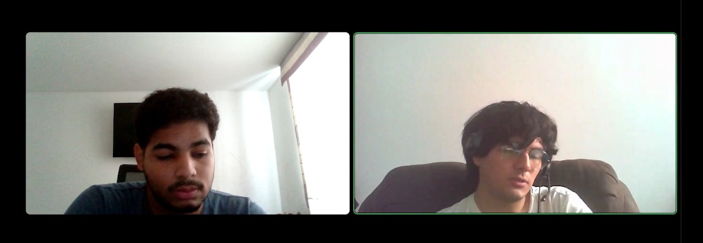
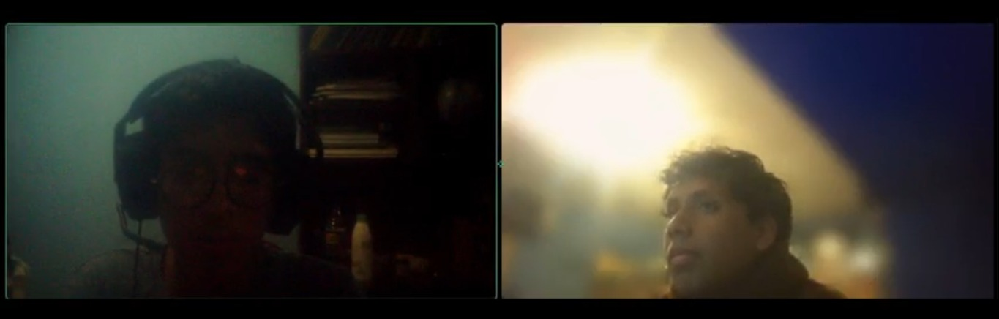
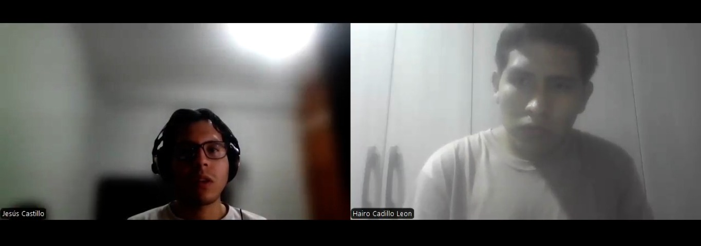
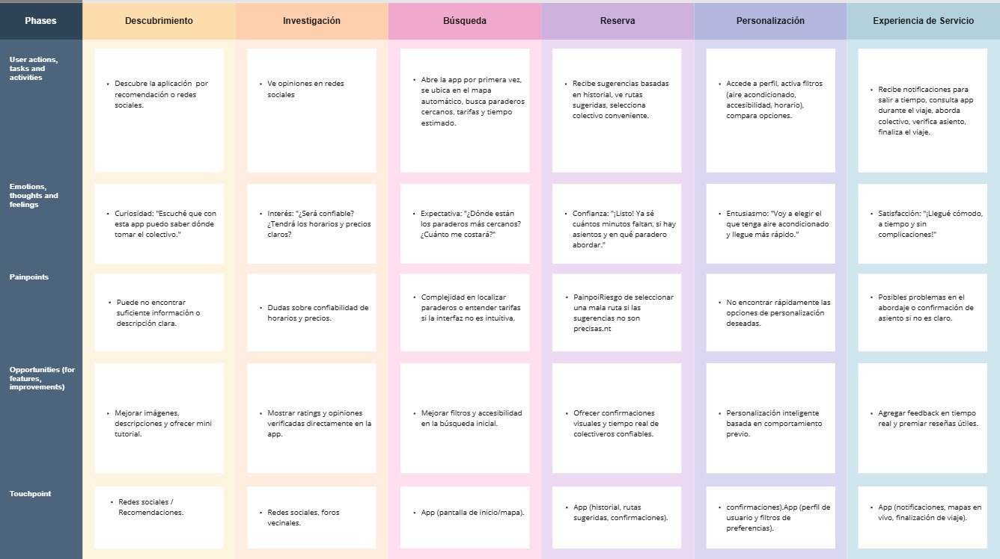
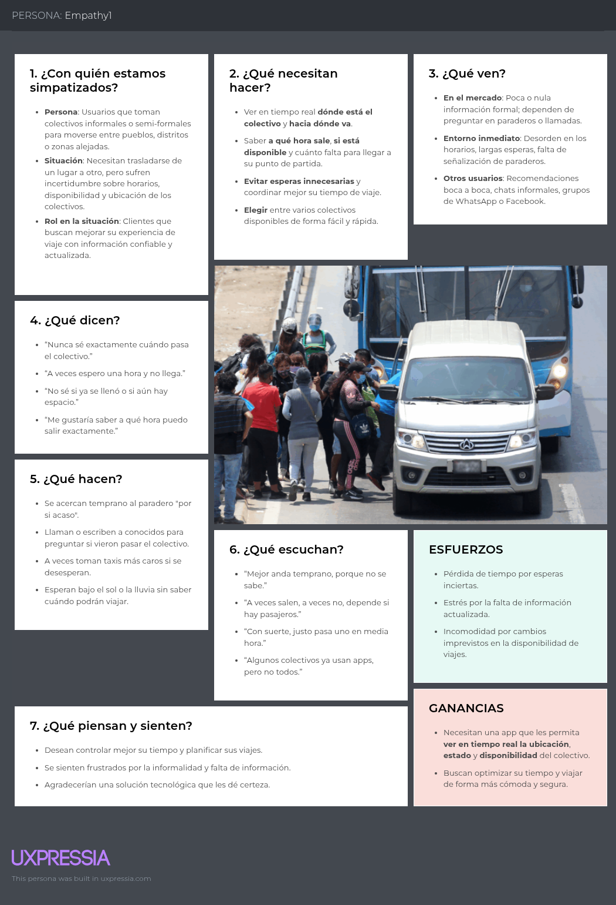
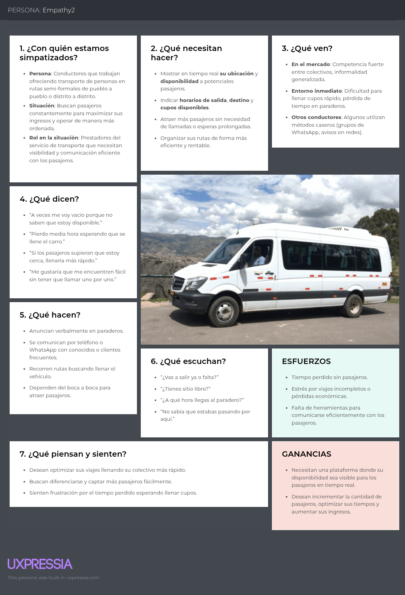

# Capítulo II: Requirements Elicitation & Analysis
## 2.1. Competidores
### 2.1.1. Análisis competitivo
| **Nombre**             | **Moovit**                                                                                                                                   | **RedBus**                                                                                             | **QuickRide**                                                                                                          | **Frock (propuesta)**                                                                                                                                   |
|------------------------|----------------------------------------------------------------------------------------------------------------------------------------------|--------------------------------------------------------------------------------------------------------|------------------------------------------------------------------------------------------------------------------------|--------------------------------------------------------------------------------------------------------------------------------------------------------|
| **Overview**           | Plataforma global para planificar viajes en transporte público, incluyendo colectivos y buses, con mapas, horarios y rutas.                 | Plataforma digital de compra de pasajes en buses interprovinciales en LATAM y Asia.                   | App india para compartir viajes al trabajo (carpooling) entre particulares con rutas fijas.                           | Plataforma enfocada en el transporte colectivo informal interurbano en zonas rurales y periféricas de Perú. Informa sobre paraderos, rutas, disponibilidad y tarifas. |
| **Ventajas Competitivas** | Amplia cobertura internacional, mapas en tiempo real, integración con transporte formal e informal.                                         | Facilita pagos seguros y reservas anticipadas, alianzas con empresas de buses formales.               | Permite compartir autos con rutas definidas entre compañeros de trabajo, bajo costo y menor congestión.              | Adaptación cultural y tecnológica al entorno rural y periférico peruano, interfaz sin registro obligatorio, visibilidad de conductores informales, enfoque flexible e inclusivo. |
| **Modelo de Negocio**  | Freemium para usuarios, venta de datos a operadores de transporte y gobiernos.                                                              | Comisión por pasaje vendido, acuerdos con empresas de transporte.                                     | Comisión por viaje compartido, modelo B2C y B2B.                                                                      | Modelo freemium: gratuito para usuarios, monetización a futuro por suscripciones o tarifas a conductores u organizaciones aliadas.                  |
| **Usuarios Objetivo**  | Usuarios urbanos y suburbanos que usan transporte público.                                                                                  | Usuarios que viajan entre ciudades con servicios de buses formales.                                   | Profesionales que comparten auto en horarios laborales.                                                               | Pasajeros de zonas rurales o periurbanas (20-60 años), conductores informales independientes, municipios o asociaciones de transporte.              |
| **Tecnologías Clave**  | GPS, API de mapas, predicción de llegada, alertas de tráfico.                                                                               | Pasarela de pago, integración con operadores formales.                                                 | Geolocalización, agrupación por rutas y horarios.                                                                    | GPS, interfaz simple y perfiles verificados de conductor, mapeo colaborativo de rutas y paraderos.                                                  |
| **Debilidades**        | Requiere conectividad constante, enfoque urbano.                                                                                            | No cubre colectivos ni rutas informales.                                                               | Limitado a carpooling urbano, no apto para zonas rurales.                                                             | Depende de la adopción digital en zonas con conectividad limitada; requiere mapeo inicial colaborativo.                                             |

### 2.1.2 Estrategias y tácticas frente a competidores

Para enfrentar el entorno competitivo, **Frock** adoptará estrategias diferenciadoras que aprovechen sus ventajas comparativas frente a plataformas como **Moovit**, **RedBus** y **QuickRide**, enfocándose en su conocimiento del contexto rural y periférico peruano y en su cercanía con el transporte colectivo informal.

#### Estrategias

- **Enfoque en nicho no atendido**: Mientras Moovit y RedBus cubren principalmente rutas urbanas y servicios formales, Frock se especializará en zonas desatendidas por el transporte tradicional, ofreciendo visibilidad y organización a un sistema que actualmente opera sin estructura.
- **Adaptación cultural y tecnológica**: A diferencia de sus competidores internacionales, Frock se desarrollará desde el entendimiento de las costumbres locales, diseñando una interfaz accesible incluso para usuarios con baja alfabetización digital.
- **Crecimiento mediante alianzas locales**: Frock buscará colaborar con asociaciones de conductores, municipios y comunidades para generar confianza, acceso a información validada y adopción progresiva del servicio.
- **Iteración constante basada en datos del usuario**: Utilizaremos técnicas Lean UX para validar con rapidez nuevas funcionalidades, priorizando aquellas que resuelvan las necesidades reales de los pasajeros y conductores.

#### Tácticas

- **Mapeo colaborativo de rutas y paraderos**: A través de incentivos a usuarios y conductores, se fomentará la participación ciudadana para alimentar el sistema con datos reales de operación.
- **Sin necesidad de registro obligatorio**: Reducimos fricciones para nuevos usuarios, permitiendo acceso inmediato a la información básica sobre rutas y paraderos.
- **Interfaz de bajo consumo y navegación offline**: Considerando la limitada conectividad en algunas zonas, se desarrollará una versión ligera de la aplicación que funcione con funcionalidades clave sin conexión.
- **Perfiles verificados de conductores**: Se brindará mayor confianza al usuario mostrando información básica validada de los conductores, sin necesidad de formalizarlos completamente en un inicio.
- **Monitoreo de métricas locales**: Nos enfocaremos en indicadores de adopción por distrito y ruta, para priorizar mejoras específicas por región y escalar de forma controlada.

## 2.2. Entrevistas
#### 2.2.1. Diseño de entrevistas
#### **Preguntas generales**

- ¿Cuál es su nombre?

- ¿Cuántos años tiene?

- ¿Cuál es su profesión?

- ¿En qué ciudad vive?

#### **🎯 Para usuarios**
- ¿Por qué eliges colectivo y no otra forma de transporte?

- ¿Has llegado a perder tiempo o equivocarte de lugar por no tener información?

- ¿Cómo sueles enterarte de qué colectivo tomar?

- ¿Alguna vez has tenido problemas para encontrar un paradero?

- ¿Te gustaría una app que te muestre los paraderos y rutas? ¿Qué te gustaría ver?

- ¿Qué tan confiable consideras la información que ves en redes o te dicen otros?

- ¿Te sentirías más tranquilo si pudieras ver esa info en un mapa antes de salir?

- ¿Sabes aproximadamente cuánto demora en salir un auto? ¿Te incomoda esperar?

- ¿Cómo sabes si todavía hay autos disponibles en ciertas horas?

- ¿Qué te gustaría ver en una app de colectivos? (rutas, horarios, mapas, precios, fotos…)

#### **🚖 Líderes de ruta:**

- ¿Cómo se decide cuándo sale cada auto?

- ¿Cuántos autos hay normalmente en la ruta?

- ¿Cómo se organizan los horarios y salidas?

- ¿En qué horarios hay más movimiento?

- ¿Los pasajeros te llaman? ¿Llegan directo al paradero?

- ¿Cómo se enteran los pasajeros de dónde están ustedes?

- ¿Alguna vez te han dicho que se perdieron o que no encontraron el paradero?

- ¿Te molestaría si alguien pone tu paradero en una app?

- ¿Tú mismo estarías dispuesto a dar información actualizada de horarios o rutas?

- ¿Preferirías que lo haga otra persona o tener una persona que te apoye?

- ¿Te interesaría aparecer como “empresa recomendada”?

#### 2.2.2. Registro de entrevistas
#### Entrevista N°1 – Segmento 1
 
- Nombres: Juan
- Apellidos: Pescoran
- Edad: 19 años
- Ciudad: Trujillo 
- URL Entrevista: https://tinyurl.com/EntrevistasFROCK-WEB
- Duración: 00:08:46 minutos 
- Resumen: 
    Juan, un estudiante universitario de 19 años, comentó que en su experiencia los "jaladores" de colectivos suelen brindar información incorrecta sobre las rutas, lo que genera confusión. Actualmente, su método para abordar un colectivo consiste en preguntar directamente al conductor sobre el recorrido. Además, considera que sería muy útil poder planificar su viaje antes de salir, especialmente porque en Trujillo no existen paraderos formales. Finalmente, destacó que valoraría mucho un sistema confiable que le permita identificar qué colectivos lo pueden llevar a su destino de manera precisa.

---

#### Entrevistado N°2 - Segmento 1
 
- Nombre: Juan diego
- Apellidos: Saiten
- Edad: 21 años
- Distrito: San Miguel
- URL Entrevista: https://tinyurl.com/EntrevistasFROCK-WEB
- Duración: 00:05:44 minutos 
- Resumen: 
   Juan Diego considera que el transporte público es una forma eficiente y económica de llegar a su destino. Sin embargo, comenta que en horas punta suele experimentar incertidumbre, ya que los conductores de colectivos a veces permanecen hasta 15 minutos esperando en un paradero antes de salir. Por ello, le gustaría contar con una aplicación que le permita visualizar su ruta de viaje y planificar mejor sus traslados.
  
---

#### Entrevistado N°3 - Segmento 1
 
- Nombres: Sammy
- Apellidos: Lindo
- Edad: 19 años
- Ciudad: Lima
- URL Entrevista: https://tinyurl.com/EntrevistasFROCK-WEB
- Duración: 00:04:39
- Resumen: 
    Samy prefiere los colectivos por ser más rápidos que los taxis, aunque las paradas frecuentes pueden causar demoras. A menudo pierde tiempo por no tener información precisa sobre los paraderos. Para conocer rutas, pregunta a conocidos o consulta redes sociales, pero a veces la información es desactualizada. Cree que una app como Chapa Toruta sería útil para ver paraderos, rutas, precios y tiempos de espera en tiempo real, y sugiere incluir detalles como placas de los vehículos para mayor confianza.
---

#### Entrevistado N°4 - Segmento 2
 
- Nombres: Juan Carlos
- Apellidos: Ramirez
- Edad: 28 años
- Ciudad: Lima 
- URL Entrevista: https://tinyurl.com/EntrevistasFROCK-WEB
- Duración: 00:02:44
- Resumen: 
    Juan Carlos, conductor de transporte público, explicó que tiene un turno establecido para el despliegue de sus vehículos, pero que la cantidad de personas también es un factor determinante para iniciar el recorrido. Para coordinar sus salidas, utiliza principalmente WhatsApp. Mencionó que sería de gran utilidad contar con una herramienta que permita a las personas conocer dónde encontrar las rutas disponibles, siempre y cuando la plataforma sea fácil de usar.

---

#### Entrevistado N°5 - Segmento 2
 
- Nombres: Hairo
- Apellidos: Cadillo
- Edad: 21 años
- Ciudad: Huaral 
- URL Entrevista: https://tinyurl.com/EntrevistasFROCK-WEB
- Duración: 00:10:54
- Resumen: 
    Hairo trabaja como administrador de rutas de vehículos menores en transporte interprovincial y zonas céntricas. Su función principal es planificar los tiempos de salida de los vehículos, aunque menciona que estos tiempos a menudo dependen de si las unidades están llenas o no. Desde su experiencia, considera que sería útil y rentable que los paraderos que administra estén integrados dentro de una plataforma digital, lo que permitiría mejorar la organización y la visibilidad del servicio.

---

#### Entrevistado N°6 - Segmento 2
 
- Nombres: Juan David
- Apellidos: Linares
- Edad: 26 años
- Ciudad: Lima
- URL Entrevista: https://tinyurl.com/EntrevistasFROCK-WEB
- Duración: 00:02:30 
- Resumen: 
      Juan es cobrador de bus en la ciudad de Lima y menciona que en su ruta suelen operar entre 20 y 25 colectivos. La organización de salida y llegada se basa en el principio de "quien llega primero sale primero". Señala que la mayoría de los pasajeros llegan sin saber exactamente cuál es el colectivo adecuado para su destino, lo que genera cierto desorden y confusión.

---

#### 2.2.3. Análisis de entrevistas
#### **SEGMENTO 1: Estudiantes y usuarios del transporte público**

#### **Características objetivas:**

| Variable | Porcentaje | Observaciones |
|----------|------------|---------------|
| Edad entre 18 y 25 años | 100% | Todos los entrevistados son jóvenes adultos, generalmente estudiantes. |
| Utiliza transporte público diariamente | 100% | Todos utilizan colectivos para desplazarse al trabajo o la universidad. |
| Conocimiento limitado sobre paraderos | 100% | Los usuarios no siempre conocen los paraderos o rutas específicas. |
| Uso de redes sociales para obtener información | 80% | La mayoría recurre a grupos de Facebook o aplicaciones para saber las rutas. |
| Conocimiento básico de tecnología | 100% | Los usuarios manejan aplicaciones móviles y redes sociales de manera fluida. |

#### **Características subjetivas:**

| Variable | Porcentaje | Observaciones |
|----------|------------|---------------|
| Necesidad de información precisa y actualizada | 100% | Todos los entrevistados mencionaron que la falta de información confiable es un problema recurrente. |
| Frustración por demoras y falta de claridad | 80% | Muchos se sienten frustrados por la incertidumbre de los tiempos de espera. |
| Preferencia por una solución digital | 100% | Todos estarían interesados en una aplicación que facilite el acceso a información actualizada. |
| Valoran la simplicidad y rapidez en las apps | 100% | La mayoría expresó que preferiría una interfaz sencilla y fácil de usar. |

#### **SEGMENTO 2: Lideres de ruta**

#### **Características objetivas:**

| Variable | Porcentaje | Observaciones |
|----------|------------|---------------|
| Edad entre 20 y 30 años | 100% | Los conductores tienen una edad promedio que varía entre 20 y 30 años. |
| Dependencia de información manual | 100% | Los conductores a menudo reciben indicaciones a través de WhatsApp o llamadas. |
| Uso limitado de tecnología para gestión de rutas | 66% | Algunos conductores no utilizan aplicaciones para gestionar sus rutas o paraderos. |
| Coordinación con otros conductores | 100% | La comunicación con otros conductores es clave para la operación diaria. |

#### **Características subjetivas:**

| Variable | Porcentaje | Observaciones |
|----------|------------|---------------|
| Necesidad de herramientas para optimizar tiempos | 100% | Todos los conductores señalaron que una app que optimice los tiempos de salida sería útil. |
| Preocupación por la falta de información en tiempo real | 80% | La falta de visibilidad de las rutas disponibles crea incertidumbre. |
| Interés en mejorar la experiencia del usuario | 100% | Los conductores están interesados en soluciones que beneficien tanto a ellos como a los pasajeros. |

## 2.3. Needfinding
#### 2.3.1. User Personas

**Segmento 1:**
Jesús Ramírez representa al segmento de pasajeros frecuentes de rutas interurbanas informales (pueblo a pueblo), en especial trabajadores independientes o técnicos que se movilizan por necesidad laboral entre zonas periféricas.

**Segmento 2:**
Elmer representa al segmento de conductores de colectivos interurbanos, es decir, operadores informales que prestan servicio de transporte compartido entre pueblos, distritos y zonas periféricas, fuera del sistema de transporte formal.

#### 2.3.2. User Task Matrix

Los segmentos objetivo representados por los User Personas: Jesús Ramírez (pasajero interurbano) y Elmer Huamán (conductor de colectivo), serán una parte crucial para este 'User Task Matrix'. Las tareas listadas reflejan acciones que los usuarios ya realizan actualmente para alcanzar sus objetivos, independientemente del uso de una aplicación o tecnología. Esta matriz permite identificar oportunidades donde la solución digital de Frock puede generar mayor valor.

| **Tarea**                                                  | **User Story ID** | **Jesús Ramírez (Pasajero)** - F | **Jesús Ramírez** - I | **Elmer Huamán (Conductor)** - F | **Elmer Huamán** - I |
|------------------------------------------------------------|-------------------|-------------------------------|------------------------|-------------------------------|------------------------|
| Buscar rutas disponibles para llegar a su destino          | US01              | Alta                          | Alta                   | Media                         | Alta                   |
| Identificar paraderos adecuados para abordar               | US02              | Alta                          | Alta                   | Media                         | Media                  |
| Ver información del conductor	                             | US03              | Media                         | Alta                   | Media                         | Alta                   |
| Avisar disponibilidad a pasajeros frecuentes               | US08              | Baja                          | Media                  | Alta                          | Alta                   |
| Ajustar su horario según los momentos de mayor demanda     | US09              | Baja                          | Media                  | Alta                          | Alta                   |
| Recordar o registrar los viajes que ha hecho               | US05              | Media                         | Baja                   | Baja                          | Baja                   |
| Evaluar la experiencia del viaje con un conductor          | US04              | Media                         | Alta                   | Alta                          | Media                  |

> **F = Frecuencia** | **I = Importancia**

#### 2.3.3. User Journey Mapping

### 2.3.4. Empathy Mapping

#### *Segmento Objetivo 1: Usuarios que usan colectivos*

#### *Segmento Objetivo 2:Conductores de colectivos*

#### 2.3.5. As-is Scenario Mapping
### AS - IS Scenario Mapping (Segmento: Pasajeros)
| FASES             | Buscar ruta/colectivo                          | Planificar viaje                                      | Abordar colectivo                                  | Llegada a destino                                   |
|------------------|------------------------------------------------|------------------------------------------------------|----------------------------------------------------|-----------------------------------------------------|
| **DOING**        | Preguntar a personas locales sobre rutas y paraderos disponibles. | No hay información clara sobre tarifas, horarios o puntos de embarque. | Llegar al paradero y esperar hasta que el colectivo llegue. | Confirmar llegada al destino mediante señales visuales. |
| **THINKING**     | "No sé si estoy en la ruta correcta."          | "No tengo idea de cuánto me costará ni a qué hora llegaré." | "¿Será este el colectivo correcto?"                 | "¿Llegué al lugar adecuado?"                        |
| **FEELING**      | Confusión, incertidumbre.                     | Ansiedad, falta de control.                          | Desconfianza, incomodidad.                         | Estrés, falta de información.                      |

### AS - IS Scenario Mapping (Segmento: Conductores)
| FASES             | Activar disponibilidad                        | Captar pasajeros                                      | Realizar recorrido                                  | Finalizar viaje                                    |
|------------------|------------------------------------------------|------------------------------------------------------|----------------------------------------------------|---------------------------------------------------|
| **DOING**        | No hay plataforma para activar su disponibilidad. | Esperar en el paradero sin saber si hay pasajeros.    | Realizar el recorrido sin un control preciso de tiempo o pasajeros. | No hay seguimiento digital ni estadísticas sobre el viaje. |
| **THINKING**     | "¿Habrá pasajeros para mi ruta hoy?"           | "¿Estarán los pasajeros listos cuando llegue?"        | "¿Voy a llegar a tiempo o hacer paradas innecesarias?" | "No tengo forma de saber si mi viaje fue rentable." |
| **FEELING**      | Incertidumbre, frustración.                    | Inseguridad, desorganización.                         | Estrés, falta de control.                          | Desconcierto, falta de retroalimentación.          |

## 2.4. Ubiquitous Language
El lenguaje ubicuo es una parte fundamental de la estrategia de UX. Se refiere al conjunto de términos y frases que, aunque no pertenecen al contexto técnico del desarrollo, se utilizan para expresar la lógica del negocio. Esto permite que todos los involucrados en el proyecto, incluidos los usuarios finales, puedan entender y participar mejor en el desarrollo del producto.

## Glosario

**Colectivo (Vehículo Compartido):**  
Automóvil que opera en rutas fijas entre pueblos o distritos, transportando varios pasajeros a la vez. Son esenciales en zonas rurales o alejadas, donde no hay transporte formal constante.

**Whereabouts (Paradero):**  
Punto habitual donde los colectivos recogen o dejan pasajeros. No siempre está señalizado oficialmente, pero es reconocido por los usuarios locales. En la plataforma, se geolocaliza para ofrecer visibilidad.

**Route (Ruta):**  
Trayecto fijo que sigue un colectivo, desde un punto de partida hasta un destino, pasando por una serie de paraderos. Las rutas pueden variar según el conductor o la demanda, pero mantienen un patrón general.

**Route request (Request):**  
Acción del usuario para conocer o solicitar información sobre una ruta específica, ya sea para planear su viaje o encontrar un colectivo disponible.

**Verified driver (Conductor Verificado):**  
Persona que opera un colectivo y que ha sido registrada en la plataforma mediante un proceso de verificación de identidad y datos del vehículo, brindando mayor confianza al usuario.

**Driver´s profile (Perfil del Conductor):**  
Información pública del conductor disponible en la plataforma, incluyendo nombre, foto, vehículo, calificación y comentarios de otros pasajeros, aumentando la confianza y seguridad del servicio.

**Availability (Disponibilidad):**  
Estado en el que un conductor está activo y visible para los usuarios de la aplicación. Indica que está en ruta, con cupos disponibles, y permite recibir solicitudes o ser ubicado por los pasajeros.

**Viaje (Ride):**  
Servicio individual que ocurre cuando un pasajero aborda un colectivo en una ruta específica. Puede ser monitoreado en tiempo real si hay conectividad disponible.

**Fare(Tarifa):** 
Costo estimado del viaje, determinado con base en la distancia, ruta y condiciones locales. Aunque el pago final puede variar, sirve como referencia para los usuarios.

**Monitoring (Monitoreo):**  
Supervisión del estado y movimiento de los colectivos registrados. Esto incluye el seguimiento de rutas activas, paraderos más frecuentados y tiempo estimado de llegada para mejorar la experiencia del usuario.

**Coverage areas (Zonas de Cobertura):**  
Áreas geográficas donde opera el servicio de colectivos registrados en la plataforma. Ayuda a delimitar las regiones con rutas disponibles y mejorar la planificación de nuevas expansiones.
