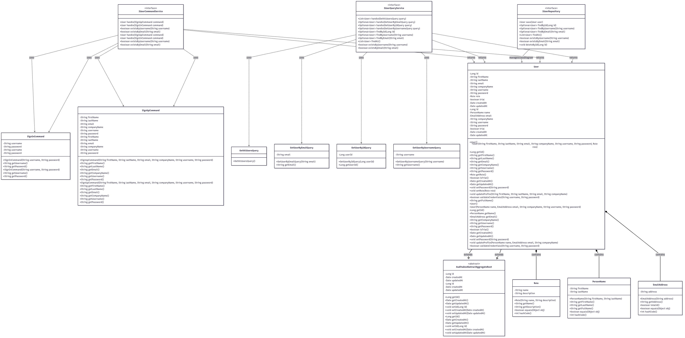
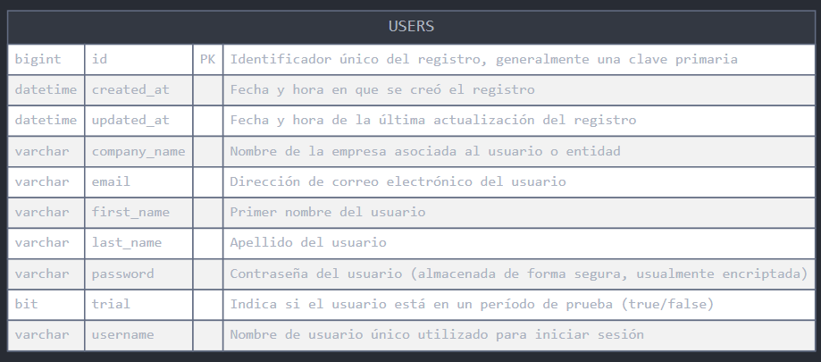
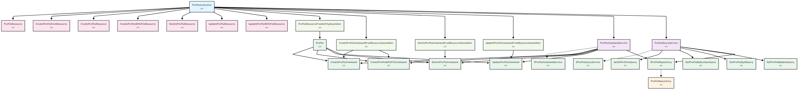
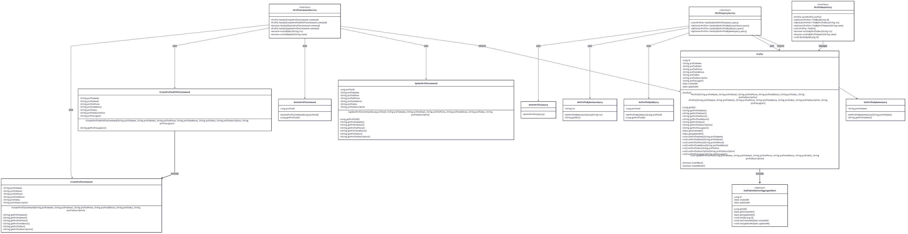
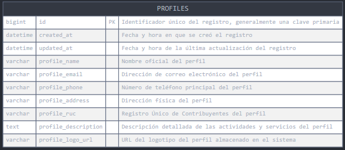

# Capítulo II: Requirements Elicitation & Analysis
## 2.1. Competidores
### 2.1.1. Análisis competitivo
<body>
<table border="1">
  <tr>
    Competitive Analysis Landscape
  </tr>
  <tr>
    <td>¿Por qué llevar a cabo este análisis?</td>
    <td colspan="6">
        Se realiza este análisis para entender el entorno competitivo, detectar
        oportunidades de diferenciación, minimizar los riesgos y construir una
        propuesta de valor sólida que pueda adaptarse a los usuarios de mejor manera.
    </td>
  </tr>

  <tr>
    <th colspan="2">StartUps</th>
    <th>Frock(Propuesta)</th>
    <th>Moovit</th>
    <th>RedBus</th>
    <th>QuickRide</th>
    
  </tr>

  <tr>
    <td rowspan="2">Perfil</td>
    <td>Overview</td>
    <td>
     Plataforma enfocada en el transporte colectivo informal interurbano en zonas rurales y periféricas de Perú.
     Informa sobre paraderos, rutas, disponibilidad y tarifas.
    </td>
    <td>
     App global de movilidad urbana que planifica viajes con transporte público
    </td>
    <td>
     App para la compra de pasajes de buses interprovinciales y rutas dentro del país.
    </td>
    <td>
     App de carpooling ridesharing para usuarios que comparten trayectos fijos, 
     especialmente para commuting al trabajo.
    </td>
  </tr>
  <tr>
    <td>Ventaja Competitiva</td>
    <td>
     Adaptación cultural y tecnológica al entorno rural y periférico peruano, interfaz sin registro obligatorio, 
     visibilidad de conductores informales, enfoque flexible e inclusivo.
    </td>
    <td>
     Amplia cobertura internacional, mapas en tiempo real, integración con transporte formal e informal.
    </td>
    <td>
     Facilita pagos seguros y reservas anticipadas, alianzas con empresas de buses formales.
    </td>
    <td>
     Permite compartir autos con rutas definidas entre compañeros de trabajo, bajo costo y menor congestión.
    </td>
  </tr>

  <tr>
    <td rowspan="2">Perfil de Marketing</td> 
    <td>Mercado Objetivo</td>
    <td>
     Pasajeros de zonas rurales o peri urbanas (20-60 años), conductores informales independientes, 
    municipios o asociaciones de transporte.
    </td>
    <td>
     Usuarios urbanos y suburbanos que usan transporte público.   
    </td>
    <td>
      Usuarios que viajan entre ciudades con servicios de buses formales.  
    </td>
    <td>
     Profesionales que comparten auto en horarios laborales.
    </td>
  </tr>
  <tr>
    <td>Estrategias de Marketing</td>
    <td>
     Crear promotores locales en pueblos y distritos, aliarse con municipalidades y 
     gobiernos locales para una mayor difusión, realizar ferias móviles en pueblos/distritos
    con stands presentando la app como solución comunitaria, crear contenido en lenguas locales
    mostrando testimonios de usuarios y conductores reales en el entorno rural.
    </td>
    <td>
     Suscripción con funciones exclusivas y sin anuncios, 
     publicidad basada en la localización, heat maps para anunciantes, 
     alianzas para publicidad nativa en Latinoamérica.
    </td>
    <td>
     Utilización de IA generativa para crear anuncios personalizados, 
     colaboración con plataformas de insights para segmentar y personalizar la experiencia del usuario, 
     campañas en redes sociales. 
    </td>
    <td>
     Branding físico/local en edificios residenciales, publicidad en ascensores, 
     campañas offline combinadas con digital, para lograr recordación en espacios de uso cotidiano.
    </td>
  </tr>
  <tr>
    <td rowspan="3">Perfil de Producto</td>
    <td>Productos & Servicios</td>
    <td>GPS, interfaz simple y perfiles verificados de conductor, mapeo colaborativo de rutas y paraderos.</td>
    <td>GPS, API de mapas, predicción de llegada, alertas de tráfico./td>
    <td>Pasarela de pago, integración con operadores formales.</td>
    <td>Geolocalización, agrupación por rutas y horarios.</td>
  </tr>
  <tr>
    <td>Precios & Servicios</td>
    <td>Modelo freemium: gratuito para usuarios, monetización a futuro por suscripciones o tarifas a 
        conductores u organizaciones aliadas.</td>
    <td>Freemium para usuarios, venta de datos a operadores de transporte y gobiernos.</td>
    <td>Comisión por pasaje vendido, acuerdos con empresas de transporte.</td>
    <td>Comisión por viaje compartido, modelo B2C y B2B.</td>
  </tr>
  <tr>
    <td>Canales de Distribución</td>
    <td>Oficinas de enlace, locales municipales, paradas oficiales de colectivos como puntos físicos de distribución 
        e información, soporte./td>
    <td>Integraciones con plataformas de transporte regionales, interurbanas: Moovit permite planificar + comprar 
        boletos via asociaciones como Distribución (intercity) directamente desde la app</td>
    <td>Agentes físicos/offline en pueblos/ciudades menores, para ventas de pasajes.</td>
    <td>Presencia en ciudades importantes como Delhi-NCR, Bengaluru, Pune, Chennai, Mumbai, etc.</td>
  </tr>
  <tr>
    <td rowspan="4">Análisis SWOT</td>
    <td>Fortalezas</td>
    <td>Adaptación cultural al transporte colectivo informal rural y periurbano, 
        donde otras apps no tienen presencia.</td>
    <td>Datos en tiempo real de transporte público formal.</td>
    <td>Alianzas fuertes con empresas de transporte formales.</td>
    <td>Fuerte comunidad de usuarios profesionales en India.</td>
  </tr>
  <tr>
    <td> Debilidades</td>
    <td>Depende de la adopción digital en zonas con conectividad limitada; requiere mapeo inicial colaborativo.</td>
    <td>Requiere conectividad constante, enfoque urbano.</td>
    <td>No cubre colectivos ni rutas informales.</td>
    <td>Limitado a carpooling urbano, no apto para zonas rurales.</td>
  </tr>
  <tr>
    <td>Oportunidades</td>
    <td>Digitalización acelerada en zonas rurales gracias al crecimiento de smartphones de bajo costo.</td>
    <td>Expansión hacia transporte rural en LATAM, aún desatendido.</td>
    <td>Escalar hacia colectivos informales o semi-formales.</td>
    <td>Expandirse más allá del ámbito corporativo hacia comunidades más amplias.</td>
  </tr>
  <tr>
    <td>Amenazas</td>
    <td>Limitaciones de conectividad (zonas sin cobertura 4G/3G), que dificultan el acceso a tiempo real.</td>
    <td>Competencia con Google Maps y Waze en zonas urbanas.</td>
    <td>Mercado limitado a buses formales: si colectivos digitales despegan, perdería espacio.</td>
    <td>Muy dependiente del segmento profesional urbano; difícil replicar en zonas rurales.</td>
  </tr>
</table>

</body>

### 2.1.2 Estrategias y tácticas frente a competidores

Para enfrentar el entorno competitivo, Frock adoptará estrategias diferenciadoras que refuercen sus ventajas frente a Moovit, RedBus y QuickRide. La clave estará en capitalizar su condición de pionera en el transporte colectivo informal interurbano del Perú, generando barreras de entrada mediante alianzas locales, mapeo colaborativo y un enfoque inclusivo adaptado a contextos rurales y periurbanos.

#### Estrategias

- **Enfoque en nicho desatendido:** Mientras Moovit, RedBus y QuickRide se concentran en transporte urbano y formal, Frock se consolidará en el espacio rural e informal, aportando organización y confianza a un sistema invisible para las demás plataformas.

- **Diferenciación cultural y comunitaria:** Se priorizará la participación ciudadana (conductores y pasajeros) en el mapeo y la validación de rutas, creando una base de datos viva que los grandes competidores no podrían replicar fácilmente.

- **Alianzas estratégicas locales:** Colaboración con municipalidades, asociaciones de transporte y ONGs de movilidad para legitimar la plataforma, generar confianza y asegurar una adopción más rápida en zonas rurales.

- **Innovación ligera y accesible:** Interfaz diseñada para usuarios con baja alfabetización digital, bajo consumo de datos y funcionalidades clave en modo offline, asegurando cobertura donde otras apps fallan.

#### Tácticas

- **Mapeo colaborativo gamificado:** Incentivar a usuarios y conductores a alimentar el sistema con información de rutas y paraderos mediante recompensas visibles en la app.

- **Acceso sin fricciones:** Mantener el acceso inmediato a la información sin necesidad de registro obligatorio, aumentando la adopción en usuarios nuevos.

- **Perfiles básicos verificados:** Mostrar información validada de conductores y vehículos para reforzar seguridad sin requerir formalización estricta.

- **Canales de distribución diferenciados:** Promoción no solo digital, sino también a través de radios locales, terminales comunales y asociaciones de transporte.

- **Monitoreo por región:** Uso de métricas locales de adopción (por distrito o ruta) para priorizar mejoras y generar casos de éxito escalables a nivel nacional.

## 2.2. Entrevistas
#### 2.2.1. Diseño de entrevistas
#### **Preguntas generales**

- ¿Cuál es su nombre?

- ¿Cuántos años tiene?

- ¿Cuál es su profesión?

- ¿En qué ciudad vive?

#### **🎯 Para usuarios**
- ¿Por qué eliges colectivo y no otra forma de transporte?

- ¿Has llegado a perder tiempo o equivocarte de lugar por no tener información?

- ¿Cómo sueles enterarte de qué colectivo tomar?

- ¿Alguna vez has tenido problemas para encontrar un paradero?

- ¿Te gustaría una app que te muestre los paraderos y rutas? ¿Qué te gustaría ver?

- ¿Qué tan confiable consideras la información que ves en redes o te dicen otros?

- ¿Te sentirías más tranquilo si pudieras ver esa info en un mapa antes de salir?

- ¿Sabes aproximadamente cuánto demora en salir un auto? ¿Te incomoda esperar?

- ¿Cómo sabes si todavía hay autos disponibles en ciertas horas?

- ¿Qué te gustaría ver en una app de colectivos? (rutas, horarios, mapas, precios, fotos…)

#### **🚖 Líderes de ruta:**

- ¿Cómo se decide cuándo sale cada auto?

- ¿Cuántos autos hay normalmente en la ruta?

- ¿Cómo se organizan los horarios y salidas?

- ¿En qué horarios hay más movimiento?

- ¿Los pasajeros te llaman? ¿Llegan directo al paradero?

- ¿Cómo se enteran los pasajeros de dónde están ustedes?

- ¿Alguna vez te han dicho que se perdieron o que no encontraron el paradero?

- ¿Te molestaría si alguien pone tu paradero en una app?

- ¿Tú mismo estarías dispuesto a dar información actualizada de horarios o rutas?

- ¿Preferirías que lo haga otra persona o tener una persona que te apoye?

- ¿Te interesaría aparecer como “empresa recomendada”?

#### 2.2.2. Registro de entrevistas

**Segemento Objetivo:** Ciudadanos que usan colectivos para movilizarse

#### Entrevista N°1
 
- Nombres: Juan
- Apellidos: Pescoran
- Edad: 19 años
- Ciudad: Trujillo 
- URL Entrevista: https://tinyurl.com/EntrevistasFROCK-WEB
- Duración: 00:08:46 minutos 
- Resumen: 
    Juan, un estudiante universitario de 19 años, comentó que en su experiencia los "jaladores" de colectivos suelen brindar información incorrecta sobre las rutas, lo que genera confusión. Actualmente, su método para abordar un colectivo consiste en preguntar directamente al conductor sobre el recorrido. Además, considera que sería muy útil poder planificar su viaje antes de salir, especialmente porque en Trujillo no existen paraderos formales. Finalmente, destacó que valoraría mucho un sistema confiable que le permita identificar qué colectivos lo pueden llevar a su destino de manera precisa.

---

#### Entrevistado N°2
 
- Nombre: Raquel 
- Apellidos: Agüero Sulca
- Edad: 52 años
- Distrito: Chorrillos
- URL Entrevista: 
- Duración: 00:04:44 minutos 
- Resumen: 
  La entrevistada se llama Raquel Agüero Sulca, tiene 52 años, trabaja como auxiliar de contabilidad y vive en Chorrillos. La entrevistada utiliza colectivos principalmente en horas punta, ya que el Metropolitano y los micros suelen estar llenos y la hacen perder tiempo. Sin embargo, reconoce que el transporte colectivo es informal y presenta dificultades: a veces los paraderos son intervenidos y cambian de lugar, lo que la ha llevado a equivocarse y perder tiempo, incluso teniendo que optar por un taxi como alternativa. Generalmente se entera de los paraderos porque suelen ubicarse en grifos o estaciones, pero como no son fijos, necesita preguntar a otras personas en la calle, lo que considera medianamente confiable, ya que no proviene de fuentes seguras. Ha tenido varios problemas para encontrar un paradero y cree que una aplicación que muestre paraderos, rutas y tarifas sería muy útil, siempre que ofrezca precios competitivos y accesibles frente a otras opciones de transporte. También le gustaría poder visualizar en un mapa la ubicación de los paraderos antes de salir, ya que le daría mayor comodidad y seguridad. En cuanto al tiempo de espera, sabe que no hay un horario fijo, pues depende de que los conductores llenen el vehículo, lo cual puede ser más lento si hay poca demanda. Por eso, considera importante que una aplicación muestre no solo las rutas, sino también la frecuencia de los colectivos y los precios.
  
---

#### Entrevistado N°3
 
- Nombres: Sammy
- Apellidos: Lindo
- Edad: 19 años
- Ciudad: Lima
- URL Entrevista: https://tinyurl.com/EntrevistasFROCK-WEB
- Duración: 00:04:39
- Resumen: 
    Samy prefiere los colectivos por ser más rápidos que los taxis, aunque las paradas frecuentes pueden causar demoras. A menudo pierde tiempo por no tener información precisa sobre los paraderos. Para conocer rutas, pregunta a conocidos o consulta redes sociales, pero a veces la información es desactualizada. Cree que una app como Chapa Toruta sería útil para ver paraderos, rutas, precios y tiempos de espera en tiempo real, y sugiere incluir detalles como placas de los vehículos para mayor confianza.
---

**Segmento Objetivo:** Conductores de colectivo

#### Entrevistado N°1
 
- Nombres: Juan Carlos
- Apellidos: Ramirez
- Edad: 28 años
- Ciudad: Lima 
- URL Entrevista: https://tinyurl.com/EntrevistasFROCK-WEB
- Duración: 00:02:44
- Resumen: 
    Juan Carlos, conductor de transporte público, explicó que tiene un turno establecido para el despliegue de sus vehículos, pero que la cantidad de personas también es un factor determinante para iniciar el recorrido. Para coordinar sus salidas, utiliza principalmente WhatsApp. Mencionó que sería de gran utilidad contar con una herramienta que permita a las personas conocer dónde encontrar las rutas disponibles, siempre y cuando la plataforma sea fácil de usar.

---

#### Entrevistado N°2
 
- Nombres: Hairo
- Apellidos: Cadillo
- Edad: 21 años
- Ciudad: Huaral 
- URL Entrevista: https://tinyurl.com/EntrevistasFROCK-WEB
- Duración: 00:10:54
- Resumen: 
    Hairo trabaja como administrador de rutas de vehículos menores en transporte interprovincial y zonas céntricas. Su función principal es planificar los tiempos de salida de los vehículos, aunque menciona que estos tiempos a menudo dependen de si las unidades están llenas o no. Desde su experiencia, considera que sería útil y rentable que los paraderos que administra estén integrados dentro de una plataforma digital, lo que permitiría mejorar la organización y la visibilidad del servicio.

---

#### Entrevistado N°3
 
- Nombres: Juan David
- Apellidos: Linares
- Edad: 26 años
- Ciudad: Lima
- URL Entrevista: https://tinyurl.com/EntrevistasFROCK-WEB
- Duración: 00:02:30 
- Resumen: 
      Juan es cobrador de bus en la ciudad de Lima y menciona que en su ruta suelen operar entre 20 y 25 colectivos. La organización de salida y llegada se basa en el principio de "quien llega primero sale primero". Señala que la mayoría de los pasajeros llegan sin saber exactamente cuál es el colectivo adecuado para su destino, lo que genera cierto desorden y confusión.

---

#### 2.2.3. Análisis de entrevistas
#### **SEGMENTO 1: Estudiantes y usuarios del transporte público**

#### **Características objetivas:**

| Variable | Porcentaje | Observaciones |
|----------|------------|---------------|
| Edad entre 18 y 25 años | 100% | Todos los entrevistados son jóvenes adultos, generalmente estudiantes. |
| Utiliza transporte público diariamente | 100% | Todos utilizan colectivos para desplazarse al trabajo o la universidad. |
| Conocimiento limitado sobre paraderos | 100% | Los usuarios no siempre conocen los paraderos o rutas específicas. |
| Uso de redes sociales para obtener información | 80% | La mayoría recurre a grupos de Facebook o aplicaciones para saber las rutas. |
| Conocimiento básico de tecnología | 100% | Los usuarios manejan aplicaciones móviles y redes sociales de manera fluida. |

#### **Características subjetivas:**

| Variable | Porcentaje | Observaciones |
|----------|------------|---------------|
| Necesidad de información precisa y actualizada | 100% | Todos los entrevistados mencionaron que la falta de información confiable es un problema recurrente. |
| Frustración por demoras y falta de claridad | 80% | Muchos se sienten frustrados por la incertidumbre de los tiempos de espera. |
| Preferencia por una solución digital | 100% | Todos estarían interesados en una aplicación que facilite el acceso a información actualizada. |
| Valoran la simplicidad y rapidez en las apps | 100% | La mayoría expresó que preferiría una interfaz sencilla y fácil de usar. |

#### **SEGMENTO 2: Lideres de ruta**

#### **Características objetivas:**

| Variable | Porcentaje | Observaciones |
|----------|------------|---------------|
| Edad entre 20 y 30 años | 100% | Los conductores tienen una edad promedio que varía entre 20 y 30 años. |
| Dependencia de información manual | 100% | Los conductores a menudo reciben indicaciones a través de WhatsApp o llamadas. |
| Uso limitado de tecnología para gestión de rutas | 66% | Algunos conductores no utilizan aplicaciones para gestionar sus rutas o paraderos. |
| Coordinación con otros conductores | 100% | La comunicación con otros conductores es clave para la operación diaria. |

#### **Características subjetivas:**

| Variable | Porcentaje | Observaciones |
|----------|------------|---------------|
| Necesidad de herramientas para optimizar tiempos | 100% | Todos los conductores señalaron que una app que optimice los tiempos de salida sería útil. |
| Preocupación por la falta de información en tiempo real | 80% | La falta de visibilidad de las rutas disponibles crea incertidumbre. |
| Interés en mejorar la experiencia del usuario | 100% | Los conductores están interesados en soluciones que beneficien tanto a ellos como a los pasajeros. |

## 2.3. Needfinding
### 2.3.1. User Personas

**Segmento 1:**
Jesús Ramírez representa al segmento de pasajeros frecuentes de rutas interurbanas informales (pueblo a pueblo), en especial trabajadores independientes o técnicos que se movilizan por necesidad laboral entre zonas periféricas.

**Segmento 2:**
Elmer representa al segmento de conductores de colectivos interurbanos, es decir, operadores informales que prestan servicio de transporte compartido entre pueblos, distritos y zonas periféricas, fuera del sistema de transporte formal.

### 2.3.2. User Task Matrix

Los segmentos objetivo representados por los User Personas: Jesús Ramírez (pasajero interurbano) y Elmer Huamán (conductor de colectivo), serán una parte crucial para este 'User Task Matrix'. Las tareas listadas reflejan acciones que los usuarios ya realizan actualmente para alcanzar sus objetivos, independientemente del uso de una aplicación o tecnología. Esta matriz permite identificar oportunidades donde la solución digital de Frock puede generar mayor valor.

| **Tarea**                                                  | **User Story ID** | **Jesús Ramírez (Pasajero)** - F | **Jesús Ramírez** - I | **Elmer Huamán (Conductor)** - F | **Elmer Huamán** - I |
|------------------------------------------------------------|-------------------|-------------------------------|------------------------|-------------------------------|------------------------|
| Buscar rutas disponibles para llegar a su destino          | US01              | Alta                          | Alta                   | Media                         | Alta                   |
| Identificar paraderos adecuados para abordar               | US02              | Alta                          | Alta                   | Media                         | Media                  |
| Ver información del conductor	                             | US03              | Media                         | Alta                   | Media                         | Alta                   |
| Avisar disponibilidad a pasajeros frecuentes               | US08              | Baja                          | Media                  | Alta                          | Alta                   |
| Ajustar su horario según los momentos de mayor demanda     | US09              | Baja                          | Media                  | Alta                          | Alta                   |
| Recordar o registrar los viajes que ha hecho               | US05              | Media                         | Baja                   | Baja                          | Baja                   |
| Evaluar la experiencia del viaje con un conductor          | US04              | Media                         | Alta                   | Alta                          | Media                  |

> **F = Frecuencia** | **I = Importancia**

### 2.3.3. User Journey Mapping

### 2.3.4. Empathy Mapping

#### *Segmento Objetivo 1: Usuarios que usan colectivos*

#### *Segmento Objetivo 2:Conductores de colectivos*

### 2.3.5. Ubiquitous Language
El lenguaje ubicuo es una parte fundamental de la estrategia de UX. Se refiere al conjunto de términos y frases que, aunque no pertenecen al contexto técnico del desarrollo, se utilizan para expresar la lógica del negocio. Esto permite que todos los involucrados en el proyecto, incluidos los usuarios finales, puedan entender y participar mejor en el desarrollo del producto.

### Glosario

**Colectivo (Vehículo Compartido):**  
Automóvil que opera en rutas fijas entre pueblos o distritos, transportando varios pasajeros a la vez. Son esenciales en zonas rurales o alejadas, donde no hay transporte formal constante.

**Whereabouts (Paradero):**  
Punto habitual donde los colectivos recogen o dejan pasajeros. No siempre está señalizado oficialmente, pero es reconocido por los usuarios locales. En la plataforma, se geolocaliza para ofrecer visibilidad.

**Route (Ruta):**  
Trayecto fijo que sigue un colectivo, desde un punto de partida hasta un destino, pasando por una serie de paraderos. Las rutas pueden variar según el conductor o la demanda, pero mantienen un patrón general.

**Route request (Request):**  
Acción del usuario para conocer o solicitar información sobre una ruta específica, ya sea para planear su viaje o encontrar un colectivo disponible.

**Verified driver (Conductor Verificado):**  
Persona que opera un colectivo y que ha sido registrada en la plataforma mediante un proceso de verificación de identidad y datos del vehículo, brindando mayor confianza al usuario.

**Driver´s profile (Perfil del Conductor):**  
Información pública del conductor disponible en la plataforma, incluyendo nombre, foto, vehículo, calificación y comentarios de otros pasajeros, aumentando la confianza y seguridad del servicio.

**Availability (Disponibilidad):**  
Estado en el que un conductor está activo y visible para los usuarios de la aplicación. Indica que está en ruta, con cupos disponibles, y permite recibir solicitudes o ser ubicado por los pasajeros.

**Viaje (Ride):**  
Servicio individual que ocurre cuando un pasajero aborda un colectivo en una ruta específica. Puede ser monitoreado en tiempo real si hay conectividad disponible.

**Fare(Tarifa):** 
Costo estimado del viaje, determinado con base en la distancia, ruta y condiciones locales. Aunque el pago final puede variar, sirve como referencia para los usuarios.

**Monitoring (Monitoreo):**  
Supervisión del estado y movimiento de los colectivos registrados. Esto incluye el seguimiento de rutas activas, paraderos más frecuentados y tiempo estimado de llegada para mejorar la experiencia del usuario.

**Coverage areas (Zonas de Cobertura):**  
Áreas geográficas donde opera el servicio de colectivos registrados en la plataforma. Ayuda a delimitar las regiones con rutas disponibles y mejorar la planificación de nuevas expansiones.

## 2.4. Requirements Specification

### 2.4.1. User Stories

**Epics**

| Epic ID | Title                                              | Description                                                                                                                                                                                                                                                                       |
|---------|----------------------------------------------------|-----------------------------------------------------------------------------------------------------------------------------------------------------------------------------------------------------------------------------------------------------------------------------------|
| EP01    | Diseño y Desarrollo de Landing page                | **Como** visitante,   **Quiero** acceder a una landing page clara y atractiva   **Para** entender de que trata la aplicación, si es confiable y me permita acceder a la aplicación si cumple con mis necesidades.                                                         |
| EP02    | Gestión y visualización de rutas de colectivos     | **Como** usuario,   **Quiero** contar con funcionalidades para crear, administrar, activar y consultar rutas de colectivos   **Para** optimizar la oferta y la demanda del servicio, facilitando la movilidad de los pasajeros y la gestión eficiente de los conductores. |
| EP03    | Gestión y visualización de paraderos de colectivos | **Como** usuario,   **Quiero** acceder a funcionalidades para visualizar, filtrar y gestionar los paraderos en el sistema   **Para** facilitar la ubicación de puntos de acceso al servicio y asegurar que la información esté siempre actualizada y organizada.          |
| EP04    | Gestión de perfil de usuario                       | **Como** usuario,   **Quiero** crear y mantener mi perfil actualizado   **Para** presentarme adecuadamente dentro de la aplicación.                                                                                                                                       |
| EP05    | Acceso y autenticación de usuarios                 | **Como** nuevo usuario   **Quiero** registrarme e iniciar sesión en la plataforma   **Para** acceder a las funcionalidades de la aplicación.                                                                                                                              |

<table border="1" cellspacing="0" cellpadding="5">
  <tr>
    <td><b>Story ID</b></td>
    <td><b>User</b></td>
    <td><b>Priority</b></td>
    <td><b>Epic</b></td>
  </tr>
  <tr>
    <td>US01</td>
    <td>Visitante</td>
    <td>Media</td>
    <td>EP01</td>
  </tr>
  <tr>
    <td><b>Title</b></td>
    <td colspan="3">Navegación Sencilla</td>
  </tr>
  <tr>
    <td colspan="4" align="center"><b>Description</b></td>
  </tr>
  <tr>
    <td colspan="4">Como visitante,  
Quiero que la landing page me permita navegar fácilmente entre secciones, 
Para acceder directamente a la sección que me interesa, sin tener que desplazarme por todo el contenido.</td>
  </tr>
  <tr>
    <td colspan="4" align="center"><b>Acceptance Criteria</b></td>
  </tr>
  <tr>
    <td colspan="4">
Escenario 01: Acceso a la información sobre el uso del producto

Dado que un visitante accede al landing page, 
Cuando consulta información sobre el uso de la aplicación 
Entonces el landing page lo dirige al contenido que describe como se usa la aplicación

Escenario 02: Acceso a la información sobre las ventajas de la aplicación

Dado que un visitante accede al landing page, 
Cuando busca información sobre las ventajas de la aplicación
Entonces el landing page lo dirige al contenido correspondiente a las ventajas

Escenario 03: Acceso a preguntas frecuentes de los usuarios

Dado que un visitante accede al landing page 
Cuando busca información para resolver sus dudas sobre la aplicación.  
Entonces, el landing page lo dirige a la sección de preguntas frecuentes
</td>
  </tr>
</table>

<table border="1" cellspacing="0" cellpadding="5">
  <tr>
    <td><b>Story ID</b></td>
    <td><b>User</b></td>
    <td><b>Priority</b></td>
    <td><b>Epic</b></td>
  </tr>
  <tr>
    <td>US02</td>
    <td>Visitante</td>
    <td>Media</td>
    <td>EP01</td>
  </tr>
  <tr>
    <td><b>Title</b></td>
    <td colspan="3">Consultar cómo funciona el servicio</td>
  </tr>
  <tr>
    <td colspan="4" align="center"><b>Description</b></td>
  </tr>
  <tr>
    <td colspan="4">Como visitante, quiero entender cómo funciona el servicio para saber cómo usarlo antes de registrarme.</td>
  </tr>
  <tr>
    <td colspan="4" align="center"><b>Acceptance Criteria</b></td>
  </tr>
  <tr>
    <td colspan="4">
Escenario 1: Información disponible

Dado que ingreso a la Landing Page, 
Cuando hago clic en el menú "Cómo funciona", 
Entonces debo ser dirigido a una sección donde se explique el funcionamiento del servicio de forma clara.

Escenario 2: Información no encontrada

Dado que no existe la información solicitada, 
Cuando intento acceder a "Cómo funciona", 
Entonces el sistema debe mostrar un mensaje indicando que la sección está en construcción o no disponible.
</td>
  </tr>
</table>

<table border="1" cellspacing="0" cellpadding="5">
  <tr>
    <td><b>Story ID</b></td>
    <td><b>User</b></td>
    <td><b>Priority</b></td>
    <td><b>Epic</b></td>
  </tr>
  <tr>
    <td>US03</td>
    <td>Visitante</td>
    <td>Media</td>
    <td>EP01</td>
  </tr>
  <tr>
    <td><b>Title</b></td>
    <td colspan="3">Conocer las ventajas del servicio</td>
  </tr>
  <tr>
    <td colspan="4" align="center"><b>Description</b></td>
  </tr>
  <tr>
    <td colspan="4">Como visitante, quiero conocer las ventajas de usar la plataforma para decidirme a utilizarla.</td>
  </tr>
  <tr>
    <td colspan="4" align="center"><b>Acceptance Criteria</b></td>
  </tr>
  <tr>
    <td colspan="4">
Escenario 1: Visualización de ventajas

Dado que ingreso a la Landing Page, 
Cuando hago clic en el menú "Ventajas", 
Entonces debo ser dirigido a una sección donde se describan claramente los beneficios de usar la plataforma.

Escenario 2: Sección no cargada

Dado que ocurre un error en la página, 
Cuando hago clic en "Ventajas", 
Entonces el sistema debe mostrar un mensaje de error amigable.
</td>
  </tr>
</table>

<table border="1" cellspacing="0" cellpadding="5">
  <tr>
    <td><b>Story ID</b></td>
    <td><b>User</b></td>
    <td><b>Priority</b></td>
    <td><b>Epic</b></td>
  </tr>
  <tr>
    <td>US04</td>
    <td>Visitante</td>
    <td>Media</td>
    <td>EP01</td>
  </tr>
  <tr>
    <td><b>Title</b></td>
    <td colspan="3">Acceder a preguntas frecuentes (FAQ)</td>
  </tr>
  <tr>
    <td colspan="4" align="center"><b>Description</b></td>
  </tr>
  <tr>
    <td colspan="4">
Como visitante, quiero resolver mis dudas rápidamente leyendo preguntas frecuentes.</td>
  </tr>
  <tr>
    <td colspan="4" align="center"><b>Acceptance Criteria</b></td>
  </tr>
  <tr>
    <td colspan="4">
Escenario 1: Acceso a FAQ

Dado que ingreso a la Landing Page, 
Cuando hago clic en el menú "FAQ", 
Entonces debo ser dirigido a una sección de preguntas frecuentes con respuestas claras.

Escenario 2: FAQ no disponible

Dado que ocurre un problema de carga, 
Cuando hago clic en "FAQ", 
Entonces el sistema debe mostrarme un mensaje indicando que el contenido no está disponible temporalmente.
</td>
  </tr>
</table>

<table border="1" cellspacing="0" cellpadding="5">
  <tr>
    <td><b>Story ID</b></td>
    <td><b>User</b></td>
    <td><b>Priority</b></td>
    <td><b>Epic</b></td>
  </tr>
  <tr>
    <td>US05</td>
    <td>Visitante</td>
    <td>Media</td>
    <td>EP01</td>
  </tr>
  <tr>
    <td><b>Title</b></td>
    <td colspan="3">Postular como colaborador</td>
  </tr>
  <tr>
    <td colspan="4" align="center"><b>Description</b></td>
  </tr>
  <tr>
    <td colspan="4">Como visitante, quiero tener una opción para colaborar con la plataforma para aportar al crecimiento del servicio.</td>
  </tr>
  <tr>
    <td colspan="4" align="center"><b>Acceptance Criteria</b></td>
  </tr>
  <tr>
    <td colspan="4">
Escenario 1: Acceso a colaboración

Dado que ingreso a la Landing Page, 
Cuando hago clic en "Colabora", 
Entonces debo ser dirigido a un formulario o sección que explique cómo puedo colaborar.

Escenario 2: Sección de colaboración no disponible

Dado que la sección de colaboración no esté activa aún, 
Cuando intento acceder, 
Entonces el sistema debe indicarme que aún no está habilitada pero que pronto estará disponible.
</td>
  </tr>
</table>

<table border="1" cellspacing="0" cellpadding="5">
  <tr>
    <td><b>Story ID</b></td>
    <td><b>User</b></td>
    <td><b>Priority</b></td>
    <td><b>Epic</b></td>
  </tr>
  <tr>
    <td>US06</td>
    <td>Visitante</td>
    <td>Media</td>
    <td>EP01</td>
  </tr>
  <tr>
    <td><b>Title</b></td>
    <td colspan="3">Video about the product</td>
  </tr>
  <tr>
    <td colspan="4" align="center"><b>Description</b></td>
  </tr>
  <tr>
    <td colspan="4">Como visitante
Quiero que el landing page me muestre visualmente como funciona la aplicación
Para tener una idea concreta de como debo usarla.</td>
  </tr>
  <tr>
    <td colspan="4" align="center"><b>Acceptance Criteria</b></td>
  </tr>
  <tr>
    <td colspan="4">
Escenario 01: Visualización de video de demostración

Dado que un visitante accede al landing page 
Cuando se dirige al contenido relacionado al uso de la aplicación 
Entonces visualiza una demostración audiovisual de la aplicación.

Escenario 02: Controles de reproducción

Dado que un visitante se dirige al contenido relacionado al uso de la aplicación 
Cuando reproduce la demostración audiovisual 
Entonces interactúa con la demostración audiovisual para retroceder, avanzar o pausar el contenido segun su necesidad.
</td>
  </tr>
</table>

<table border="1" cellspacing="0" cellpadding="5">
  <tr>
    <td><b>Story ID</b></td>
    <td><b>User</b></td>
    <td><b>Priority</b></td>
    <td><b>Epic</b></td>
  </tr>
  <tr>
    <td>US07</td>
    <td>Visitante</td>
    <td>Media</td>
    <td>EP01</td>
  </tr>
  <tr>
    <td><b>Title</b></td>
    <td colspan="3">Video About the team</td>
  </tr>
  <tr>
    <td colspan="4" align="center"><b>Description</b></td>
  </tr>
  <tr>
    <td colspan="4">Como visitante
Quiero que la landing page me muestre quiénes conforman el equipo detrás de la aplicación
Para generar confianza y sentir que el producto está respaldado por personas reales y competentes.</td>
  </tr>
  <tr>
    <td colspan="4" align="center"><b>Acceptance Criteria</b></td>
  </tr>
  <tr>
    <td colspan="4">
Escenario 1: Reproducción del video

Dado que ingreso a la sección About the Team 
Cuando visualizo el contenido disponible 
Entonces debo encontrar un video del equipo listo para reproducirse (con opción de play/pausa).

Escenario 2: Presentación de roles en el video

Dado que estoy reproduciendo el video del equipo 
Cuando cada integrante se presenta 
Entonces debo escuchar/observar que mencionan su nombre y el rol que desempeñaron en el desarrollo de la aplicación.

</td>
  </tr>
</table>

<table border="1" cellspacing="0" cellpadding="5">
  <tr>
    <td><b>Story ID</b></td>
    <td><b>User</b></td>
    <td><b>Priority</b></td>
    <td><b>Epic</b></td>
  </tr>
  <tr>
    <td>US08</td>
    <td>Pasajero</td>
    <td>Alta</td>
    <td>EP02</td>
  </tr>
  <tr>
    <td><b>Title</b></td>
    <td colspan="3">Buscar rutas disponibles</td>
  </tr>
  <tr>
    <td colspan="4" align="center"><b>Description</b></td>
  </tr>
  <tr>
    <td colspan="4">
        Como pasajero, quiero buscar rutas de colectivos cercanas para saber qué opciones tengo para movilizarme.
    </td>
  </tr>
  <tr>
    <td colspan="4" align="center"><b>Acceptance Criteria</b></td>
  </tr>
  <tr>
    <td colspan="4">Escenario 1: Búsqueda exitosa

Dado que soy un pasajero con acceso a la app,
Cuando ingreso una ubicación de origen y destino,
Entonces el sistema debe mostrarme las rutas de colectivos disponibles.

Escenario 2: Sin resultados

Dado que no hay rutas activas entre los puntos seleccionados,
Cuando realizo la búsqueda,
Entonces el sistema debe indicarme que no hay resultados disponibles.</td>
  </tr>
</table>

<table border="1" cellspacing="0" cellpadding="5">
  <tr>
    <td><b>Story ID</b></td>
    <td><b>User</b></td>
    <td><b>Priority</b></td>
    <td><b>Epic</b></td>
  </tr>
  <tr>
    <td>US09</td>
    <td>Conductor</td>
    <td>Alta</td>
    <td>EP02</td>
  </tr>
  <tr>
    <td><b>Title</b></td>
    <td colspan="3">Activar disponibilidad de ruta</td>
  </tr>
  <tr>
    <td colspan="4" align="center"><b>Description</b></td>
  </tr>
  <tr>
    <td colspan="4">
        Como conductor, quiero activar mi ruta disponible para que los pasajeros puedan verla.
    </td>
  </tr>
  <tr>
    <td colspan="4" align="center"><b>Acceptance Criteria</b></td>
  </tr>
  <tr>
    <td colspan="4">
        Escenario 1: Activación de ruta

Dado que tengo una ruta registrada,
Cuando activo mi disponibilidad,
Entonces los pasajeros deben poder verla en tiempo real.

Escenario 2: Ruta sin activar

Dado que no he activado mi disponibilidad,
Cuando los pasajeros consultan las rutas,
Entonces mi ruta no debe aparecer en los resultados.
    </td>
  </tr>
</table>

<table border="1" cellspacing="0" cellpadding="5">
  <tr>
    <td><b>Story ID</b></td>
    <td><b>User</b></td>
    <td><b>Priority</b></td>
    <td><b>Epic</b></td>
  </tr>
  <tr>
    <td>US10</td>
    <td>Conductor</td>
    <td>Alta</td>
    <td>EP02</td>
  </tr>
  <tr>
    <td><b>Title</b></td>
    <td colspan="3">Gestión de Rutas</td>
  </tr>
  <tr>
    <td colspan="4" align="center"><b>Description</b></td>
  </tr>
  <tr>
    <td colspan="4">Como conducto, quiero crear, editar y eliminar rutas, para mantener mi servicio actualizado.</td>
  </tr>
  <tr>
    <td colspan="4" align="center"><b>Acceptance Criteria</b></td>
  </tr>
  <tr>
    <td colspan="4">Escenario 1: Crear nueva ruta

Dado que estoy en la sección de rutas,
Cuando creo una nueva ruta,
Entonces debe aparecer en la lista de rutas.

Escenario 2: Editar o eliminar ruta

Dado que selecciono una ruta existente,
Cuando la edito o elimino,
Entonces los cambios deben reflejarse de inmediato.</td>
  </tr>
</table>

<table border="1" cellspacing="0" cellpadding="5">
  <tr>
    <td><b>Story ID</b></td>
    <td><b>User</b></td>
    <td><b>Priority</b></td>
    <td><b>Epic</b></td>
  </tr>
  <tr>
    <td>US11</td>
    <td>Pasajero</td>
    <td>Alta</td>
    <td>EP02</td>
  </tr>
  <tr>
    <td><b>Title</b></td>
    <td colspan="3">Ver detalles completos de una ruta</td>
  </tr>
  <tr>
    <td colspan="4" align="center"><b>Description</b></td>
  </tr>
  <tr>
    <td colspan="4">Como viajero, quiero ver detalles completos de una ruta seleccionada, para conocer la empresa, duración, tarifas y horarios.</td>
  </tr>
  <tr>
    <td colspan="4" align="center"><b>Acceptance Criteria</b></td>
  </tr>
  <tr>
    <td colspan="4">Escenario 1: Visualización correcta

Dado que selecciono una ruta,
Cuando ingreso a sus detalles,
Entonces debo ver la empresa, la dirección, duración, tarifa y horarios.</td>
  </tr>
</table>

<table border="1" cellspacing="0" cellpadding="5">
  <tr>
    <td><b>Story ID</b></td>
    <td><b>User</b></td>
    <td><b>Priority</b></td>
    <td><b>Epic</b></td>
  </tr>
  <tr>
    <td>US12</td>
    <td>Conductor</td>
    <td>Alta</td>
    <td>EP02</td>
  </tr>
  <tr>
    <td><b>Title</b></td>
    <td colspan="3">Ver demanda de rutas por horario</td>
  </tr>
  <tr>
    <td colspan="4" align="center"><b>Description</b></td>
  </tr>
  <tr>
    <td colspan="4">Como conductor, quiero ver los horarios con mayor demanda para decidir cuándo salir a trabajar.</td>
  </tr>
  <tr>
    <td colspan="4" align="center"><b>Acceptance Criteria</b></td>
  </tr>
  <tr>
    <td colspan="4">Escenario 1: Datos disponibles

Dado que accedo a la sección de análisis,
Cuando selecciono un distrito,
Entonces el sistema debe mostrarme los horarios con más búsquedas de esa ruta.

Escenario 2: Sin datos registrados

Dado que no hay suficiente información histórica,
Cuando intento ver la demanda,
Entonces el sistema debe indicarme que no hay datos suficientes aún.
</td>
  </tr>
</table>

<table border="1" cellspacing="0" cellpadding="5">
  <tr>
    <td><b>Story ID</b></td>
    <td><b>User</b></td>
    <td><b>Priority</b></td>
    <td><b>Epic</b></td>
  </tr>
  <tr>
    <td>US13</td>
    <td>Pasajero</td>
    <td>Alta</td>
    <td>EP03</td>
  </tr>
  <tr>
    <td><b>Title</b></td>
    <td colspan="3">Ver paraderos en el mapa</td>
  </tr>
  <tr>
    <td colspan="4" align="center"><b>Description</b></td>
  </tr>
  <tr>
    <td colspan="4">Como pasajero, quiero ver en un mapa los paraderos cercanos para saber dónde tomar el colectivo.</td>
  </tr>
  <tr>
    <td colspan="4" align="center"><b>Acceptance Criteria</b></td>
  </tr>
  <tr>
    <td colspan="4">Escenario 1: Visualización de paraderos

Dado que ingreso a la sección de mapa,
Cuando permito el acceso a mi ubicación,
Entonces el sistema debe mostrar los paraderos cercanos en el mapa.

Escenario 2: Error de ubicación

Dado que no doy acceso a mi ubicación,
Cuando intento ver el mapa,
Entonces el sistema debe mostrar un mensaje indicando que no puede mostrar los paraderos.</td>
  </tr>
</table>

<table border="1" cellspacing="0" cellpadding="5">
  <tr>
    <td><b>Story ID</b></td>
    <td><b>User</b></td>
    <td><b>Priority</b></td>
    <td><b>Epic</b></td>
  </tr>
  <tr>
    <td>US14</td>
    <td>Conductor</td>
    <td>Alta</td>
    <td>EP03</td>
  </tr>
  <tr>
    <td><b>Title</b></td>
    <td colspan="3">Gestión de paraderos</td>
  </tr>
  <tr>
    <td colspan="4" align="center"><b>Description</b></td>
  </tr>
  <tr>
    <td colspan="4">Como conductor, quiero agregar, editar o eliminar paraderos, para mantener actualizada mi lista de paraderos.</td>
  </tr>
  <tr>
    <td colspan="4" align="center"><b>Acceptance Criteria</b></td>
  </tr>
  <tr>
    <td colspan="4">Escenario 1: Agregar nuevo paradero

Dado que estoy en la sección de paraderos,
Cuando ingreso los datos de un nuevo paradero y confirmo,
Entonces el paradero debe aparecer en la lista.

Escenario 2: Editar un paradero

Dado que tengo paraderos existentes,
Cuando selecciono uno y edito sus datos,
Entonces los cambios deben guardarse correctamente.</td>
  </tr>
</table>

<table border="1" cellspacing="0" cellpadding="5">
  <tr>
    <td><b>Story ID</b></td>
    <td><b>User</b></td>
    <td><b>Priority</b></td>
    <td><b>Epic</b></td>
  </tr>
  <tr>
    <td>US15</td>
    <td>Pasajero</td>
    <td>Alta</td>
    <td>EP03</td>
  </tr>
  <tr>
    <td><b>Title</b></td>
    <td colspan="3">Filtrar paraderos por ubicación</td>
  </tr>
  <tr>
    <td colspan="4" align="center"><b>Description</b></td>
  </tr>
  <tr>
    <td colspan="4">Como viajero, quiero filtrar los paraderos por región, provincia, distrito y localidad, para encontrar las opciones más cercanas a mí.</td>
  </tr>
  <tr>
    <td colspan="4" align="center"><b>Acceptance Criteria</b></td>
  </tr>
  <tr>
    <td colspan="4">Escenario 1: Filtrado exitoso

Dado que estoy en la página de búsqueda,
Cuando selecciono una región y provincia,
Entonces los paraderos deben actualizarse según el filtro.</td>
  </tr>
</table>

<table border="1" cellspacing="0" cellpadding="5">
  <tr>
    <td><b>Story ID</b></td>
    <td><b>User</b></td>
    <td><b>Priority</b></td>
    <td><b>Epic</b></td>
  </tr>
  <tr>
    <td>US16</td>
    <td>Conductor</td>
    <td>Media</td>
    <td>EP03</td>
  </tr>
  <tr>
    <td><b>Title</b></td>
    <td colspan="3">Ver paraderos en la página de inicio</td>
  </tr>
  <tr>
    <td colspan="4" align="center"><b>Description</b></td>
  </tr>
  <tr>
    <td colspan="4">Como conductor, quiero ver un listado de mis paraderos con su ubicación, para gestionarlos fácilmente.</td>
  </tr>
  <tr>
    <td colspan="4" align="center"><b>Acceptance Criteria</b></td>
  </tr>
  <tr>
    <td colspan="4">Escenario 1: Visualización correcta

Dado que tengo paraderos registrados,
 Cuando ingreso a la página de inicio,
 Entonces debo ver el nombre del paradero, su región, localidad, distrito y provincia.
Escenario 2: Opción de ver ubicación

Dado que estoy en la lista de paraderos,
Cuando hago clic en "Ver ubicación",
Entonces debo ser redirigido al mapa del paradero.</td>
  </tr>
</table>

<table border="1" cellspacing="0" cellpadding="5">
  <tr>
    <td><b>Story ID</b></td>
    <td><b>User</b></td>
    <td><b>Priority</b></td>
    <td><b>Epic</b></td>
  </tr>
  <tr>
    <td>US17</td>
    <td>Usuario</td>
    <td>Media</td>
    <td>EP04</td>
  </tr>
  <tr>
    <td><b>Title</b></td>
    <td colspan="3">Crear Perfil</td>
  </tr>
  <tr>
    <td colspan="4" align="center"><b>Description</b></td>
  </tr>
  <tr>
    <td colspan="4">Como usuario, 
Quiero crear o completar mi perfil con información básica
Para presentarme en la aplicación</td>
  </tr>
  <tr>
    <td colspan="4" align="center"><b>Acceptance Criteria</b></td>
  </tr>
  <tr>
    <td colspan="4">Escenario 01: Crear perfil con datos obligatorios

Dado que el usuario accede a su perfil por primera vez.
Cuando completa datos obligatorios (nombre, foto, rol: anfitrión u organizador)
Entonces el sistema guarda la información
Y actualiza el perfil

Escenario 02: No completa los campos obligatorios

Dado que el usuario accede a su perfil por primera vez
Cuando no completa todos los campos obligatorios
Y crea su perfil
Entonces el sistema muestra un mensaje de error indicando los campos faltantes
Y no permite continuar hasta que se completen

</td>
  </tr>
</table>

<table border="1" cellspacing="0" cellpadding="5">
  <tr>
    <td><b>Story ID</b></td>
    <td><b>User</b></td>
    <td><b>Priority</b></td>
    <td><b>Epic</b></td>
  </tr>
  <tr>
    <td>US18</td>
    <td>Usuario</td>
    <td>Media</td>
    <td>EP04</td>
  </tr>
  <tr>
    <td><b>Title</b></td>
    <td colspan="3">Editar Perfil</td>
  </tr>
  <tr>
    <td colspan="4" align="center"><b>Description</b></td>
  </tr>
  <tr>
    <td colspan="4">Como usuario,
Quiero modificar mi información de perfil
Para mantener mis datos actualizados</td>
  </tr>
  <tr>
    <td colspan="4" align="center"><b>Acceptance Criteria</b></td>
  </tr>
  <tr>
    <td colspan="4">Escenario 01: Editar información básica

Dado que el usuario accede a su perfil
Cuando cambia sus datos personales
Entonces el sistema guarda los cambios
Y confirma la actualización exitosa

Escenario 02: Intenta guardar datos inválidos

Dado que un usuario accede a su perfil
Cuando ingresa información no válida
Entonces el sistema muestra un mensaje de error indicando el problema
Y no guarda la información hasta que sea válida
</td>
  </tr>
</table>

<table border="1" cellspacing="0" cellpadding="5">
  <tr>
    <td><b>Story ID</b></td>
    <td><b>User</b></td>
    <td><b>Priority</b></td>
    <td><b>Epic</b></td>
  </tr>
  <tr>
    <td>US19</td>
    <td>Pasajero</td>
    <td>Media</td>
    <td>EP04</td>
  </tr>
  <tr>
    <td><b>Title</b></td>
    <td colspan="3">Ver información del conductor</td>
  </tr>
  <tr>
    <td colspan="4" align="center"><b>Description</b></td>
  </tr>
  <tr>
    <td colspan="4">Como pasajero, quiero ver información del conductor antes de abordar para mayor confianza.</td>
  </tr>
  <tr>
    <td colspan="4" align="center"><b>Acceptance Criteria</b></td>
  </tr>
  <tr>
    <td colspan="4">Escenario 1: Información visible

Dado que selecciono una ruta activa,
Cuando visualizo los detalles del colectivo,
Entonces debo poder ver el nombre, tipo de vehículo y calificaciones del conductor.

Escenario 2: Información incompleta

Dado que el conductor no ha completado su perfil,
Cuando visualizo su información,
Entonces el sistema debe mostrar solo los datos disponibles y un aviso indicando que el perfil no está completo.</td>
  </tr>
</table>

<table border="1" cellspacing="0" cellpadding="5">
  <tr>
    <td><b>Story ID</b></td>
    <td><b>User</b></td>
    <td><b>Priority</b></td>
    <td><b>Epic</b></td>
  </tr>
  <tr>
    <td>US20</td>
    <td>Usuario</td>
    <td>Baja</td>
    <td>EP05</td>
  </tr>
  <tr>
    <td><b>Title</b></td>
    <td colspan="3">Registrar Usuario</td>
  </tr>
  <tr>
    <td colspan="4" align="center"><b>Description</b></td>
  </tr>
  <tr>
    <td colspan="4">Como usuario, quiero registrarme en la aplicación para acceder a los servicios que ofrece.</td>
  </tr>
  <tr>
    <td colspan="4" align="center"><b>Acceptance Criteria</b></td>
  </tr>
  <tr>
    <td colspan="4">Escenario 1: Registro exitoso

Dado que completo el formulario de registro con todos los datos requeridos,
Cuando envío el formulario,
Entonces debo recibir una confirmación de que el registro fue exitoso.

Escenario 2: Datos incompletos

Dado que no completo todos los campos requeridos,
Cuando intento registrarme,
Entonces el sistema debe indicarme los campos faltantes.</td>
  </tr>
</table>

<table border="1" cellspacing="0" cellpadding="5">
  <tr>
    <td><b>Story ID</b></td>
    <td><b>User</b></td>
    <td><b>Priority</b></td>
    <td><b>Epic</b></td>
  </tr>
  <tr>
    <td>US21</td>
    <td>Usuario</td>
    <td>Baja</td>
    <td>EP05</td>
  </tr>
  <tr>
    <td><b>Title</b></td>
    <td colspan="3">Iniciar Sesión</td>
  </tr>
  <tr>
    <td colspan="4" align="center"><b>Description</b></td>
  </tr>
  <tr>
    <td colspan="4">Como usuario, quiero iniciar sesión en la aplicación para acceder a los servicios que ofrece</td>
  </tr>
  <tr>
    <td colspan="4" align="center"><b>Acceptance Criteria</b></td>
  </tr>
  <tr>
    <td colspan="4">Escenario 1: Inicio de sesión exitoso

Dado que soy un usuario registrada,
Cuando ingreso mis credenciales correctamente,
Entonces debo ser redirigido a mi panel de administración.</td>
  </tr>
</table>

<table border="1" cellspacing="0" cellpadding="5">
  <tr>
    <td><b>Story ID</b></td>
    <td><b>User</b></td>
    <td><b>Priority</b></td>
    <td><b>Epic</b></td>
  </tr>
  <tr>
    <td>US22</td>
    <td>Usuario</td>
    <td>Baja</td>
    <td>EP05</td>
  </tr>
  <tr>
    <td><b>Title</b></td>
    <td colspan="3">Cerrar Sesión</td>
  </tr>
  <tr>
    <td colspan="4" align="center"><b>Description</b></td>
  </tr>
  <tr>
    <td colspan="4">Como usuario de la plataforma quiero poder salir de la sesión iniciada para ya no estar más en ella</td>
  </tr>
  <tr>
    <td colspan="4" align="center"><b>Acceptance Criteria</b></td>
  </tr>
  <tr>
    <td colspan="4">Escenario 1: Cierre de sesión exitoso

Dado que tengo una sesión activa,
Cuando selecciono la opción de cerrar sesión,
Entonces el sistema debe cerrar mi sesión y redirigirme a la página de inicio.</td>
  </tr>
</table>

**Spike Stories**

<table border="1" cellspacing="0" cellpadding="5">
  <tr>
    <td><b>Story ID</b></td>
    <td><b>User</b></td>
    <td><b>Priority</b></td>
    <td><b>Epic</b></td>
  </tr>
  <tr>
    <td>SS01</td>
    <td>Desarrollador</td>
    <td>Alta</td>
    <td>EP02</td>
  </tr>
  <tr>
    <td><b>Title</b></td>
    <td colspan="3">Integración de Google Maps</td>
  </tr>
  <tr>
    <td colspan="4" align="center"><b>Description</b></td>
  </tr>
  <tr>
    <td colspan="4">Como desarrollador,Quiero investigar e implementar un prototipo básico con el servicio de Google Maps en la aplicación
Para comprender cómo mostrar mapas, colocar pines (markers) y generar rutas entre ellos.</td>
  </tr>
  <tr>
    <td colspan="4" align="center"><b>Acceptance Criteria</b></td>
  </tr>
  <tr>
    <td colspan="4">Escenario 1: Consulta de la documentación oficial

Dado que necesito integrar Google Maps en la aplicación móvil
Cuando accedo a la documentación oficial de la API/SDK de Google Maps
Entonces debo identificar los pasos básicos para configurar la clave de API, mostrar un mapa, añadir pines y generar rutas, documentando lo aprendido para el equipo.

Escenario 2: Mostrar mapa básico

Dado que ejecuto la aplicación en un dispositivo o emulador
Cuando ingreso a la pantalla de mapas
Entonces debo visualizar un mapa cargado correctamente usando la API de Google Maps.

Escenario 3: Colocar un pin en el mapa

Dado que tengo un mapa cargado en la aplicación
Cuando selecciono una ubicación específica o la defino en el código
Entonces debo ver un marcador (pin) colocado en esa ubicación.

Escenario 4: Generar ruta entre dos pines
Dado que tengo al menos dos pines en el mapa
Cuando activo la opción de generar ruta
Entonces debo visualizar una línea que conecte ambos pines, representando el recorrido sugerido.
</td>
  </tr>
</table>

### 2.4.2. Impact Mapping

El Impact Mapping permite alinear los objetivos del proyecto con las necesidades de conductores de colectivos y pasajeros, mostrando cómo cada decisión impacta en la experiencia de ambos. Así, se convierte en una guía estratégica para diseñar soluciones que generen beneficios reales y respondan efectivamente a sus necesidades.

### 2.4.3. Product Backlog

| #Orden | ID    | User Story                                               | Story Points |
|:-------|:------|:---------------------------------------------------------|:-------------|
| 01     | SS01  | Integración de Google Maps                               | 8            |
| 02     | US08  | Buscar rutas disponibles                                 | 8            |
| 03     | US09  | Activar disponibilidad de ruta                           | 8            |
| 04     | US10  | Gestión de Rutas                                         | 8            |
| 05     | US11  | Ver detalles completos de una ruta                       | 8            |
| 06     | US12  | Ver demanda de rutas por horario                         | 8            |
| 07     | US13  | Ver paraderos en el mapa                                 | 8            |
| 08     | US14  | Gestión de paraderos                                     | 8            |
| 09     | US15  | Ver paraderos en la página de inicio                     | 8            |
| 10     | US16  | Hacer una búsqueda de colectivos cercanos a mi ubicación | 5            |
| 11     | US01  | Navegación Sencilla                                      | 5            |
| 12     | US02  | Consultar cómo funciona el servicio                      | 5            |
| 13     | US03  | Conocer las ventajas del servicio                        | 5            |
| 14     | US04  | Acceder a preguntas frecuentes (FAQ)                     | 5            |
| 15     | US05  | Postular como colaborador                                | 5            |
| 16     | US06  | Video about the product                                  | 5            |
| 17     | US07  | Video About the team                                     | 5            |
| 18     | US17  | Crear Perfil                                             | 3            |
| 19     | US18  | Editar Perfil                                            | 3            |
| 20     | US19  | Ver información del conductor                            | 3            |
| 21     | US20  | Registrar Usuario                                        | 3            |
| 22     | US21  | Iniciar Sesión                                           | 3            |
| 23     | US22  | Cerrar Sesión                                            | 3            |

## 2.5. Strategic-Level Domain-Driven Design

### 2.5.1. EventStorming

#### 2.5.1.1. Candidate Context Discovery

#### 2.5.1.2. Domain Message Flow Modeling

#### 2.5.1.3. Bounded Context Canvases

### 2.5.2. Context Mapping

### 2.5.3. Software Architecture

#### 2.5.3.1. Software Architecture Context Level Diagrams

Para el siguiente diagrama de contexto, se muestra la relación entre el sistema de gestión de transporte y los actores externos que interactúan con él. Se representan los dos tipos principales de usuarios: Pasajero, que busca y reserva rutas de transporte, y Gestor de Empresa, que administra rutas, horarios y paradas. También se incluyen los servicios externos utilizados por la plataforma, como el servicio de mapas (para visualización de rutas), el servicio de pagos (para procesar transacciones en línea) y el servicio de notificaciones (para envío de SMS y correos electrónicos). 

#### 2.5.3.2. Software Architecture Container Level Diagrams
**Diagrama de contenedor del bounded context del Registro de Usuario:** 
Este diagrama representa la arquitectura a nivel de contenedor para el flujo de registro de usuarios dentro del Bounded Context de Autenticación.
Muestra los principales componentes involucrados en el proceso: validación de datos, encriptación de contraseñas, persistencia del usuario y generación de tokens. 

**Diagrama de contenedor del bounded context de Rutas:** 
Este diagrama ilustra la arquitectura a nivel de contenedor del Bounded Context de Rutas, encargado de la gestión de las rutas. Detalla cómo las solicitudes de usuarios y conductores fluyen a través de controladores y servicios, cómo la información se persiste en MySQL, y cómo el sistema se integra con servicios externos como Google Maps para validar rutas. 

#### 2.5.3.3. Software Architecture Deployment Diagrams

# 2.6. Tactical-Level Domain-Driven Design

## 2.6.1. Bounded Context: IAM

Siguiendo el modelo de arquitectura "Clean Architecture" hemos dividido el proyecto en capas. A continuación detallamos las capas del Bounded Context referenciado.

### 2.6.1.1. Domain Layer

#### Sub-capa Model - Aggregates:

| Tipo | Nombre | Descripción | Responsabilidad Principal | Relación con otros elementos |
|------|--------|-------------|---------------------------|------------------------------|
| Aggregate | User | Clase para definir el Usuario de la aplicación | Ser el punto de entrada para modificar y mantener la integridad del usuario como entidad del dominio de identidad | Relacionado con los demás boundedContext, ya que encapsula toda la lógica de negocio. |

#### Sub-capa Model - Commands:

| Tipo | Nombre | Descripción | Responsabilidad Principal | Relación con otros elementos |
|------|--------|-------------|---------------------------|------------------------------|
| Command | SignInCommand | Comando para el inicio de sesión | Representar la intención de iniciar sesión | Usado en la implementación del servicio de autenticación. |
| Command | SignUpCommand | Comando para registro | Representa la intención de registrarse a la aplicación | Usado en la implementación del servicio de autenticación |

#### Sub-capa Model - Queries:

| Tipo | Nombre | Descripción | Responsabilidad Principal | Relación con otros elementos |
|------|--------|-------------|---------------------------|------------------------------|
| Query | GetAllUsersQuery | Consulta para obtener todos los usuarios | Representar la intención de obtener la lista completa de usuarios | Usado en la implementación del servicio de consultas |
| Query | GetUserByEmailQuery | Consulta para obtener un usuario por email | Representar la intención de buscar un usuario específico por su dirección de email | Usado en la implementación del servicio de consultas |
| Query | GetUserByIdQuery | Consulta para obtener un usuario por ID | Representar la intención de buscar un usuario específico por su identificador único | Usado en la implementación del servicio de consultas |
| Query | GetUserByUsernameQuery | Consulta para obtener un usuario por nombre de usuario | Representar la intención de buscar un usuario específico por su nombre de usuario | Usado en la implementación del servicio de consultas |

#### Sub-capa Model - Value Objects:

| Tipo | Nombre | Descripción | Responsabilidad Principal | Relación con otros elementos |
|------|--------|-------------|---------------------------|------------------------------|
| Value Object | Role | Rol del usuario en el sistema | Representar los diferentes roles y permisos que puede tener un usuario | usado en "User" |

#### Sub-capa Services:

| Tipo | Nombre | Descripción | Responsabilidad Principal | Relación con otros elementos |
|------|--------|-------------|---------------------------|------------------------------|
| Interface | IUserCommandService | Servicio para métodos de autenticación | Estipular una estructura clara a seguir | Uso en la capa "application" para implementar los métodos dados |
| Interface | IUserQueryService | Servicio para métodos de consulta de usuarios | Estipular una estructura clara a seguir | uso en la capa "Infrastructure" para la implementación de los métodos. |

#### Sub-capa Repositories:

| Tipo | Nombre | Descripción | Responsabilidad Principal | Relación con otros elementos |
|------|--------|-------------|---------------------------|------------------------------|
| Interface | IUserRepository | Repositorio para operaciones de persistencia del modelo User | Definir contratos para operaciones CRUD del usuario | Implementado en la capa de Infrastructure |

### 2.6.1.2. Interface Layer

#### Sub-capa REST - Resources:

| Tipo | Nombre | Descripción | Responsabilidad Principal | Relación con otros elementos |
|------|--------|-------------|---------------------------|------------------------------|
| Resource | AuthenticatedUserResource | Estructura de respuesta para usuario autenticado | Representar datos del usuario autenticado de forma estructurada | Usado en AuthenticationController para respuestas de autenticación exitosa |
| Resource | SignInResource | Estructura de una petición para iniciar sesión | Representar y exponer datos del dominio de forma accesible y estructurada para el cliente | Uso en el "AuthenticationController" para peticionar datos de una manera predeterminada en la autenticación |
| Resource | SignUpResource | Estructura de una petición para registrar un usuario | Representar y exponer datos del dominio de forma accesible y estructurada para el cliente | Uso en el "AuthenticationController" para peticionar datos de una manera predeterminada en el registro |
| Resource | UserResource | Estructura de datos del usuario | Representar y exponer datos del dominio de forma accesible y estructurada para el cliente | Uso en el "UsersController" para emitir datos de una manera predeterminada sobre usuarios |

#### Sub-capa REST - Transform:

| Tipo | Nombre | Descripción | Responsabilidad Principal | Relación con otros elementos |
|------|--------|-------------|---------------------------|------------------------------|
| Assembler | AuthenticatedUserResourceFromEntityAssembler | Transformador de entidad User a AuthenticatedUserResource | Convertir la entidad del dominio a su representación REST correspondiente | Usado en controladores para transformar respuestas |
| Assembler | SignInCommandFromResourceAssembler | Transformador de SignInResource a SignInCommand | Convertir la petición REST a comando del dominio | Usado en AuthenticationController para procesar peticiones de login |
| Assembler | SignUpCommandFromResourceAssembler | Transformador de SignUpResource a SignUpCommand | Convertir la petición REST a comando del dominio | Usado en AuthenticationController para procesar peticiones de registro |
| Assembler | UserResourceFromEntityAssembler | Transformador de entidad User a UserResource | Convertir la entidad del dominio a su representación REST correspondiente | Usado en UsersController para transformar respuestas |

#### Sub-capa REST - Controllers:

| Tipo | Nombre | Descripción | Responsabilidad Principal | Relación con otros elementos |
|------|--------|-------------|---------------------------|------------------------------|
| Controller | AuthenticationController | Controlador para operaciones de autenticación | Manejar las peticiones HTTP relacionadas con autenticación y registro | Usa los services de aplicación y los assemblers para procesar peticiones |
| Controller | UsersController | Controlador para operaciones de gestión de usuarios | Manejar las peticiones HTTP relacionadas con operaciones CRUD de usuarios | Usa los query services y assemblers para procesar peticiones |

#### Sub-capa ACL:

| Tipo | Nombre | Descripción | Responsabilidad Principal | Relación con otros elementos |
|------|--------|-------------|---------------------------|------------------------------|
| Service | IamContextFacade | Servicio de fachada para IAM | Proporcionar una interfaz simplificada para interactuar con el contexto IAM desde otros bounded contexts | Relacionado con otros bounded contexts que necesitan servicios de identidad y acceso |

### 2.6.1.3. Application Layer

#### Sub-capa Internal - CommandServices:

| Tipo | Nombre | Descripción | Responsabilidad Principal | Relación con otros elementos |
|------|--------|-------------|---------------------------|------------------------------|
| CommandHandler | UserCommandService | Implementación de los Comandos de Autenticación | Implementar los métodos para el servicio de autenticación | Implementa los métodos de la interface de su mismo nombre en la capa de "Services". |

#### Sub-capa Internal - OutboundServices:

| Tipo | Nombre | Descripción | Responsabilidad Principal | Relación con otros elementos |
|------|--------|-------------|---------------------------|------------------------------|
| Service | IHashingService | Interfaz para servicios de hashing | Definir contratos para operaciones de hash de contraseñas | Implementado en la capa Infrastructure |
| Service | ITokenService | Interfaz para servicios de tokens | Definir contratos para generación y validación de tokens | Implementado en la capa Infrastructure |

#### Sub-capa Internal - QueryServices:

| Tipo | Nombre | Descripción | Responsabilidad Principal | Relación con otros elementos |
|------|--------|-------------|---------------------------|------------------------------|
| QueryHandler | UserQueryService | Implementación de las consultas de usuarios | Implementar los métodos para las consultas de usuarios | Implementa los métodos de la interface de su mismo nombre en la capa de "Services". |

### 2.6.1.4. Infrastructure Layer

#### Sub-capa Hashing (BCrypt):

| Tipo | Nombre | Descripción | Responsabilidad Principal | Relación con otros elementos |
|------|--------|-------------|---------------------------|------------------------------|
| Service | HashingService | Servicio para el hash de contraseñas usando BCrypt | Proporcionar métodos para hashear y verificar contraseñas de forma segura | Relacionado con la seguridad de la aplicación y usado en UserCommandService |

#### Sub-capa Persistence (EFC):

| Tipo | Nombre | Descripción | Responsabilidad Principal | Relación con otros elementos |
|------|--------|-------------|---------------------------|------------------------------|
| Repository | UserRepository | Repositorio para usar del modelo "User" con Entity Framework Core | Acceder y manipular datos persistidos en la base de datos | Usado en la Capa "Application" para implementar el registro y autenticación de un usuario. |

#### Sub-capa Pipeline (Middleware):

| Tipo | Nombre | Descripción | Responsabilidad Principal | Relación con otros elementos |
|------|--------|-------------|---------------------------|------------------------------|
| Attribute | AllowAnonymousAttribute | Atributo para permitir acceso anónimo | Marcar endpoints que no requieren autenticación | Usado en controladores para endpoints públicos |
| Attribute | AuthorizeAttribute | Atributo para requerir autorización | Marcar endpoints que requieren autenticación y/o autorización específica | Usado en controladores para proteger endpoints |
| Component | RequestAuthorizationMiddleware | Middleware para autorización de peticiones | Interceptar y validar autorización en cada petición HTTP | Relacionado con el pipeline de la aplicación |
| Extension | RequestAuthorizationMiddlewareExtensions | Extensiones para el middleware de autorización | Proporcionar métodos de extensión para configurar el middleware | Usado para configurar el pipeline de autorización |

#### Sub-capa Tokens (JWT):

| Tipo | Nombre | Descripción | Responsabilidad Principal | Relación con otros elementos |
|------|--------|-------------|---------------------------|------------------------------|
| Config | TokenSettings | Configuración de tokens JWT | Almacenar configuraciones relacionadas con la generación y validación de tokens | Usado por TokenService para configurar JWT |
| Service | TokenService | Servicio para manejo de tokens JWT | Encapsular toda la lógica relacionada con el manejo de tokens JWT (generación, validación, decodificación) | Relacionado con la seguridad de la aplicación y usado en autenticación |

### 2.6.1.5. Bounded Context Software Architecture Component Level Diagrams

Este diagrama representa la descomposición interna del container IAM Application, correspondiente al bounded context de identidad y autenticación (IAM) dentro del sistema. Se trata de un backend desarrollado bajo los principios de Clean Architecture y Domain-Driven Design (DDD), y se ilustra aquí en el Nivel 3 del C4 Model (Component Diagram).

### 2.6.1.6. Bounded Context Software Architecture Code Level Diagrams

#### 2.6.1.6.1. Bounded Context Domain Layer Class Diagrams

**Diagrama de clases de la capa Domain:**

En esta presente imagen, las clases del dominio IAM incluyen User como aggregate root, Commands para las operaciones de autenticación y registro, Value Objects para encapsular datos importantes, e interfaces para los servicios de dominio con sus respectivas implementaciones.

#### 2.6.1.6.2. Bounded Context Database Design Diagram

| Nombre | Descripción |
|--------|-------------|
| id | Identificador único del registro, generalmente una clave primaria. |
| created_at | Fecha y hora en que se creó el registro. |
| updated_at | Fecha y hora de la última actualización del registro. |
| company_name | Nombre de la empresa asociada al usuario o entidad. |
| email | Dirección de correo electrónico del usuario. |
| first_name | Primer nombre del usuario. |
| last_name | Apellido del usuario. |
| password | Contraseña del usuario (almacenada de forma segura, usualmente encriptada). |
| trial | Indica si el usuario está en un período de prueba (true/false). |
| username | Nombre de usuario único utilizado para iniciar sesión. |

## 2.6.2. Bounded Context: Profile

Siguiendo el modelo de arquitectura "Clean Architecture" hemos dividido el proyecto en capas. A continuación detallamos las capas del Bounded Context Profile referenciado.

### 2.6.2.1. Domain Layer

#### Sub-capa Model - Aggregates:

| Tipo | Nombre | Descripción | Responsabilidad Principal | Relación con otros elementos |
|------|--------|-------------|---------------------------|------------------------------|
| Aggregate | Profile | Entidad que representa un perfil en el sistema | Ser el punto de entrada para modificar y mantener la integridad de la información del perfil como entidad del dominio | Relacionado con otros bounded contexts que requieren información de perfiles |

#### Sub-capa Model - Commands:

| Tipo | Nombre | Descripción | Responsabilidad Principal | Relación con otros elementos |
|------|--------|-------------|---------------------------|------------------------------|
| Command | CreateProfileCommand | Comando para crear un nuevo perfil | Representar la intención de crear un nuevo perfil en el sistema | Usado en la implementación del servicio de comandos de perfil |
| Command | CreateProfileWithFileCommand | Comando para crear un perfil con archivo adjunto | Representar la intención de crear un nuevo perfil incluyendo archivos de documentación | Usado en la implementación del servicio de comandos de perfil |
| Command | DeleteProfileCommand | Comando para eliminar un perfil | Representar la intención de eliminar un perfil del sistema | Usado en la implementación del servicio de comandos de perfil |
| Command | UpdateProfileCommand | Comando para actualizar información de perfil | Representar la intención de modificar los datos de un perfil existente | Usado en la implementación del servicio de comandos de perfil |

#### Sub-capa Model - Queries:

| Tipo | Nombre | Descripción | Responsabilidad Principal | Relación con otros elementos |
|------|--------|-------------|---------------------------|------------------------------|
| Query | GetAllProfilesQuery | Consulta para obtener todos los perfiles | Representar la intención de obtener la lista completa de perfiles registrados | Usado en la implementación del servicio de consultas |
| Query | GetProfileByRucUserQuery | Consulta para obtener perfil por RUC de usuario | Representar la intención de buscar un perfil específico por el RUC del usuario asociado | Usado en la implementación del servicio de consultas |
| Query | GetProfileByIdQuery | Consulta para obtener perfil por ID | Representar la intención de buscar un perfil específico por su identificador único | Usado en la implementación del servicio de consultas |
| Query | GetProfileByNameQuery | Consulta para obtener perfil por nombre | Representar la intención de buscar un perfil específico por su nombre comercial | Usado en la implementación del servicio de consultas |

#### Sub-capa Repositories:

| Tipo | Nombre | Descripción | Responsabilidad Principal | Relación con otros elementos |
|------|--------|-------------|---------------------------|------------------------------|
| Interface | IProfileRepository | Repositorio para operaciones de persistencia del modelo Profile | Definir contratos para operaciones CRUD de perfiles | Implementado en la capa de Infrastructure |

#### Sub-capa Services:

| Tipo | Nombre | Descripción | Responsabilidad Principal | Relación con otros elementos |
|------|--------|-------------|---------------------------|------------------------------|
| Interface | IProfileCommandService | Servicio para métodos de comandos de perfil | Estipular una estructura clara a seguir para operaciones de escritura | Uso en la capa "application" para implementar los métodos dados |
| Interface | IProfileQueryService | Servicio para métodos de consulta de perfil | Estipular una estructura clara a seguir para operaciones de lectura | Usado en la capa "Infrastructure" para la implementación de los métodos |

### 2.6.2.2. Interface Layer

#### Sub-capa REST - Resources:

| Tipo | Nombre | Descripción | Responsabilidad Principal | Relación con otros elementos |
|------|--------|-------------|---------------------------|------------------------------|
| Resource | ProfileResource | Estructura de datos de perfil para API | Representar y exponer datos de perfil de forma accesible y estructurada para el cliente | Usado en controladores para estructurar respuestas de perfil |
| Resource | CreateProfileFormResource | Estructura de petición para crear perfil con formulario | Representar datos de entrada para creación de perfil a través de formulario | Usado en controlador para procesar peticiones de creación |
| Resource | CreateProfileResource | Estructura de petición para crear perfil | Representar datos de entrada para creación de perfil | Usado en controlador para procesar peticiones de creación estándar |
| Resource | CreateProfileWithFileResource | Estructura de petición para crear perfil con archivos | Representar datos de entrada para creación de perfil incluyendo archivos adjuntos | Usado en controlador para procesar peticiones con documentos |
| Resource | DeleteProfileResource | Estructura de petición para eliminar perfil | Representar datos necesarios para identificar y eliminar un perfil | Usado en controlador para procesar peticiones de eliminación |
| Resource | UpdateProfileResource | Estructura de petición para actualizar perfil | Representar datos de entrada para actualización de información de perfil | Usado en controlador para procesar peticiones de actualización |
| Resource | UpdateProfileWithFileResource | Estructura de petición para actualizar perfil con archivos | Representar datos de entrada para actualización de perfil incluyendo archivos adjuntos | Usado en controlador para procesar actualizaciones con documentos |

#### Sub-capa REST - Transform:

| Tipo | Nombre | Descripción | Responsabilidad Principal | Relación con otros elementos |
|------|--------|-------------|---------------------------|------------------------------|
| Assembler | ProfileResourceFromEntityAssembler | Transformador de entidad Profile a ProfileResource | Convertir la entidad del dominio a su representación REST correspondiente | Usado en controladores para transformar respuestas |
| Assembler | CreateProfileCommandFromResourceAssembler | Transformador de CreateProfileResource a CreateProfileCommand | Convertir la petición REST a comando del dominio | Usado en controlador para procesar peticiones de creación |
| Assembler | DeleteProfileCommandFromResourceAssembler | Transformador de DeleteProfileResource a DeleteProfileCommand | Convertir la petición REST a comando del dominio | Usado en controlador para procesar peticiones de eliminación |
| Assembler | UpdateProfileCommandFromResourceAssembler | Transformador de UpdateProfileResource a UpdateProfileCommand | Convertir la petición REST a comando del dominio | Usado en controlador para procesar peticiones de actualización |

### 2.6.2.3. Application Layer

#### Sub-capa Internal - CommandServices:

| Tipo | Nombre | Descripción | Responsabilidad Principal | Relación con otros elementos |
|------|--------|-------------|---------------------------|------------------------------|
| CommandHandler | ProfileCommandService | Implementación de comandos de perfil | Implementar los métodos para el servicio de gestión de perfiles | Implementa los métodos de la interface IProfileCommandService en la capa de "Services" |

#### Sub-capa Internal - QueryServices:

| Tipo | Nombre | Descripción | Responsabilidad Principal | Relación con otros elementos |
|------|--------|-------------|---------------------------|------------------------------|
| QueryHandler | ProfileQueryService | Implementación de consultas de perfil | Implementar los métodos para las consultas de perfiles | Implementa los métodos de la interface IProfileQueryService en la capa de "Services" |

### 2.6.2.4. Infrastructure Layer

#### Sub-capa Persistence - Repositories:

| Tipo | Nombre | Descripción | Responsabilidad Principal | Relación con otros elementos |
|------|--------|-------------|---------------------------|------------------------------|
| Repository | ProfileRepository | Repositorio para usar del modelo "Profile" | Acceder y manipular datos persistidos de perfiles en la base de datos | Usado en la Capa "Application" para implementar operaciones CRUD de perfiles |

### 2.6.2.5. Bounded Context Software Architecture Component Level Diagrams

Este diagrama representa la descomposición interna del container Profile Application, correspondiente al bounded context de gestión de perfiles de empresa dentro del sistema. Se trata de un backend desarrollado bajo los principios de Clean Architecture y Domain-Driven Design (DDD), y se ilustra aquí en el Nivel 3 del C4 Model (Component Diagram).

### 2.6.2.6. Bounded Context Software Architecture Code Level Diagrams

#### 2.6.2.6.1. Bounded Context Domain Layer Class Diagrams

**Diagrama de clases de la capa Domain:**

En esta imagen se muestran las clases del dominio Profile que incluyen Company como aggregate root, Commands para las operaciones CRUD de empresas, Queries para las consultas de información, e interfaces para los servicios de dominio con sus respectivas implementaciones.

#### 2.6.2.6.2. Bounded Context Database Design Diagram

| Nombre | Descripción |
|--------|-------------|
| id | Identificador único del registro, generalmente una clave primaria. |
| created_at | Fecha y hora en que se creó el registro. |
| updated_at | Fecha y hora de la última actualización del registro. |
| profile_name | Nombre oficial del perfil. |
| profile_email | Dirección de correo electrónico del perfil. |
| profile_phone | Número de teléfono principal del perfil. |
| profile_address | Dirección física del perfil. |
| profile_ruc | Registro Único de Contribuyentes del perfil. |
| profile_description | Descripción detallada de las actividades y servicios del perfil. |
| profile_logo_url | URL del logotipo del perfil almacenado en el sistema. |

### 2.6.3. Bounded Context: Stops
#### 2.6.3.1. Domain Layer
#### 2.6.3.2. Interface Layer
#### 2.6.3.3. Application Layer
#### 2.6.3.4 Infrastructure Layer
#### 2.6.3.5. Bounded Context Software Architecture Component Level Diagrams
#### 2.6.3.6. Bounded Context Software Architecture Code Level Diagrams
#### 2.6.3.6.1. Bounded Context Domain Layer Class Diagrams
#### 2.6.3.6.2. Bounded Context Database Design Diagram

### 2.6.4. Bounded Context: Carriage Routes
#### 2.6.4.1. Domain Layer
#### 2.6.4.2. Interface Layer
#### 2.6.4.3. Application Layer
#### 2.6.4.4 Infrastructure Layer
#### 2.6.4.5. Bounded Context Software Architecture Component Level Diagrams
#### 2.6.4.6. Bounded Context Software Architecture Code Level Diagrams
#### 2.6.4.6.1. Bounded Context Domain Layer Class Diagrams
#### 2.6.4.6.2. Bounded Context Database Design Diagram
