# Capítulo II: Requirements Elicitation & Analysis
## 2.1. Competidores
### 2.1.1. Análisis competitivo
<body>
<table border="1">
  <tr>
    Competitive Analysis Landscape
  </tr>
  <tr>
    <td>¿Por qué llevar a cabo este análisis?</td>
    <td colspan="6">
        Se realiza este análisis para entender el entorno competitivo, detectar
        oportunidades de diferenciación, minimizar los riesgos y construir una
        propuesta de valor sólida que pueda adaptarse a los usuarios de mejor manera.
    </td>
  </tr>

  <tr>
    <th colspan="2">StartUps</th>
    <th>Frock(Propuesta)</th>
    <th>Moovit</th>
    <th>RedBus</th>
    <th>QuickRide</th>
    
  </tr>

  <tr>
    <td rowspan="2">Perfil</td>
    <td>Overview</td>
    <td>
     Plataforma enfocada en el transporte colectivo informal interurbano en zonas rurales y periféricas de Perú.
     Informa sobre paraderos, rutas, disponibilidad y tarifas.
    </td>
    <td>
     App global de movilidad urbana que planifica viajes con transporte público
    </td>
    <td>
     App para la compra de pasajes de buses interprovinciales y rutas dentro del país.
    </td>
    <td>
     App de carpooling ridesharing para usuarios que comparten trayectos fijos, 
     especialmente para commuting al trabajo.
    </td>
  </tr>
  <tr>
    <td>Ventaja Competitiva</td>
    <td>
     Adaptación cultural y tecnológica al entorno rural y periférico peruano, interfaz sin registro obligatorio, 
     visibilidad de conductores informales, enfoque flexible e inclusivo.
    </td>
    <td>
     Amplia cobertura internacional, mapas en tiempo real, integración con transporte formal e informal.
    </td>
    <td>
     Facilita pagos seguros y reservas anticipadas, alianzas con empresas de buses formales.
    </td>
    <td>
     Permite compartir autos con rutas definidas entre compañeros de trabajo, bajo costo y menor congestión.
    </td>
  </tr>

  <tr>
    <td rowspan="2">Perfil de Marketing</td> 
    <td>Mercado Objetivo</td>
    <td>
     Pasajeros de zonas rurales o peri urbanas (20-60 años), conductores informales independientes, 
    municipios o asociaciones de transporte.
    </td>
    <td>
     Usuarios urbanos y suburbanos que usan transporte público.   
    </td>
    <td>
      Usuarios que viajan entre ciudades con servicios de buses formales.  
    </td>
    <td>
     Profesionales que comparten auto en horarios laborales.
    </td>
  </tr>
  <tr>
    <td>Estrategias de Marketing</td>
    <td>
     Crear promotores locales en pueblos y distritos, aliarse con municipalidades y 
     gobiernos locales para una mayor difusión, realizar ferias móviles en pueblos/distritos
    con stands presentando la app como solución comunitaria, crear contenido en lenguas locales
    mostrando testimonios de usuarios y conductores reales en el entorno rural.
    </td>
    <td>
     Suscripción con funciones exclusivas y sin anuncios, 
     publicidad basada en la localización, heat maps para anunciantes, 
     alianzas para publicidad nativa en Latinoamérica.
    </td>
    <td>
     Utilización de IA generativa para crear anuncios personalizados, 
     colaboración con plataformas de insights para segmentar y personalizar la experiencia del usuario, 
     campañas en redes sociales. 
    </td>
    <td>
     Branding físico/local en edificios residenciales, publicidad en ascensores, 
     campañas offline combinadas con digital, para lograr recordación en espacios de uso cotidiano.
    </td>
  </tr>
  <tr>
    <td rowspan="3">Perfil de Producto</td>
    <td>Productos & Servicios</td>
    <td>GPS, interfaz simple y perfiles verificados de conductor, mapeo colaborativo de rutas y paraderos.</td>
    <td>GPS, API de mapas, predicción de llegada, alertas de tráfico./td>
    <td>Pasarela de pago, integración con operadores formales.</td>
    <td>Geolocalización, agrupación por rutas y horarios.</td>
  </tr>
  <tr>
    <td>Precios & Servicios</td>
    <td>Modelo freemium: gratuito para usuarios, monetización a futuro por suscripciones o tarifas a 
        conductores u organizaciones aliadas.</td>
    <td>Freemium para usuarios, venta de datos a operadores de transporte y gobiernos.</td>
    <td>Comisión por pasaje vendido, acuerdos con empresas de transporte.</td>
    <td>Comisión por viaje compartido, modelo B2C y B2B.</td>
  </tr>
  <tr>
    <td>Canales de Distribución</td>
    <td>Oficinas de enlace, locales municipales, paradas oficiales de colectivos como puntos físicos de distribución 
        e información, soporte./td>
    <td>Integraciones con plataformas de transporte regionales, interurbanas: Moovit permite planificar + comprar 
        boletos via asociaciones como Distribución (intercity) directamente desde la app</td>
    <td>Agentes físicos/offline en pueblos/ciudades menores, para ventas de pasajes.</td>
    <td>Presencia en ciudades importantes como Delhi-NCR, Bengaluru, Pune, Chennai, Mumbai, etc.</td>
  </tr>
  <tr>
    <td rowspan="4">Análisis SWOT</td>
    <td>Fortalezas</td>
    <td>Adaptación cultural al transporte colectivo informal rural y periurbano, 
        donde otras apps no tienen presencia.</td>
    <td>Datos en tiempo real de transporte público formal.</td>
    <td>Alianzas fuertes con empresas de transporte formales.</td>
    <td>Fuerte comunidad de usuarios profesionales en India.</td>
  </tr>
  <tr>
    <td> Debilidades</td>
    <td>Depende de la adopción digital en zonas con conectividad limitada; requiere mapeo inicial colaborativo.</td>
    <td>Requiere conectividad constante, enfoque urbano.</td>
    <td>No cubre colectivos ni rutas informales.</td>
    <td>Limitado a carpooling urbano, no apto para zonas rurales.</td>
  </tr>
  <tr>
    <td>Oportunidades</td>
    <td>Digitalización acelerada en zonas rurales gracias al crecimiento de smartphones de bajo costo.</td>
    <td>Expansión hacia transporte rural en LATAM, aún desatendido.</td>
    <td>Escalar hacia colectivos informales o semi-formales.</td>
    <td>Expandirse más allá del ámbito corporativo hacia comunidades más amplias.</td>
  </tr>
  <tr>
    <td>Amenazas</td>
    <td>Limitaciones de conectividad (zonas sin cobertura 4G/3G), que dificultan el acceso a tiempo real.</td>
    <td>Competencia con Google Maps y Waze en zonas urbanas.</td>
    <td>Mercado limitado a buses formales: si colectivos digitales despegan, perdería espacio.</td>
    <td>Muy dependiente del segmento profesional urbano; difícil replicar en zonas rurales.</td>
  </tr>
</table>

</body>

### 2.1.2 Estrategias y tácticas frente a competidores

Para enfrentar el entorno competitivo, Frock adoptará estrategias diferenciadoras que refuercen sus ventajas frente a Moovit, RedBus y QuickRide. La clave estará en capitalizar su condición de pionera en el transporte colectivo informal interurbano del Perú, generando barreras de entrada mediante alianzas locales, mapeo colaborativo y un enfoque inclusivo adaptado a contextos rurales y periurbanos.

#### Estrategias

- **Enfoque en nicho desatendido:** Mientras Moovit, RedBus y QuickRide se concentran en transporte urbano y formal, Frock se consolidará en el espacio rural e informal, aportando organización y confianza a un sistema invisible para las demás plataformas.

- **Diferenciación cultural y comunitaria:** Se priorizará la participación ciudadana (conductores y pasajeros) en el mapeo y la validación de rutas, creando una base de datos viva que los grandes competidores no podrían replicar fácilmente.

- **Alianzas estratégicas locales:** Colaboración con municipalidades, asociaciones de transporte y ONGs de movilidad para legitimar la plataforma, generar confianza y asegurar una adopción más rápida en zonas rurales.

- **Innovación ligera y accesible:** Interfaz diseñada para usuarios con baja alfabetización digital, bajo consumo de datos y funcionalidades clave en modo offline, asegurando cobertura donde otras apps fallan.

#### Tácticas

- **Mapeo colaborativo gamificado:** Incentivar a usuarios y conductores a alimentar el sistema con información de rutas y paraderos mediante recompensas visibles en la app.

- **Acceso sin fricciones:** Mantener el acceso inmediato a la información sin necesidad de registro obligatorio, aumentando la adopción en usuarios nuevos.

- **Perfiles básicos verificados:** Mostrar información validada de conductores y vehículos para reforzar seguridad sin requerir formalización estricta.

- **Canales de distribución diferenciados:** Promoción no solo digital, sino también a través de radios locales, terminales comunales y asociaciones de transporte.

- **Monitoreo por región:** Uso de métricas locales de adopción (por distrito o ruta) para priorizar mejoras y generar casos de éxito escalables a nivel nacional.

## 2.2. Entrevistas
#### 2.2.1. Diseño de entrevistas
#### **Preguntas generales**

- ¿Cuál es su nombre?

- ¿Cuántos años tiene?

- ¿Cuál es su profesión?

- ¿En qué ciudad vive?

#### **🎯 Para usuarios**
- ¿Por qué eliges colectivo y no otra forma de transporte?

- ¿Has llegado a perder tiempo o equivocarte de lugar por no tener información?

- ¿Cómo sueles enterarte de qué colectivo tomar?

- ¿Alguna vez has tenido problemas para encontrar un paradero?

- ¿Te gustaría una app que te muestre los paraderos y rutas? ¿Qué te gustaría ver?

- ¿Qué tan confiable consideras la información que ves en redes o te dicen otros?

- ¿Te sentirías más tranquilo si pudieras ver esa info en un mapa antes de salir?

- ¿Sabes aproximadamente cuánto demora en salir un auto? ¿Te incomoda esperar?

- ¿Cómo sabes si todavía hay autos disponibles en ciertas horas?

- ¿Qué te gustaría ver en una app de colectivos? (rutas, horarios, mapas, precios, fotos…)

#### **🚖 Líderes de ruta:**

- ¿Cómo se decide cuándo sale cada auto?

- ¿Cuántos autos hay normalmente en la ruta?

- ¿Cómo se organizan los horarios y salidas?

- ¿En qué horarios hay más movimiento?

- ¿Los pasajeros te llaman? ¿Llegan directo al paradero?

- ¿Cómo se enteran los pasajeros de dónde están ustedes?

- ¿Alguna vez te han dicho que se perdieron o que no encontraron el paradero?

- ¿Te molestaría si alguien pone tu paradero en una app?

- ¿Tú mismo estarías dispuesto a dar información actualizada de horarios o rutas?

- ¿Preferirías que lo haga otra persona o tener una persona que te apoye?

- ¿Te interesaría aparecer como “empresa recomendada”?

#### 2.2.2. Registro de entrevistas

**Segemento Objetivo:** Ciudadanos que usan colectivos para movilizarse

#### Entrevista N°1
 
- Nombres: Juan
- Apellidos: Pescoran
- Edad: 19 años
- Ciudad: Trujillo 
- URL Entrevista: https://tinyurl.com/EntrevistasFROCK-WEB
- Duración: 00:08:46 minutos 
- Resumen: 
    Juan, un estudiante universitario de 19 años, comentó que en su experiencia los "jaladores" de colectivos suelen brindar información incorrecta sobre las rutas, lo que genera confusión. Actualmente, su método para abordar un colectivo consiste en preguntar directamente al conductor sobre el recorrido. Además, considera que sería muy útil poder planificar su viaje antes de salir, especialmente porque en Trujillo no existen paraderos formales. Finalmente, destacó que valoraría mucho un sistema confiable que le permita identificar qué colectivos lo pueden llevar a su destino de manera precisa.

---

#### Entrevistado N°2
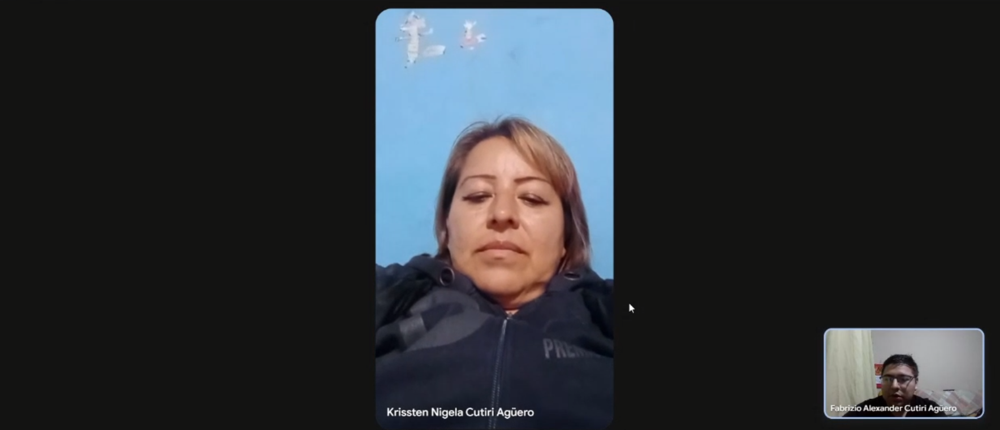 
- Nombre: Raquel 
- Apellidos: Agüero Sulca
- Edad: 52 años
- Distrito: Chorrillos
- URL Entrevista: 
- Duración: 00:04:44 minutos 
- Resumen: 
  La entrevistada se llama Raquel Agüero Sulca, tiene 52 años, trabaja como auxiliar de contabilidad y vive en Chorrillos. La entrevistada utiliza colectivos principalmente en horas punta, ya que el Metropolitano y los micros suelen estar llenos y la hacen perder tiempo. Sin embargo, reconoce que el transporte colectivo es informal y presenta dificultades: a veces los paraderos son intervenidos y cambian de lugar, lo que la ha llevado a equivocarse y perder tiempo, incluso teniendo que optar por un taxi como alternativa. Generalmente se entera de los paraderos porque suelen ubicarse en grifos o estaciones, pero como no son fijos, necesita preguntar a otras personas en la calle, lo que considera medianamente confiable, ya que no proviene de fuentes seguras. Ha tenido varios problemas para encontrar un paradero y cree que una aplicación que muestre paraderos, rutas y tarifas sería muy útil, siempre que ofrezca precios competitivos y accesibles frente a otras opciones de transporte. También le gustaría poder visualizar en un mapa la ubicación de los paraderos antes de salir, ya que le daría mayor comodidad y seguridad. En cuanto al tiempo de espera, sabe que no hay un horario fijo, pues depende de que los conductores llenen el vehículo, lo cual puede ser más lento si hay poca demanda. Por eso, considera importante que una aplicación muestre no solo las rutas, sino también la frecuencia de los colectivos y los precios.
  
---

#### Entrevistado N°3
 
- Nombres: Sammy
- Apellidos: Lindo
- Edad: 19 años
- Ciudad: Lima
- URL Entrevista: https://tinyurl.com/EntrevistasFROCK-WEB
- Duración: 00:04:39
- Resumen: 
    Samy prefiere los colectivos por ser más rápidos que los taxis, aunque las paradas frecuentes pueden causar demoras. A menudo pierde tiempo por no tener información precisa sobre los paraderos. Para conocer rutas, pregunta a conocidos o consulta redes sociales, pero a veces la información es desactualizada. Cree que una app como Chapa Toruta sería útil para ver paraderos, rutas, precios y tiempos de espera en tiempo real, y sugiere incluir detalles como placas de los vehículos para mayor confianza.
---

**Segmento Objetivo:** Conductores de colectivo

#### Entrevistado N°1
 
- Nombres: Juan Carlos
- Apellidos: Ramirez
- Edad: 28 años
- Ciudad: Lima 
- URL Entrevista: https://tinyurl.com/EntrevistasFROCK-WEB
- Duración: 00:02:44
- Resumen: 
    Juan Carlos, conductor de transporte público, explicó que tiene un turno establecido para el despliegue de sus vehículos, pero que la cantidad de personas también es un factor determinante para iniciar el recorrido. Para coordinar sus salidas, utiliza principalmente WhatsApp. Mencionó que sería de gran utilidad contar con una herramienta que permita a las personas conocer dónde encontrar las rutas disponibles, siempre y cuando la plataforma sea fácil de usar.

---

#### Entrevistado N°2
 
- Nombres: Hairo
- Apellidos: Cadillo
- Edad: 21 años
- Ciudad: Huaral 
- URL Entrevista: https://tinyurl.com/EntrevistasFROCK-WEB
- Duración: 00:10:54
- Resumen: 
    Hairo trabaja como administrador de rutas de vehículos menores en transporte interprovincial y zonas céntricas. Su función principal es planificar los tiempos de salida de los vehículos, aunque menciona que estos tiempos a menudo dependen de si las unidades están llenas o no. Desde su experiencia, considera que sería útil y rentable que los paraderos que administra estén integrados dentro de una plataforma digital, lo que permitiría mejorar la organización y la visibilidad del servicio.

---

#### Entrevistado N°3
 
- Nombres: Juan David
- Apellidos: Linares
- Edad: 26 años
- Ciudad: Lima
- URL Entrevista: https://tinyurl.com/EntrevistasFROCK-WEB
- Duración: 00:02:30 
- Resumen: 
      Juan es cobrador de bus en la ciudad de Lima y menciona que en su ruta suelen operar entre 20 y 25 colectivos. La organización de salida y llegada se basa en el principio de "quien llega primero sale primero". Señala que la mayoría de los pasajeros llegan sin saber exactamente cuál es el colectivo adecuado para su destino, lo que genera cierto desorden y confusión.

---

#### 2.2.3. Análisis de entrevistas
#### **SEGMENTO 1: Estudiantes y usuarios del transporte público**

#### **Características objetivas:**

| Variable | Porcentaje | Observaciones |
|----------|------------|---------------|
| Edad entre 18 y 25 años | 100% | Todos los entrevistados son jóvenes adultos, generalmente estudiantes. |
| Utiliza transporte público diariamente | 100% | Todos utilizan colectivos para desplazarse al trabajo o la universidad. |
| Conocimiento limitado sobre paraderos | 100% | Los usuarios no siempre conocen los paraderos o rutas específicas. |
| Uso de redes sociales para obtener información | 80% | La mayoría recurre a grupos de Facebook o aplicaciones para saber las rutas. |
| Conocimiento básico de tecnología | 100% | Los usuarios manejan aplicaciones móviles y redes sociales de manera fluida. |

#### **Características subjetivas:**

| Variable | Porcentaje | Observaciones |
|----------|------------|---------------|
| Necesidad de información precisa y actualizada | 100% | Todos los entrevistados mencionaron que la falta de información confiable es un problema recurrente. |
| Frustración por demoras y falta de claridad | 80% | Muchos se sienten frustrados por la incertidumbre de los tiempos de espera. |
| Preferencia por una solución digital | 100% | Todos estarían interesados en una aplicación que facilite el acceso a información actualizada. |
| Valoran la simplicidad y rapidez en las apps | 100% | La mayoría expresó que preferiría una interfaz sencilla y fácil de usar. |

#### **SEGMENTO 2: Lideres de ruta**

#### **Características objetivas:**

| Variable | Porcentaje | Observaciones |
|----------|------------|---------------|
| Edad entre 20 y 30 años | 100% | Los conductores tienen una edad promedio que varía entre 20 y 30 años. |
| Dependencia de información manual | 100% | Los conductores a menudo reciben indicaciones a través de WhatsApp o llamadas. |
| Uso limitado de tecnología para gestión de rutas | 66% | Algunos conductores no utilizan aplicaciones para gestionar sus rutas o paraderos. |
| Coordinación con otros conductores | 100% | La comunicación con otros conductores es clave para la operación diaria. |

#### **Características subjetivas:**

| Variable | Porcentaje | Observaciones |
|----------|------------|---------------|
| Necesidad de herramientas para optimizar tiempos | 100% | Todos los conductores señalaron que una app que optimice los tiempos de salida sería útil. |
| Preocupación por la falta de información en tiempo real | 80% | La falta de visibilidad de las rutas disponibles crea incertidumbre. |
| Interés en mejorar la experiencia del usuario | 100% | Los conductores están interesados en soluciones que beneficien tanto a ellos como a los pasajeros. |

## 2.3. Needfinding
### 2.3.1. User Personas

**Segmento 1:**
Jesús Ramírez representa al segmento de pasajeros frecuentes de rutas interurbanas informales (pueblo a pueblo), en especial trabajadores independientes o técnicos que se movilizan por necesidad laboral entre zonas periféricas.

**Segmento 2:**
Elmer representa al segmento de conductores de colectivos interurbanos, es decir, operadores informales que prestan servicio de transporte compartido entre pueblos, distritos y zonas periféricas, fuera del sistema de transporte formal.

### 2.3.2. User Task Matrix

Los segmentos objetivo representados por los User Personas: Jesús Ramírez (pasajero interurbano) y Elmer Huamán (conductor de colectivo), serán una parte crucial para este 'User Task Matrix'. Las tareas listadas reflejan acciones que los usuarios ya realizan actualmente para alcanzar sus objetivos, independientemente del uso de una aplicación o tecnología. Esta matriz permite identificar oportunidades donde la solución digital de Frock puede generar mayor valor.

| **Tarea**                                                  | **User Story ID** | **Jesús Ramírez (Pasajero)** - F | **Jesús Ramírez** - I | **Elmer Huamán (Conductor)** - F | **Elmer Huamán** - I |
|------------------------------------------------------------|-------------------|-------------------------------|------------------------|-------------------------------|------------------------|
| Buscar rutas disponibles para llegar a su destino          | US01              | Alta                          | Alta                   | Media                         | Alta                   |
| Identificar paraderos adecuados para abordar               | US02              | Alta                          | Alta                   | Media                         | Media                  |
| Ver información del conductor	                             | US03              | Media                         | Alta                   | Media                         | Alta                   |
| Avisar disponibilidad a pasajeros frecuentes               | US08              | Baja                          | Media                  | Alta                          | Alta                   |
| Ajustar su horario según los momentos de mayor demanda     | US09              | Baja                          | Media                  | Alta                          | Alta                   |
| Recordar o registrar los viajes que ha hecho               | US05              | Media                         | Baja                   | Baja                          | Baja                   |
| Evaluar la experiencia del viaje con un conductor          | US04              | Media                         | Alta                   | Alta                          | Media                  |

> **F = Frecuencia** | **I = Importancia**

### 2.3.3. User Journey Mapping

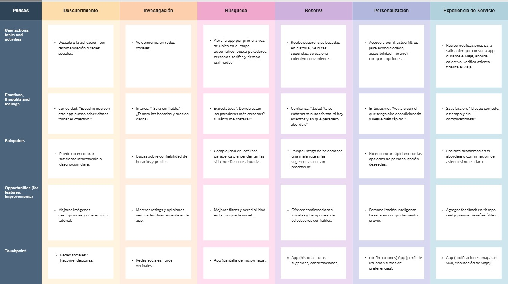
### 2.3.4. Empathy Mapping

#### *Segmento Objetivo 1: Usuarios que usan colectivos*

#### *Segmento Objetivo 2:Conductores de colectivos*
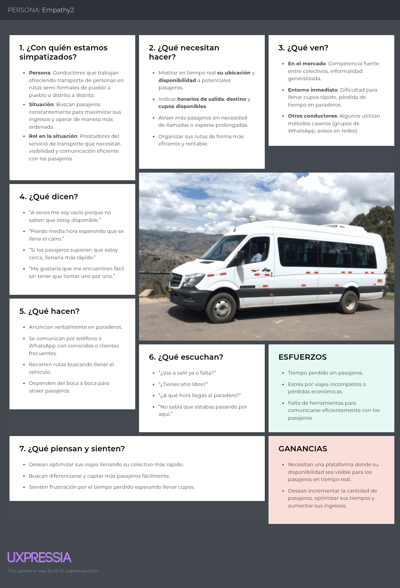

### 2.3.5. Ubiquitous Language
El lenguaje ubicuo es una parte fundamental de la estrategia de UX. Se refiere al conjunto de términos y frases que, aunque no pertenecen al contexto técnico del desarrollo, se utilizan para expresar la lógica del negocio. Esto permite que todos los involucrados en el proyecto, incluidos los usuarios finales, puedan entender y participar mejor en el desarrollo del producto.

### Glosario

**Colectivo (Vehículo Compartido):**  
Automóvil que opera en rutas fijas entre pueblos o distritos, transportando varios pasajeros a la vez. Son esenciales en zonas rurales o alejadas, donde no hay transporte formal constante.

**Whereabouts (Paradero):**  
Punto habitual donde los colectivos recogen o dejan pasajeros. No siempre está señalizado oficialmente, pero es reconocido por los usuarios locales. En la plataforma, se geolocaliza para ofrecer visibilidad.

**Route (Ruta):**  
Trayecto fijo que sigue un colectivo, desde un punto de partida hasta un destino, pasando por una serie de paraderos. Las rutas pueden variar según el conductor o la demanda, pero mantienen un patrón general.

**Route request (Request):**  
Acción del usuario para conocer o solicitar información sobre una ruta específica, ya sea para planear su viaje o encontrar un colectivo disponible.

**Verified driver (Conductor Verificado):**  
Persona que opera un colectivo y que ha sido registrada en la plataforma mediante un proceso de verificación de identidad y datos del vehículo, brindando mayor confianza al usuario.

**Driver´s profile (Perfil del Conductor):**  
Información pública del conductor disponible en la plataforma, incluyendo nombre, foto, vehículo, calificación y comentarios de otros pasajeros, aumentando la confianza y seguridad del servicio.

**Availability (Disponibilidad):**  
Estado en el que un conductor está activo y visible para los usuarios de la aplicación. Indica que está en ruta, con cupos disponibles, y permite recibir solicitudes o ser ubicado por los pasajeros.

**Viaje (Ride):**  
Servicio individual que ocurre cuando un pasajero aborda un colectivo en una ruta específica. Puede ser monitoreado en tiempo real si hay conectividad disponible.

**Fare(Tarifa):** 
Costo estimado del viaje, determinado con base en la distancia, ruta y condiciones locales. Aunque el pago final puede variar, sirve como referencia para los usuarios.

**Monitoring (Monitoreo):**  
Supervisión del estado y movimiento de los colectivos registrados. Esto incluye el seguimiento de rutas activas, paraderos más frecuentados y tiempo estimado de llegada para mejorar la experiencia del usuario.

**Coverage areas (Zonas de Cobertura):**  
Áreas geográficas donde opera el servicio de colectivos registrados en la plataforma. Ayuda a delimitar las regiones con rutas disponibles y mejorar la planificación de nuevas expansiones.

## 2.4. Requirements Specification

### 2.4.1. User Stories

### 2.4.2. Impact Mapping

El Impact Mapping permite alinear los objetivos del proyecto con las necesidades de conductores de colectivos y pasajeros, mostrando cómo cada decisión impacta en la experiencia de ambos. Así, se convierte en una guía estratégica para diseñar soluciones que generen beneficios reales y respondan efectivamente a sus necesidades.

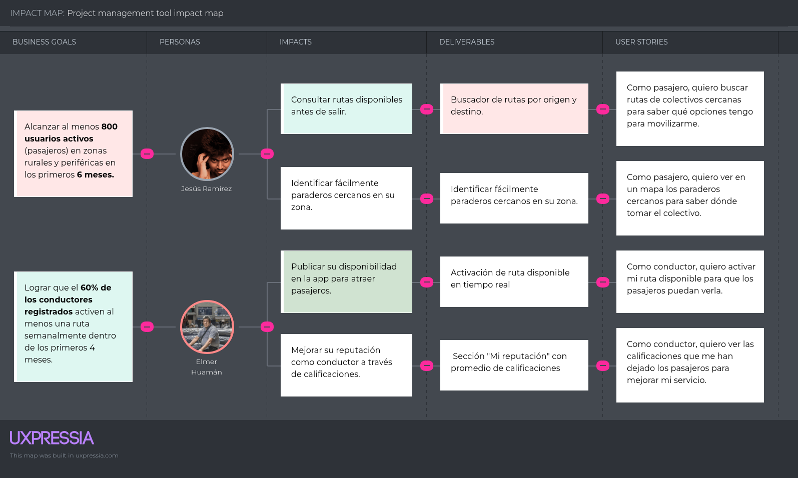

### 2.4.3. Product Backlog

## 2.5. Strategic-Level Domain-Driven Design

### 2.5.1. EventStorming

Para el proceso de EventStorming utilizamos la herramienta Miro y realizamos 4 pasos para llegar a definir los bounded context que se van a trabajar.

En primer lugar, debemos identificar los eventos y trazarlos mediante una linea de tiempo imaginaria que va de izquierda a derecha. Además, se usa post-it anaranjado para identificar a los eventos.

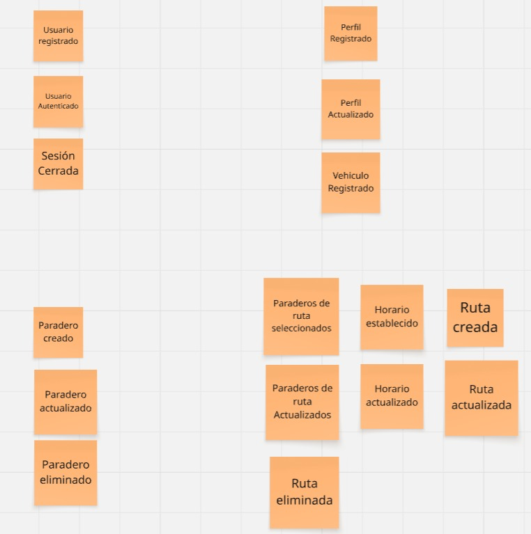

Como segundo paso, identificamos los comandos que disparan o llevan a acabo el evento. Identificamos a estos con un post-it de color azul.

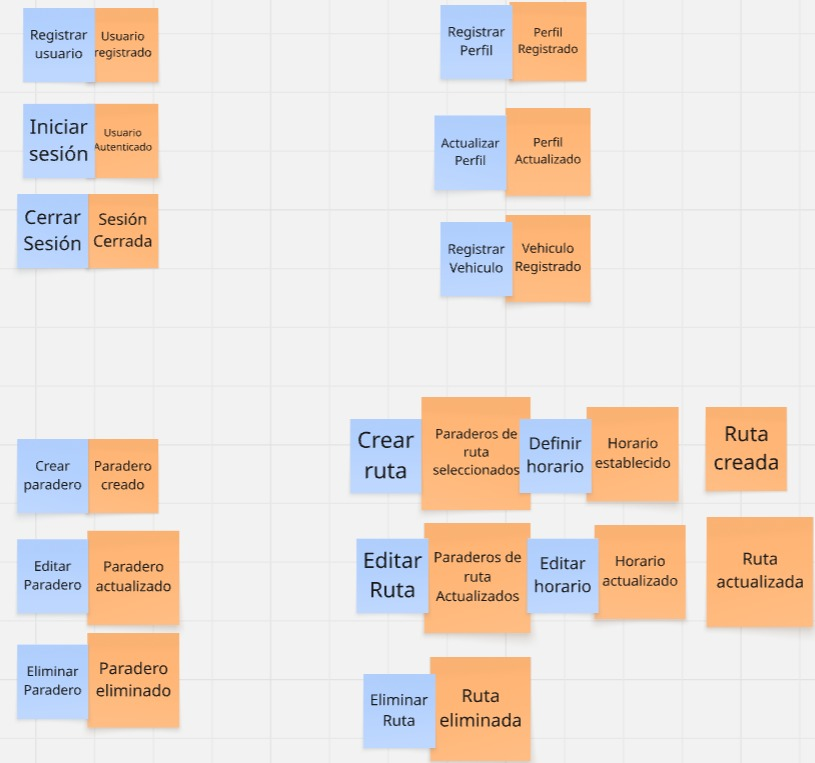

Como tercer paso, identificamos los agentes que realizan o usan el comando. Estos se representan mediante un post-it de color amarillo.

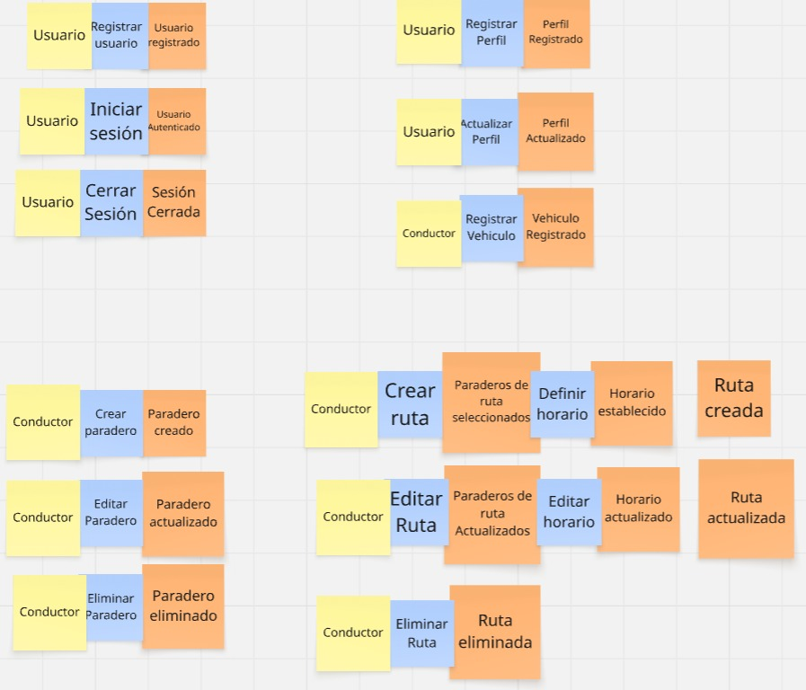

Como último paso, identificamos los eventos que se relacionen entre sí mediante los agregados y entidades que utilizan, agrupandolos por Bounded Context.

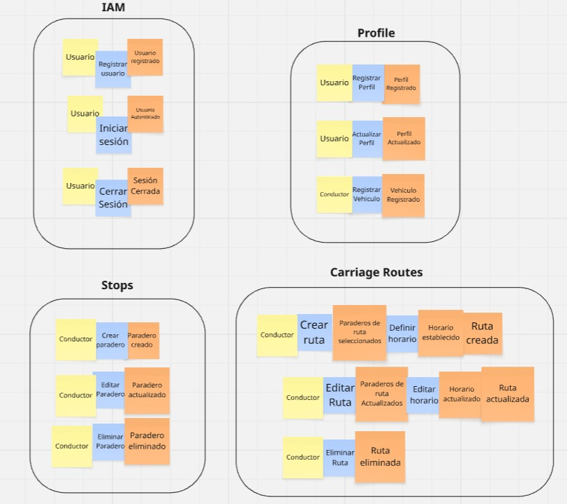

#### 2.5.1.1. Candidate Context Discovery

En esta sesión aplicamos la técnica de Candidate Context Discovery para identificar y separar los posibles bounded contexts. Para ello, aplicamos principalmente la técnica look-for-pivotal-events para analizar los eventos que marcan un cambio de estado en el negocio. Al identificar eventos como **ParaderoCreado**, **RutaCreada**,  **UsuarioRegistrado**, entre otros; pudimos detectar que cada uno implicaba responsabilidades y reglas distintas.

Este proceso nos llevo a crear los siguientes Bounded Contexts:

| Bounded Context       | Descripción                                                                 | Eventos clave                                                   |
|-----------------------|-----------------------------------------------------------------------------|-----------------------------------------------------------------|
| IAM                   | Maneja la autenticación y autorización de los usuarios, asegurando accesos. | `Usuario Registrado`, `Usuario Autenticado`                     |
| Profile               | Administra la información de perfil de conductores y pasajeros.             | `Perfil Creado`, `Perfil Actualizado`                           |
| Gestión de Paraderos  | Permite crear, editar y eliminar paraderos, que sirven como puntos de ruta. | `Paradero Creado`, `Paradero Actualizado`, `Paradero Eliminado` |
| Gestión de Rutas      | Administra la creación, edición y eliminación de rutas con paraderos.       | `Ruta Creada`, `Ruta Actualizada`, `Ruta Eliminada`             |

#### 2.5.1.2. Domain Message Flow Modeling

El Domain Message Flow Modelling es una técnica que permite representar cómo fluyen los mensajes de dominio (commands, events y queries) entre los distintos bounded contexts del sistema. Su propósito es clarificar las interacciones, dependencias y responsabilidades de cada contexto

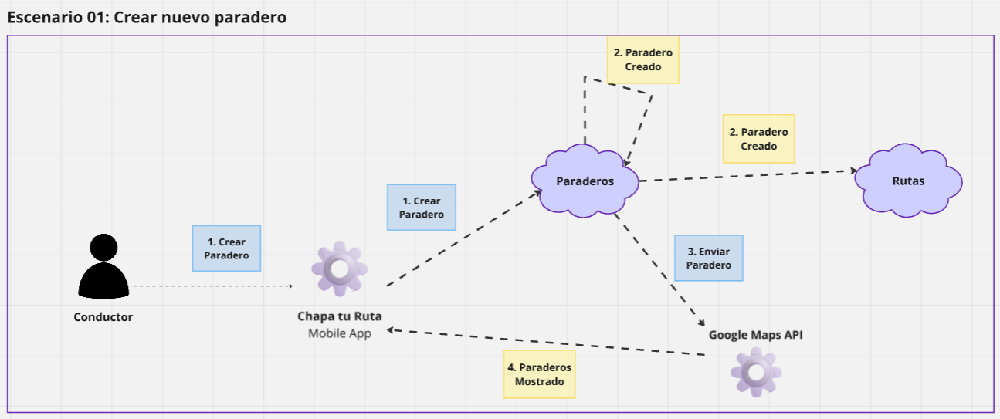

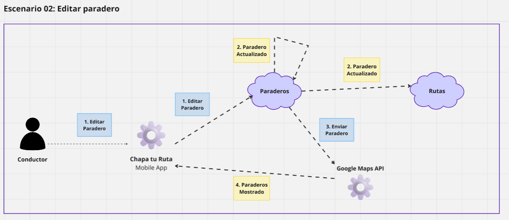

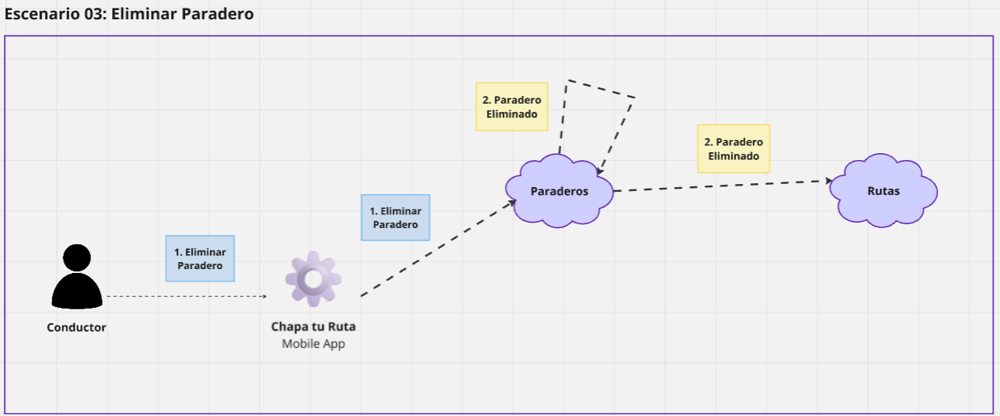

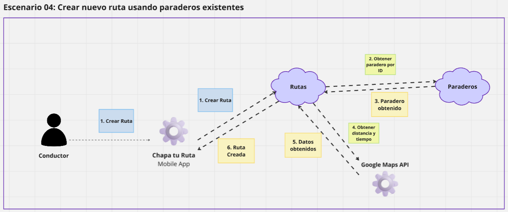

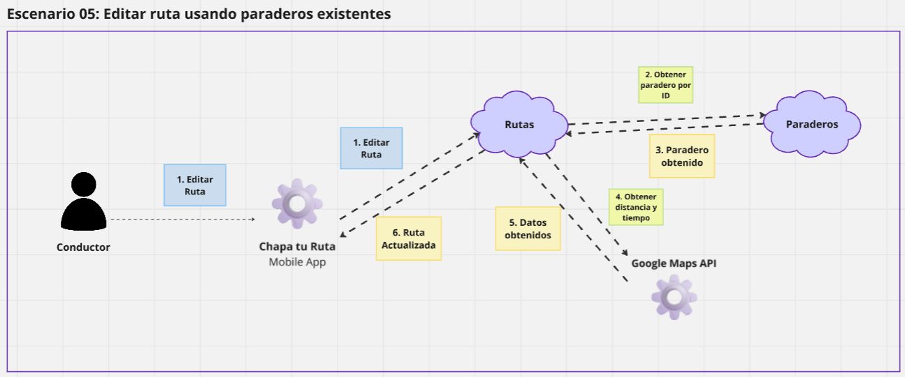

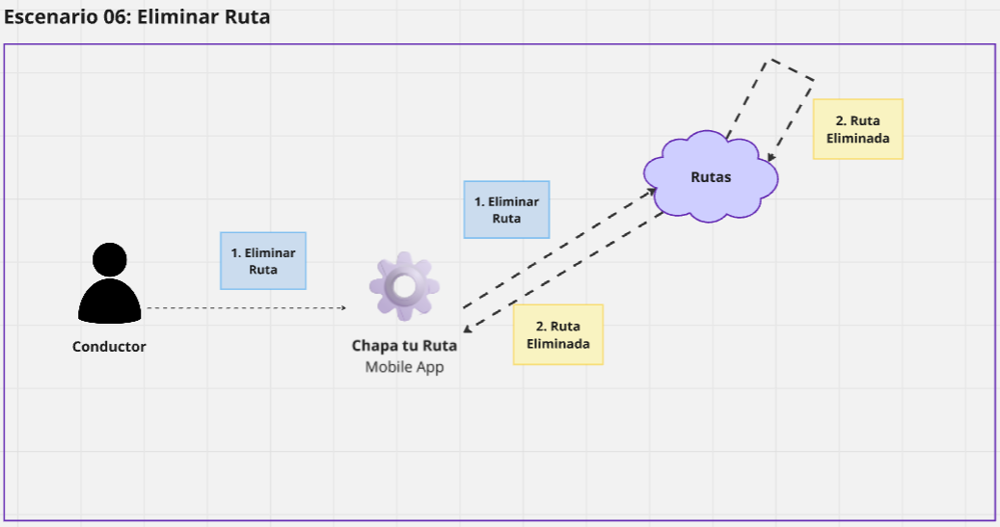

#### 2.5.1.3. Bounded Context Canvases

El Bounded Context Canvas es una herramienta visual aplicada en el marco del Domain-Driven Design (DDD) que permite representar de manera clara los límites, responsabilidades e interacciones de cada contexto dentro de un sistema complejo. Su propósito es facilitar que los equipos construyan una visión compartida sobre el nombre y objetivo de cada contexto, las entidades y agregados que lo conforman, así como las reglas de negocio que gobiernan su funcionamiento.

En esta sección se presentan los Bounded Context Canvases correspondientes a los contextos identificados en nuestro proyecto.

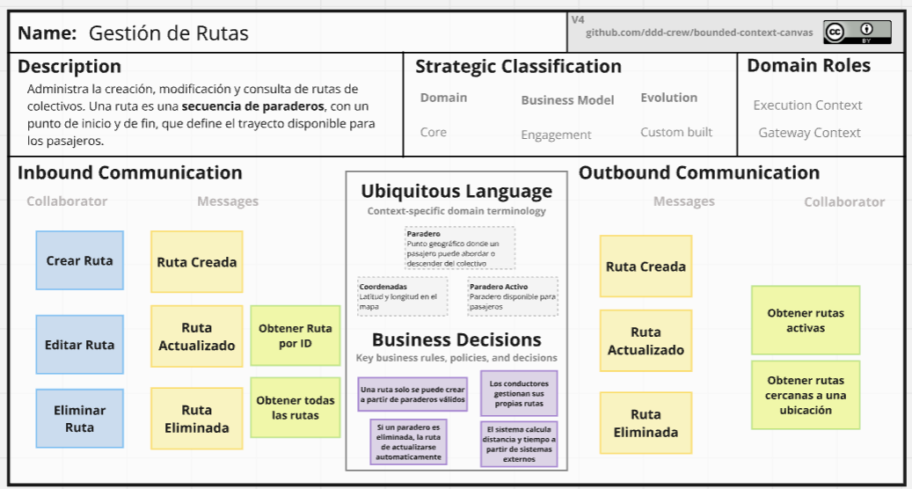

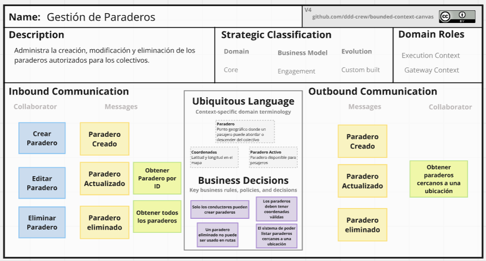

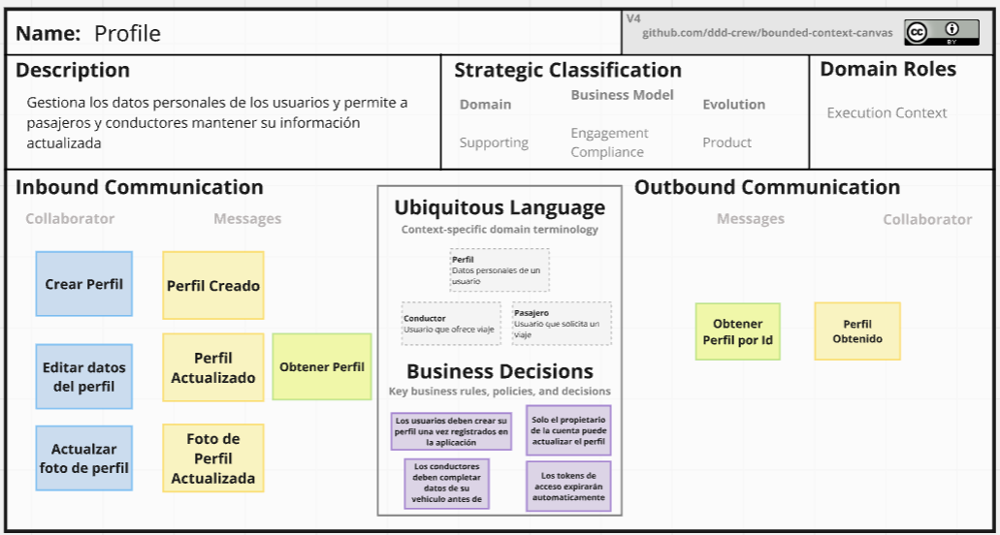

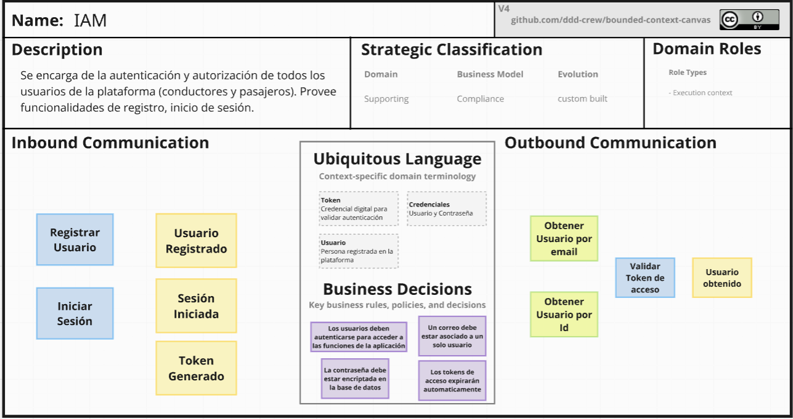

### 2.5.2. Context Mapping

### 2.5.3. Software Architecture

#### 2.5.3.1. Software Architecture Context Level Diagrams

Para el siguiente diagrama de contexto, se muestra la relación entre el sistema de gestión de transporte y los actores externos que interactúan con él. Se representan los dos tipos principales de usuarios: Pasajero, que busca y reserva rutas de transporte, y Gestor de Empresa, que administra rutas, horarios y paradas. También se incluyen los servicios externos utilizados por la plataforma, como el servicio de mapas (para visualización de rutas), el servicio de pagos (para procesar transacciones en línea) y el servicio de notificaciones (para envío de SMS y correos electrónicos). 

#### 2.5.3.2. Software Architecture Container Level Diagrams
**Diagrama de contenedor del bounded context del Registro de Usuario:** 
Este diagrama representa la arquitectura a nivel de contenedor para el flujo de registro de usuarios dentro del Bounded Context de Autenticación.
Muestra los principales componentes involucrados en el proceso: validación de datos, encriptación de contraseñas, persistencia del usuario y generación de tokens. 

**Diagrama de contenedor del bounded context de Rutas:** 
Este diagrama ilustra la arquitectura a nivel de contenedor del Bounded Context de Rutas, encargado de la gestión de las rutas. Detalla cómo las solicitudes de usuarios y conductores fluyen a través de controladores y servicios, cómo la información se persiste en MySQL, y cómo el sistema se integra con servicios externos como Google Maps para validar rutas. 

#### 2.5.3.3. Software Architecture Deployment Diagrams

## 2.6. Tactical-Level Domain-Driven Design
### 2.6.1. Bounded Context: IAM
### 2.6.1.1. Domain Layer
#### 2.6.1.2. Interface Layer
#### 2.6.1.3. Application Layer
#### 2.6.1.4 Infrastructure Layer
#### 2.6.1.5. Bounded Context Software Architecture Component Level Diagrams
#### 2.6.1.6. Bounded Context Software Architecture Code Level Diagrams
#### 2.6.1.6.1. Bounded Context Domain Layer Class Diagrams
#### 2.6.1.6.2. Bounded Context Database Design Diagram

### 2.6.2. Bounded Context: Profile
#### 2.6.2.1. Domain Layer
#### 2.6.2.2. Interface Layer
#### 2.6.2.3. Application Layer
#### 2.6.2.4 Infrastructure Layer
#### 2.6.2.5. Bounded Context Software Architecture Component Level Diagrams
#### 2.6.2.6. Bounded Context Software Architecture Code Level Diagrams
#### 2.6.2.6.1. Bounded Context Domain Layer Class Diagrams
#### 2.6.2.6.2. Bounded Context Database Design Diagram

### 2.6.3. Bounded Context: Stops
#### 2.6.3.1. Domain Layer
#### 2.6.3.2. Interface Layer
#### 2.6.3.3. Application Layer
#### 2.6.3.4 Infrastructure Layer
#### 2.6.3.5. Bounded Context Software Architecture Component Level Diagrams
#### 2.6.3.6. Bounded Context Software Architecture Code Level Diagrams
#### 2.6.3.6.1. Bounded Context Domain Layer Class Diagrams
#### 2.6.3.6.2. Bounded Context Database Design Diagram

### 2.6.4. Bounded Context: Carriage Routes
#### 2.6.4.1. Domain Layer
#### 2.6.4.2. Interface Layer
#### 2.6.4.3. Application Layer
#### 2.6.4.4 Infrastructure Layer
#### 2.6.4.5. Bounded Context Software Architecture Component Level Diagrams
#### 2.6.4.6. Bounded Context Software Architecture Code Level Diagrams
#### 2.6.4.6.1. Bounded Context Domain Layer Class Diagrams
#### 2.6.4.6.2. Bounded Context Database Design Diagram