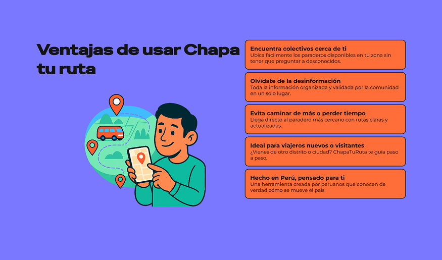

# Capítulo IV: Product Design
## 4.1. Style Guidelines.
  
En 
  esta sección, el equipo establece un repositorio organizado y central de elementos comunes (assets, fonts, colores, iconografía) para mantener una presentación visual consistente y enfocada, alineada con el espíritu de **Chapa tu Ruta**: dinámico, confiable y cercano a la cultura popular peruana.
### 4.1.1. General Style Guidelines.
#### Branding
  - Identidad visual vibrante y accesible, con un estilo animoso que transmita **movimiento**, **eficiencia** y **optimismo urbano**.
    - Iconografía reconocible e intuitiva: íconos simples, grandes, fáciles de asociar a acciones comunes (ej. casa, rutas, búsqueda).

      
    
      
    
      
    
      
    
      
    
      
    
      
    
      

#### Typography

  - Tipografías claras y sin serifas, de alta legibilidad para usuarios en movimiento.
    - Priorizar estilos **negrita** o **semi-negrita** para botones y acciones principales.
    - Jerarquías bien marcadas: **Títulos > Subtítulos > Texto general**.

#### Colors

- Paleta de colores fuertes (inspirada en tonos limeños y de transporte urbano):
    - **Primarios**: Violeta energético, verde neón, azul eléctrico.
    - **Secundarios**: Gris claro, blanco para fondos.
    - **Accentos**: Rojo alerta, amarillo vibrante para notificaciones críticas o destacadas.
      - Colores transmiten **agilidad, energía y confianza**.

     

#### Spacing

- Márgenes y paddings estandarizados:
    - Separaciones interiores de **10px**, **20px**, **50px** según jerarquía visual.
    - Áreas interactivas suficientemente amplias para facilidad de click y touch.
  - Espacios que respiran pero mantienen sensación de **compacto y eficiente**.

    

#### Communication Tone

  - Tono de comunicación:
      - **Casual**, cercano pero respetuoso.
      - **Entusiasta y positivo** ("¡Chapa tu ruta!", "¡Listo para salir!").
      - Uso de lenguaje **amigable, directo, breve y familiar** para usuarios peruanos citadinos.

#### Dimension Guidelines

  - Componentes de UI manejan dimensiones estándar para consistencia:
    - **Botones principales**: 100px de ancho mínimo.
    - **Íconos**: 40px a 50px de ancho/alto.
    - **Inputs de texto**: 280px de ancho por 70px de alto.
    - **Tarjetas de información (rutas)**: 300px a 316px de ancho.
    - **Mensajes de éxito/error**: 353px de ancho.

    

    

    

### 4.1.2. Web Style Guidelines.
#### Design
- Uso de layouts flexibles (Flexbox, Grid) para adaptarse sin perder claridad ni funcionalidad.
- Elementos clave (botones, buscadores, rutas) visibles y accesibles en cualquier tamaño de pantalla.

#### Navigation
- Menús de navegación sencillos y visibles.
- Uso de "sticky headers" para mantener acceso a funciones esenciales (búsqueda de rutas, mapa, perfil).
- Efectos de transición suaves para cambios de página o secciones (fade, slide).

- 
#### Interaction States
- Estados de interacción claramente diferenciados:
    - **Hover**: cambios sutiles de color o sombra para indicar interactividad.
    - **Active/Pressed**: ligeras animaciones de hundimiento o cambio de tono.
    - **Focus**: bordes destacados para accesibilidad al navegar con teclado.

#### Visual Consistency
- Mantener coherencia de estilos entre páginas:
    - Botones, íconos y colores respetan el mismo sistema visual.
    - Jerarquías de texto y espacios replican los lineamientos generales.
    - Evitar cambios bruscos de estilo que confundan al usuario.

#### Feedback & Notifications
- Mensajes claros y breves en acciones del usuario:
    - Confirmaciones (ej. "¡Ruta guardada exitosamente!").
    - Errores (ej. "No pudimos encontrar esa ruta, intenta de nuevo.").
- Uso de colores de la paleta oficial para comunicar estado (verde éxito, rojo error, amarillo advertencia).

    

## 4.2. Information Architecture.

### 4.2.1. Organization Systems
Para organizar el contenido en las experiencias web y móvil de Frock, se aplicarán los siguientes sistemas de organización:

**Jerárquico (Visual Hierarchy):**  
Se utilizará para destacar información clave como rutas, paraderos y horarios. Por ejemplo, en el Landing Page, la sección "Sé parte de nosotros" tendrá un encabezado principal (#) seguido de subsecciones (##, ###) para registro y detalles de rutas.

**Secuencial (Step-by-Step):**  
Se implementará en procesos como el registro de usuarios o la creación de rutas, donde se guiará al usuario paso a paso (ejemplo: "1. Registro" → "2. Indica tu ruta").

**Por Tópicos:**  
La información se agrupará por temas como "Rutas", "Horarios", "Paraderos" y "Reseñas", facilitando la navegación intuitiva.

**Según Audiencia:**  
Se diferenciará entre conductores (quienes registran rutas y horarios) y pasajeros (quienes buscan información de viaje), adaptando el contenido a cada grupo.

### 4.2.2. Labeling Systems
Las etiquetas se diseñarán para ser claras y concisas, evitando confusión:

**Ejemplos de Etiquetas:**
- "Nombre comercial" (para registro de conductores).
- "Desde / Hasta" (para definir rutas).
- "Horarios: Lun-Vie 8:00 am" (formato uniforme).
- "Editar" / "Agregar Ruta" (acciones destacadas con verbos).

**Asociaciones:**  
Se vincularán términos como "Paradero" con "Ruta" y "Horarios" para reforzar la relación entre componentes.

### 4.2.3. SEO Tags and Meta Tags
Se optimizará el contenido para motores de búsqueda con los siguientes tags:

**Landing Page:**
- **Title:** "Frock - Moderniza tu transporte colectivo"
- **Meta Description:** "Conecta ciudades y distritos con rutas informales organizadas. Encuentra horarios, paraderos y reseñas en un solo lugar."
- **Keywords:** transporte colectivo, rutas informales, paraderos, horarios, movilidad urbana.
- **Author:** Equipo Frock.

**Aplicación Web:**
- **Title (Rutas):** "Mis Rutas | Frock"
- **Meta Description:** "Administra y edita tus rutas registradas. Agrega nuevos trayectos y horarios fácilmente."

### 4.2.4. Navigation Systems
La navegación se basará en:

**Menú Principal:**  
Accesos directos a "Inicio", "Rutas", "Horarios", "Paraderos" y "Reseñas".

**Breadcrumbs:**  
Ruta de navegación como "Inicio > Mis Rutas > Editar Ruta".

**Botones de Acción:**  
Destacados con verbos ("Registrar", "Agregar Ruta", "Editar") y diseño consistente (color/contraste).

**Flujo Secuencial:**  
Para tareas críticas (ejemplo: registro de conductor → agregar ruta → confirmación).

### 4.2.5. Searching Systems
Para ayudar a los usuarios a encontrar información rápidamente:

**Búsqueda por Filtros:**
- Paraderos (dropdown con opciones como "La Torre").
- Horarios (selector de rango horario).
- Precios (slider de "50 a 100").

**Resultados de Búsqueda:**  
Mostrados en tarjetas con detalles clave: "De La Torre a Estación Dos | 7 asientos | 20 min".

**Búsqueda Predictiva:**  
Autocompletado al escribir nombres de paraderos o rutas.

## 4.3. Landing Page UI Design.
### 4.3.1. Landing Page Wireframe.
#### Full langin page wireframe design

#### a. Hero section wireframe

#### b. Como funciona section wireframe

#### c. Ventajas section wireframe

#### d. FAQ section wireframe

#### e. Footer section wireframe

### 4.3.2. Landing Page Mock-up.
#### Full landing page design

#### a. Hero section design

#### b. Como funciona section design

#### c. Ventajas section design

#### d. FAQ section design

#### e. Footer section design

## 4.4. Web Applications UX/UI Design.

### 4.4.1. Web Applications Wireframes.

### 4.4.2. Web Applications Wireflow Diagrams.

### 4.4.2. Web Applications Mock-ups.

### 4.4.3. Web Applications User Flow Diagrams.

## 4.5. Web Applications Prototyping.

## 4.6. Domain-Driven Software Architecture.
Los esquemas de contenedores ilustran los distintos componentes del sistema, tales como aplicaciones en línea, bases de datos, microservicios y la forma en que interactúan entre ellos. Estos esquemas ofrecen una perspectiva a nivel superior de la arquitectura del sistema, resaltando las obligaciones de cada contenedor y sus interrelaciones.

### 4.6.1. Software Architecture Context Diagram.
El diagrama de contexto del sistema muestra la relación entre el sistema y los actores externos, proporcionando una visión general de la arquitectura del sistema y sus interacciones con el entorno externo.

### 4.6.2. Software Architecture Container Diagrams.
Los esquemas de contenedores ilustran las distintas partes que conforman el sistema, tales como aplicaciones en línea, bases de datos, microservicios y la forma en que interactúan entre ellos. Estos esquemas ofrecen una panorámica detallada de la arquitectura del sistema, resaltando las obligaciones de cada contenedor y sus relaciones entre sí.

### 4.6.3. Software Architecture Components Diagrams.
En esta sección, se presentan los diagramas de componentes de la arquitectura de software. Estos diagramas detallan los diferentes componentes que conforman el sistema, sus responsabilidades y cómo interactúan entre sí.

#### Diagrama de componentes del Frontend

#### Diagrama de componentes del Backend

## 4.7. Software Object-Oriented Design.
### 4.7.1. Class Diagrams.
#### User Diagram

La clase User representa tanto a pasajeros como a gestores de empresas de transporte en el sistema. Contiene información básica como nombre, email, contraseña encriptada y rol, además de funcionalidades para autenticación, actualización de perfil y cambio de contraseña. Es la entidad central que controla el acceso al sistema y establece las jerarquías de usuarios, permitiendo que los gestores administren empresas mientras los pasajeros utilizan los servicios de búsqueda y reserva de rutas.

#### Routes Diagram

La clase Route define los servicios de transporte disponibles con sus características operativas como precio, duración estimada del viaje y la posibilidad de crear rutas compuestas mediante referencias a rutas padre. Proporciona funcionalidades para gestionar horarios, obtener las paradas que conecta en orden secuencial y calcular tiempos de llegada estimados. Es la entidad que representa el producto principal del sistema: el servicio de transporte entre diferentes ubicaciones.

#### Company and Stops Diagram

Las clases Company y Stop forman el núcleo operativo de la infraestructura de transporte. Company representa las empresas registradas en el sistema, cada una asociada a un gestor específico, almacenando información comercial como nombre y logotipo, mientras que Stop representa los puntos físicos donde operan estos servicios, incluyendo terminales y paradas con información detallada de ubicación, dirección, coordenadas de Google Maps y datos de contacto. Ambas entidades están estrechamente relacionadas ya que cada parada pertenece a una empresa específica, permitiendo que los gestores administren tanto sus rutas como la infraestructura física donde operan, creando un ecosistema completo de servicios de transporte bajo una marca comercial unificada.

### 4.7.2. Class Dictionary.
# Sistema de Gestión de Transporte - Diccionario de Clases

## 1. Clase User
Esta clase representa un usuario en el sistema, que puede ser un pasajero o un gestor de empresa de transporte.

### Atributos
- **`id`**: Identificador único del usuario
- **`name`**: Nombre completo del usuario
- **`email`**: Dirección de correo electrónico del usuario
- **`password`**: Contraseña encriptada del usuario
- **`role`**: Rol del usuario en el sistema (pasajero, gestor)
- **`created_at`**: Fecha y hora de registro del usuario
- **`fk_user_id`**: Identificador del usuario superior (para jerarquías)

### Métodos
- **`User(name, email, password, role)`**: Constructor para crear un nuevo usuario
- **`updateProfile(name, email)`**: Actualiza la información del perfil del usuario
- **`changePassword(newPassword)`**: Cambia la contraseña del usuario
- **`authenticate(email, password)`**: Autentica las credenciales del usuario

---

## 2. Clase Company
Esta clase representa una empresa de transporte registrada en el sistema.

### Atributos
- **`id`**: Identificador único de la empresa
- **`name`**: Nombre comercial de la empresa de transporte
- **`logo_url`**: URL del logotipo de la empresa
- **`fk_user_id`**: Identificador del gestor propietario de la empresa

### Métodos
- **`Company(name, logo_url, fk_user_id)`**: Constructor para registrar una nueva empresa
- **`updateCompanyInfo(name, logo_url)`**: Actualiza la información de la empresa
- **`getRoutes()`**: Obtiene todas las rutas operadas por la empresa
- **`getStops()`**: Obtiene todas las paradas gestionadas por la empresa

---

## 3. Clase Route
Esta clase representa una ruta de transporte con sus características principales.

### Atributos
- **`id`**: Identificador único de la ruta
- **`price`**: Precio del pasaje para esta ruta
- **`duration_min`**: Duración estimada del viaje en minutos
- **`fk_id_route`**: Referencia a ruta padre (para rutas compuestas)

### Métodos
- **`Route(price, duration_min)`**: Constructor para crear una nueva ruta
- **`updateRouteInfo(price, duration_min)`**: Actualiza información de la ruta
- **`getSchedules()`**: Obtiene todos los horarios disponibles para la ruta
- **`getStops()`**: Obtiene todas las paradas de la ruta en orden
- **`calculateEstimatedArrival(departure_time)`**: Calcula hora estimada de llegada

---

## 4. Clase Stop
Esta clase representa una parada o terminal de transporte.

### Atributos
- **`id`**: Identificador único de la parada
- **`name`**: Nombre de la parada o terminal
- **`google_maps_url`**: URL de Google Maps para la ubicación
- **`image_url`**: URL de imagen representativa de la parada
- **`phone`**: Número de teléfono de contacto de la parada
- **`fk_company`**: Identificador de la empresa que gestiona la parada
- **`address`**: Dirección física de la parada
- **`reference`**: Referencias adicionales para ubicar la parada
- **`fk_id_locality`**: Identificador de la localidad donde se ubica

### Métodos
- **`Stop(name, address, phone, fk_company, fk_id_locality)`**: Constructor para crear parada
- **`updateStopInfo(name, address, phone)`**: Actualiza información de la parada
- **`getLocation()`**: Obtiene coordenadas geográficas de la parada
- **`getRoutesFromStop()`**: Obtiene rutas que parten desde esta parada

---

## 5. Clase Schedule
Esta clase representa los horarios de operación de una ruta en específica.

### Atributos
- **`id`**: Identificador único del horario
- **`day`**: Día de la semana para este horario
- **`time_from`**: Hora de inicio del servicio
- **`time_to`**: Hora de fin del servicio
- **`is_available`**: Indica si el horario está disponible
- **`fk_id_route`**: Identificador de la ruta asociada

### Métodos
- **`Schedule(day, time_from, time_to, fk_id_route)`**: Constructor para crear horario
- **`updateSchedule(time_from, time_to, is_available)`**: Actualiza el horario
- **`checkAvailability(requested_time)`**: Verifica disponibilidad en hora específica
- **`toggleAvailability()`**: Activa/desactiva la disponibilidad del horario

---

## 6. Clase Locality
Esta clase representa una localidad dentro de un distrito.

### Atributos
- **`id`**: Identificador único de la localidad
- **`name`**: Nombre de la localidad
- **`fk_id_district`**: Identificador del distrito al que pertenece

### Métodos
- **`Locality(name, fk_id_district)`**: Constructor para crear localidad
- **`updateName(name)`**: Actualiza el nombre de la localidad
- **`getStops()`**: Obtiene todas las paradas ubicadas en esta localidad
- **`getDistrict()`**: Obtiene información del distrito padre

---

## 7. Clase District
Esta clase representa un distrito dentro de una provincia.

### Atributos
- **`id`**: Identificador único del distrito
- **`name`**: Nombre del distrito
- **`fk_id_province`**: Identificador de la provincia a la que pertenece

### Métodos
- **`District(name, fk_id_province)`**: Constructor para crear distrito
- **`updateName(name)`**: Actualiza el nombre del distrito
- **`getLocalities()`**: Obtiene todas las localidades del distrito
- **`getProvince()`**: Obtiene información de la provincia padre

---

## 8. Clase Province
Esta clase representa una provincia dentro de una región.

### Atributos
- **`id`**: Identificador único de la provincia
- **`name`**: Nombre de la provincia
- **`fk_id_region`**: Identificador de la región a la que pertenece

### Métodos
- **`Province(name, fk_id_region)`**: Constructor para crear provincia
- **`updateName(name)`**: Actualiza el nombre de la provincia
- **`getDistricts()`**: Obtiene todos los distritos de la provincia
- **`getRegion()`**: Obtiene información de la región padre

---

## 9. Clase Region
Esta clase representa la división geográfica de mayor nivel en el sistema.

### Atributos
- **`id`**: Identificador único de la región
- **`name`**: Nombre de la región

### Métodos
- **`Region(name)`**: Constructor para crear región
- **`updateName(name)`**: Actualiza el nombre de la región
- **`getProvinces()`**: Obtiene todas las provincias de la región
- **`getFullGeographicHierarchy()`**: Obtiene la jerarquía geográfica completa

---

## 10. Clase Itinerary
Esta clase representa itinerarios que agrupan múltiples rutas.

### Atributos
- **`id`**: Identificador único del itinerario
- **`fk_id_itinerary`**: Referencia a itinerario padre (para itinerarios anidados)
- **`fk_id_route`**: Identificador de la ruta asociada

### Métodos
- **`Itinerary(fk_id_route)`**: Constructor para crear itinerario
- **`addRoute(route_id)`**: Agrega una ruta al itinerario
- **`removeRoute(route_id)`**: Remueve una ruta del itinerario
- **`calculateTotalDuration()`**: Calcula duración total del itinerario
- **`calculateTotalPrice()`**: Calcula precio total del itinerario

---

## 11. Clase StopsRoute
Esta clase representa los pasos o paradas de una ruta específica.

### Atributos
- **`id`**: Identificador único del paso de ruta
- **`fk_id_route`**: Identificador de la ruta
- **`fk_id_stop`**: Identificador de la parada

### Métodos
- **`StepRoute(fk_id_route, fk_id_stop)`**: Constructor para crear paso de ruta
- **`updateStopOrder(new_order)`**: Actualiza el orden de la parada en la ruta
- **`getRouteDetails()`**: Obtiene detalles de la ruta asociada
- **`getStopDetails()`**: Obtiene detalles de la parada asociada

---

## 12. Clase ItineraryRoute
Esta clase representa la relación entre itinerarios y rutas.

### Atributos
- **`id`**: Identificador único de la relación
- **`fk_id_itinerary`**: Identificador del itinerario
- **`fk_id_route`**: Identificador de la ruta

### Métodos
- **`ItineraryRoute(fk_id_itinerary, fk_id_route)`**: Constructor para crear relación
- **`removeFromItinerary()`**: Remueve la ruta del itinerario
- **`getItineraryDetails()`**: Obtiene detalles del itinerario
- **`getRouteDetails()`**: Obtiene detalles de la ruta

---

## Servicios Principales del Sistema

### RouteSearchService
Servicio especializado para búsqueda y filtrado de rutas disponibles en el sistema.

### ReservationService  
Servicio encargado de la gestión integral de reservas de pasajeros.

### GeographicService
Servicio para el manejo de la jerarquía geográfica completa (región → provincia → distrito → localidad).

### CompanyManagementService
Servicio para la gestión integral de empresas de transporte y todos sus recursos asociados.

## 4.8. Database Design.
### 4.8.1. Database Diagram.

