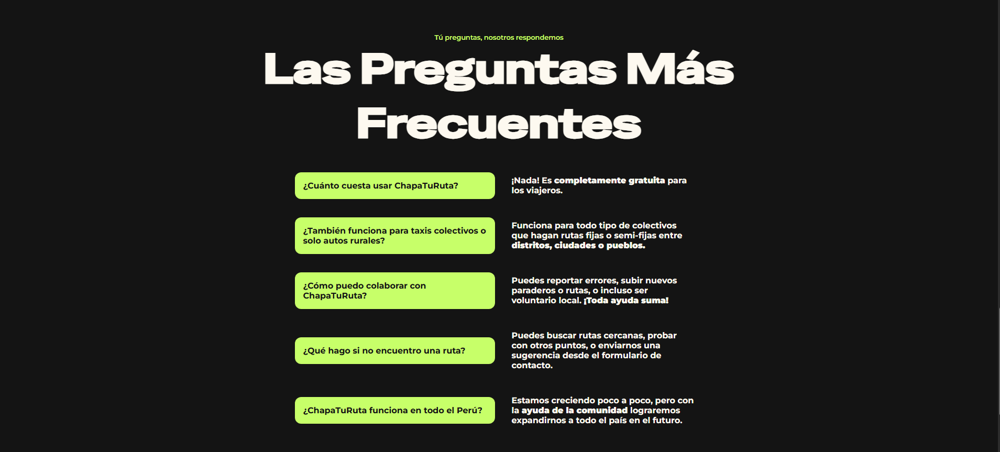
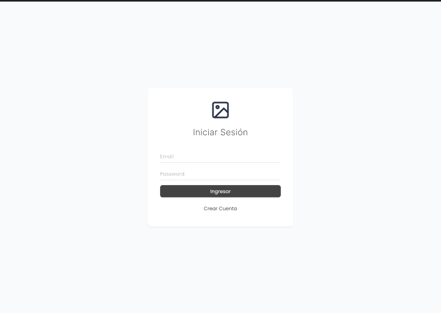
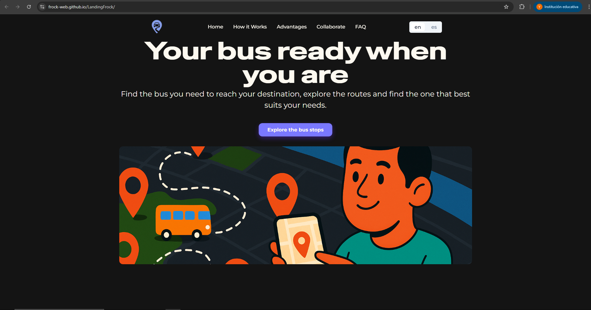

# Capítulo V: Product Implementation, Validation & Deployment.
## 5.1. Software Configuration Management.
### 5.1.1. Software Development Environment Configuration.

En esta sección se proporcionan los enlaces a las aplicaciones y productos de software que utilizaremos durante el desarrollo del proyecto.

Con ese fin, se organizará en las siguientes secciones: 

* Project Management
* Requirements Management
* Product UX/UI Design
* Software Development
* Software Testing
* Software Documentation

Asimismo, se clasificarán los elementos de estas secciones como rutas de referencia (para software basado en modelos Saas) o rutas de descarga (para productos que se ejecuten en las computadoras de los miembros del equipo) para cada uno de los productos de software.

**Project Management**

Esta disciplina se fundamenta en la administración de proyectos y busca principalmente la mejora de procesos y su entorno con el propósito de lograr los resultados esperados.

* Durante el ciclo digital del proyecto, se llevará a cabo la implementación de un producto de software basado en el modelo SaaS, el cual funcionará a través de un navegador web; no obstante, no se desarrollará una versión de la aplicación móvil correspondiente.

**Requirements Management:**

Este proceso se enfoca en asegurar que una organización documente, verifique y satisfaga las necesidades y expectativas de sus clientes, así como las de las partes interesadas internas o externas.

* **Pivotal Tracker:** Esta herramienta se describe como una plataforma que facilita la gestión de las historias de usuario, organizándolas en epopeyas y evaluando su importancia en el programa según su puntuación. Se utilizó debido a su capacidad para permitir que cada miembro del equipo comparta una vista en tiempo real de los avances en cada proyecto, contribuyendo con diferentes secciones o ajustando el flujo del proyecto.

**Product UX/UI Design**

Esta herramienta facilita la creación digital de modelos que se integran en la vida del consumidor. En este caso, estamos desarrollando un modelo de sitio web compatible tanto con computadoras como con dispositivos móviles.

Para lograrlo, utilizamos varias herramientas de diseño y colaboración, que incluyen:

* **Uxpressia:** Uxpressia es una plataforma en línea especializada en el mapeo de la trayectoria del cliente. Nos ayuda a crear mapas de impacto y perfiles de usuario, como User Personas, Empathy Maps y Journey Maps. Puedes encontrar más información sobre Uxpressia en [este enlace](https://uxpressia.com/).
* **MIRO:** MIRO es una pizarra digital colaborativa en línea que se adapta a diversas actividades colaborativas, como investigación, ideación, creación de lluvias de ideas y mapas mentales. Es una herramienta versátil que facilita el trabajo en equipo. Descubre más sobre MIRO en [su sitio web](https://miro.com/app/dashboard/).
* **Figma:** Figma es una herramienta de prototipado web y un editor de gráficos vectoriales. A diferencia de otras herramientas, Figma se ejecuta en línea, lo que permite crear modelos que funcionan tanto en navegadores web como en navegadores móviles. Puedes explorar Figma en [este enlace](https://www.figma.com/design/).
* **Lucid Chart:** Esta es una aplicación de diagramación en línea que permite a los usuarios colaborar y trabajar juntos en tiempo real para crear una variedad de diseños, incluidos diagramas UML, mapas mentales, prototipos de software y otros tipos de diagramas. Puedes conocer más acerca de Lucid Chart en [este enlace](https://lucid.app/lucidchart/).
* **Overflow:** Overflow es una herramienta de diagramación que ofrece la posibilidad de colaborar en tiempo real. Utilizamos esta herramienta para crear diagramas de Userflows. Si deseas obtener más información sobre Overflow, visita [su sitio web](https://userflow.com/app/).

Estas herramientas nos ayudan a dar vida a nuestros diseños digitales y a garantizar que nuestros productos sean accesibles y atractivos en diferentes plataformas.

**Software Development:**

* **GitHub:** Esta es una plataforma digital donde se pueden alojar proyectos mediante repositorios, los cuales utilizan un sistema de control de versiones llamado Git. GitHub nos permite trabajar colaborativamente y tener un seguimiento detallado de los avances en el proyecto. Para acceder a nuestro repositorio utiliza [este enlace](https://github.com/Frock-WEB).

* **Git:** Este es un software de control de versiones el cual se instala localmente y nos permite tener un historial de cambios que se realizan en el proyecto mediante commits. También se utiliza para trabajar colaborativamente en repositorios que se encuentran subidos en GitHub. Para descargar Git utiliza [este enlace](https://git-scm.com).

**Software Testing:**

Se trata de la acción de evaluar los elementos y el funcionamiento del software sometido a prueba mediante procesos de validación y verificación.

**Lenguaje Gherkin:** Este lenguaje, conocido como DSL (Lenguaje Específico de Dominio), está diseñado específicamente para abordar problemas particulares. Además de poder ser interpretado en código, permite agregar historias de usuario del programa junto con sus componentes correspondientes, como Característica, Escenario, Ejemplo, Esquema de Escenario, Dado, Cuando, Entonces y Y.

**Software Documentation**

Se refiere a textos escritos o ilustraciones que acompañan al software de computadora o están integrados en su código fuente. Esta documentación tiene como objetivo explicar cómo funciona el software o cómo utilizarlo.

### 5.1.2. Source Code Management.

En esta sección se detalla qué medios se utilizaron para el seguimiento de las modificaciones, así como la semántica y nomenclatura que se usará para los commits y releases que se implementarán durante el avance del proyecto.

Antes que nada, hay que mencionar que se utilizará GitHub como sistema de control de versiones del informe, landing page, web service y frontend de nuestro proyecto. Para ello se crearon sus respectivos repositorios:

* Url de la organización: [github.com/FROCK](https://github.com/Frock-WEB)
* Repositorio Landing page: [github.com/Dotvue/FROCK-landing-page](https://frock-web.github.io/LandingFrock/)

**GitFlow:**

Git Flow es un modelo de trabajo el cual consta de ramas principales y ramas de apoyo. Decidimos utilizar este modelo ya que nos permite mantener el código de nuestro proyecto limpio y ordenado al dividirlo en ramas, de tal forma que nos facilita trabajar colaborativamente. Además, lo que hace eficiente a GitFlow es que presenta una gran variedad de ramas, las cuales son:

* **Ramas Principales:**
    * **Main:** Esta es la rama principal desde donde se ramifican todas las demás. Además, contiene el código fuente que está listo para producción y cada cambio que se realice en esta se consideraría como una nueva versión del proyecto
    * **Develop:** Esta rama surge a partir de la rama Main y se utiliza para integrar las funcionalidades trabajadas en las ramas posteriores. Aquí se acopla todo el código que está listo para pasar a la rama Main y crear una nueva versión (Release) de nuestro proyecto.

* **Ramas de Apoyo:**

    * **Feature:** Estas son ramas creadas a partir Develop y se crean tantas como funcionalidades presenta nuestro proyecto. Una vez se termina de trabajar en estas ramas, deben fusionarse con la rama Develop para posteriormente ser eliminada. La nomenclatura que se utiliza es la siguiente:

            feature/benefits
            feature/profile
            feature/memberships

    * **Release:** Estas son ramas creadas a partir de Develop y sirven para preparar una nueva versión de nuestro proyecto que está listo para publicar. Cabe destacar que, en caso se requiera agregar nuevas funcionalidades, se tendrá que crear otra rama Release siguiendo las normas del Semantic Versioning 2.0.0, la cual se explicará más adelante.

    * **Hotfix:** Estas ramas son creadas a partir del Main y sirven para corregir rápidamente los errores que se presentan en el código publicado en esa rama (Main). Cabe destacar que una vez corregido el error, las ramas Hotfix deben fusionarse con las ramas Main y Develop.


**Semantic Versioning**

Este es un conjunto de reglas que nos permitirán gestionar correctamente la numeración de versiones de nuestro proyecto, para ello lo implementaremos en las ramas Release siguiendo el formato X.Y.Z (Major, Minor, Patch)

* **Versión de Parche (Z):** Se incrementa solo si se implementan correcciones compatibles con versiones anteriores.

* **Versión Secundaria (Y):** Se incrementa cuando se agregan nuevas funcionalidades que son compatibles con versiones anteriores.

* **Versión Principal (X):** Se incrementa cuando los cambios agregados no son compatibles con las versiones anteriores. Cabe destacar que al incrementar este parámetro, la enumeración de los parámetros Y y Z se inicializan en 0.

        release-1.0.5
        release-2.1.3
        release-2.2.1

**Conventional Commits**

Este es un conjunto de reglas, las cuales deben seguir nuestros commits para crear un historial explícito de los cambios realizados en el proyecto, haciéndolo más sencillo de comprender para el equipo de desarrollo. Los conventional commits siguen la siguiente estructura: 

    <type> [opcional scope]: <description>
    [optional body]
    [optional footer]

* **type:** Dependiendo del cambio que se realicen en el proyecto, los commits pueden ser:
    * **feat:** Cuando se agrega una nueva funcionalidad (feature)
    * **docs:** Cuando se realizan cambios en la documentación del proyecto
    * **fix:** Cuando se corrige un error en el código
    * **chore**: Cuando se realizan cambios que no afectan al código
    * **refactor:** Cuando se realizan cambios es la estructura del código, sin afectar al comportamiento del proyecto
    * **build**: Cuando se realizan cambios en los componentes del proyecto, como dependencias externas.
    * **perf:** Cuando se realizan cambio que mejoran el rendimiento del proyecto
* **scope:** Este es un campo opcional, que nos permite especificar el alcance que tiene el commit.
* **description:** Este es un campo obligatorio, ya que proporciona información breve y concisa de los cambios que se han realizado. Además debe ser escrito en minúsculas y de modo imperativo
* **body:** Este es un campo opcional en el cual se detalla más información sobre el commit, como el motivo del cambio. 
* **footer:** Este es un campo opcion y se utiliza para informar respecto a cambios importantes en el proyecto

### 5.1.3. Source Code Style Guide & Conventions.

**Nomenclatura General**

Para los nombres de variables, objetos, elementos y funciones no se utilizarán mayúsculas en estos nombres, ya que, de acuerdo con W3Schools (sin fecha), puesto que la combinación entre mayúsculas y minúsculas puede dificultar la legibilidad del código.

Ejemplos de nomenclatura estándar, siguiendo las recomendaciones de Google (s.f.):

```
.gallery {}
.video {}
.login {}
```

**Sangría**

Al trabajar con HTML, CSS y/o JavaScript, se aplicará un espaciado de dos espacios antes de cada línea que se encuentre dentro de un bloque. Según W3Schools (sin fecha), no se recomienda el uso de la tecla "Tabulación". 

Ejemplo de nomenclatura estándar de la sangría HTML según W3Schools(s.f):
``` html
<!DOCTYPE html>
<html>
  <head>
    <title>Título</title>
  </head>
  <body>
    <h1>Encabezado</h1>
    <p>Párrafo.</p>
  </body>
</html>
```


Ejemplo de formato estándar de sangría en CSS según W3Schools (s.f):

``` CSS
html {
  background: #fff; /* Fondo blanco */
  color: #404;     /* Color de texto gris */
}
```

Ejemplo de nomenclatura estándar de la sangría en JavaScript según W3School (s.f.):

``` JavaScript
function toCelsius(fahrenheit) {
  return (5 / 9) * (fahrenheit - 32);
}
```

**HTML:**


HTML, acrónimo de HyperText Markup Language en inglés, es un lenguaje de marcado que se utiliza para definir la estructura de una página web. También incluye funcionalidades que permiten controlar el comportamiento de diferentes elementos del contenido de la página, como cambiar el tamaño del texto o aplicar formato cursiva, entre otros. En nuestro proyecto, emplearemos HTML5, y las pautas a seguir para utilizar este lenguaje de la siguiente manera:

* **Declare Document Type**
La declaración del tipo de documento debe realizarse en la primera línea del código. Según Google (s.f.), se prefiere la sintaxis de HTML5 para todos los documentos HTML. Para declararla, simplemente copia lo siguiente:

``` html
<!DOCTYPE html>
```

* **Blank**
Cada vez que comienza un nuevo bloque, lista o tabla de gran longitud, es recomendable dejar una línea en blanco después del elemento anterior para mejorar la legibilidad y la presentación del código, de acuerdo con las pautas de W3Schools (s.f.).
Ejemplo:

``` html
<body>

<h1>Famous Cities</h1>

<h2>Tokyo</h2>
<p>Tokyo is the capital of Japan, the center of the Greater Tokyo Area, and the most populous metropolitan area in the world.</p>

<h2>London</h2>
<p>London is the capital city of England. It is the most populous city in the United Kingdom.</p>

<h2>Paris</h2>
<p>Paris is the capital of France. The Paris area is one of the largest population centers in Europe.</p>

</body>
```

Esta práctica de dejar una línea en blanco mejora la estructura y legibilidad del código HTML.

* **Quote attribute Values**
Para los valores de los atributos, aunque no sea una caractística obligatoria,es común utilizar comillas dobles alrededor de ellos. Según W3Schools (s.f), esto hace el código más legible y es una práctica común entre los desarrolladores. 
Ejemplo:

``` html
<table class="striped">
```

Este enfoque de usar comillas dobles alrededor de los valores de los atributos es ampliamente aceptado y recomendado en la comunidad de desarrollo web.

* **Never Skip the \<title> Element**
El elemento `<title>` permite que las páginas aparezcan en la lista de resultados al realizar búsquedas en un navegador web. Además, este elemento es responsable de proporcionar el nombre de la página cuando se agrega a marcadores o favoritos.
Ejemplo:

``` html
<title>HTML Style Guide and Coding Conventions</title>
```

Este elemento es esencial para mejorar la identificación y accesibilidad de una página web.

* **HTML Line-Wrapping**
A pesar de que  no exista un límite de palabras por línea en un documento HTML, no se recomienda generar líneas de código excesivamente largas. Para la siguiente línea, se deben utilizar al menos cuatro espacios para distinguir elementos secundarios.
Ejemplo según Google (s.f):

``` html
<button mat-icon-button color='primary' class="menu-button"
(click)="openMenu()">
<mat-icon>menu</mat-icon>
</button>
```


**CSS:**

Conocido así por el acrónimo de su nombre en inglés, Cascading Style Sheets, es un lenguaje que se enfoca en definir y mejorar la presentación de un documento basado en HTML. Las pautas a seguir al utilizar CSS son:

* **Shorthand Properties**
Se debe declarar los campos de los elementos en la menor cantidad de líneas posible, según Google (s.f). esto mejora la eficiencia del código y lo hace más legible. Además, se debe evitar agregar unidades después del valor cero.

Ejemplo segpun Google (s.f):

``` css
border-top: 0;
font: 100%/1.6 palatino, georgia, serif;
padding: 0 1em 2em;
```

* **Declaration**
Es importante incluir un espacio entre el nombre del selector del elemento y la llave que inicia el bloque de CSS. Tambien es necesario incluir un espacio entre los dos puntos que siguen del nombre de una propiedad y su valor correspondiente. Como en la mayoría de lenguajes de programación, debe colocarse punto y coma al final de cada declaración en CSS, según Google (s.f), esta práctica contribuye a mantener la coherencia en el código.

Ejemplo según Google (s.f)

``` css
html {
  background: #fff;
  color: #404;
}
```

* **CSS quotation Marks**
No se deben utilizar comillas dobles (`"`) en el código CSS; en su lugar, se permiten y deben emplearse comillas simples (`'`) únicamente para selectores de atributos y valores de propiedades.
Ejemplo conforme a las pautas estándar de Google (sin fecha):

``` css
html {
  font-family: 'open sans', arial, sans-serif;
}
```

Este ejemplo demuestra el uso de comillas simples para encerrar el valor del atributo `font-family` en CSS, lo cual es una práctica común y aceptada.

**JavaScript**

JavaScript es un lenguaje de programación que permite especificar de manera precisa las acciones que debe realizar el navegador web, incluyendo el orden de ejecución de tareas y la frecuencia con la que se deben llevar a cabo. A continuación, se presentan las pautas para el uso de JavaScript en nuestro proyecto:

* **Spaces around operators**
Se debe colocar un espacio alrededor de cada operador matemático y tambien dcomas que se usen en el código JavaScript. 
Ejemplo estándar de W3Schools (s.f):

``` javascript
let x = y + z;
const myArray = ['Volvo', 'Saab', 'Fiat'];
```

El uso consistente de espacios alrededor de operadores y comas mejora la legibilidad del código JavaScript.

* **Simple Statement's End**
Como en el caso de muchos otros lenguajes de programación, se debe terminar una declaración con punto y coma.
Ejemplo estándar según W3Schools (s.f):

``` javascript
const cars = ['Volvo', 'Saab', 'Fiat'];

const person = {
  firstName: "John",
  lastName: "Doe",
  age: 50,
  eyeColor: "blue"
};
```

* **Beginning and End of Function**
Un bloque de función debe incluir una llave al final de la primera línea, de modo que el cierre de la función esté en la última línea, sin necesidad de un punto y coma. Esto mismo se aplica a las estructuras condicionales y los bucles. 
Ejemplo estándar según W3Schools (s.f):

``` javascript
function toCelsius(fahrenheit) {
  return (5 / 9) * (fahrenheit - 32);
}
```

* **Object Rules**
Para la creación de un objeto, al igual que en una función, se comienza con una llave al final de la primera línea, pero en este caso, la llave de cierre debe ir seguida de un punto y coma. Para definir las propiedades del objeto, coloque dos puntos y un espacio para indicar su valor. Si el valor es un string, se debe encerrar entre comillas dobles.
Ejemplo estándar según W3Schools (s.f):

``` javascript
const person = {
  firstName: "John",
  lastName: "Doe",
  age: 50,
  eyeColor: "blue"
};
```

**Gherkin:**

Gherkin es un Lenguaje Específico de Dominio (DSL) que se utiliza para resolver problemas específicos mediante la generación de casos de prueba que validan una característica en diversos escenarios. Gherkin incluye varios elementos, entre los cuales los más conocidos y utilizados son Feature, Scenario, Example, Given, When y Then. A continuación, se presentan las pautas que debemos seguir al utilizar Gherkin en nuestro código:

* **Discernible Given-When-Then Blocks**
Es importante aplicar sangría a los elementos que representan los pasos a seguir en un escenario. En el caso de "And", se debe aplicar una sangría adicional. Siguiendo la recomendación de Keiblinger (2021), este enfoque ayuda a identificar rápidamente las partes que componen un escenario. A continuación, se muestra un ejemplo:

``` gherkin
Scenario: Administrador accedde al catálogo de combis diarios
  Given que el administrador está autenticado en la plataforma de administración
  When el administrador navega a la sección de "Catálogo de combis"
    Then el sistema debería mostrar una lista de combis afiliadas
      And proporcionar opciones de filtrado y búsqueda para facilitar la selección
      And permitir al administrador ver los detalles de cada nombre, descripción y precio
```


* **Step with Tables**
Según Keiblinger (2021), cuando sea necesario introducir valores en partes del escenario, se debe emplear una tabla o crear un formulario que refleje esa parte del escenario. Antes de esta representación, se deben colocar dos puntos.
Ejemplo:

``` gherkin
Then se mostrará el mensaje:
  | Mensaje |
  | Se completaron los requisitos adecuadamente |
```

* **Reducing Noise**
Con el propósito de reducir la acumulación de líneas de código excesivas en un escenario, los valores predeterminados deben colocarse en pasos para campos que no están muy relacionados con el escenario. Los valores "estándar" que coloquemos deben ir entre comillas simples. Según Keiblinger (2021), esta operación reduce considerablemente el tamaño del código.
Ejemplo:

``` gherkin
When escribo claramente los requisitos 'dominio en C'
```

* **Scenarios Separator**
Para separar dos escenarios, se debe insertar un salto de línea y, según Keiblinger (2021), de ser posible, agregar una línea de comentario para facilitar la legibilidad de estos. De esta manera, se identifica rápidamente el inicio y el fin de un escenario. 
Ejemplo:

``` gherkin
Scenario: Administrador recibe notificación sobre estado del pedido
Given que el administrador está autenticado en la plataforma de administración
When el estado de un pedido cambia, por ejemplo, de "Pendiente" o "Habilitado"
  Then el sistema debería enviar una notificación al administrador sobre el cambio de estado de la combi
    And la notificación debería incluir detalles relevantes de la combi, número de pasajeros, estado actual, fecha y hora estimada de llegada

# --------------------------

Scenario: Otro escenario
Given que en otro contexto
When ocurre algo diferente
  Then se muestra otro resultado
```

### 5.1.4. Software Deployment Configuration.

Dado que hemos mencionado anteriormente, la administración de nuestro código fuente se llevará a cabo mediante GitHub. Además, utilizaremos GitHub Pages para la publicación y despliegue de la página.

En cuanto al desarrollo del landing page, estamos utilizando el repositorio ubicado en el siguiente URL: https://github.com/orgs/Frock-WEB/repositories


Para desplegar la Landing Page de manera local descargamos el zip, o podemos clonar el repositorio con la herramienta git y el comando: 

    git clone + URL repository

La URL del repositorio se ubica en la siguiente sección de cada repositorio en GitHub:


## 5.2. Landing Page, Services & Applications Implementation.
### 5.2.1. Sprint 1
#### 5.2.1.1. Sprint Planning 1.

En la etapa inicial de nuestro proyecto, decidimos llevar a cabo la implementación del diseño de nuestra Landing Page utilizando WebStorm como el entorno de desarrollo.

Repositorio Github: https://github.com/Frock-WEB/LandingFrock
#### 5.2.1.1. Sprint  1.

Para el primer sprint el equipo establecio que el desarrollo de las tareas serian unas 20 horas.

<table>
    <thead>
        <tr>
            <th>Sprint #</th>
            <th>Sprint 1</th>
        </tr>
    </thead>
    <tbody>
        <tr>
            <td colspan="2"><b>Sprint  Background</b></td>
        </tr>
        <tr>
            <td>Date</td>
            <td>2025/04/02</td>
        </tr>
        <tr>
            <td>Time</td>
            <td>10:30 PM</td>
        </tr>
        <tr>
            <td>Location</td>
            <td>Google meet</td>
        </tr>
        <tr>
            <td>Prepared by</td>
            <td>Yasser Rentería Palacios</td>
        </tr>
        <tr>
            <td>Atendees (to  meeting)</td>
            <td>
                <li>Adrián Emanuel Valerio Garcia</li>
                <li>Jesús Iván Castillo Vidal</li>
                <li>Elvia Rodríguez Villa</li>
                <li>Amir Castro Sanchez</li>
            </td>
        </tr>
        <tr>
            <td>Sprint 1 Review Summary</td>
            <td>
                Este es el primer sprint a realizar por el equipo
            </td>
        </tr>
        <tr>
            <td>Sprint 1 Retrospective Summary</td>
            <td>
                Acuerdo de la implementación de una primera versión del Landing Page  
            </td>
        </tr>
        <tr>
            <td colspan="2"><b>Sprint Goal & User Stories</b></td>
        </tr>
        <tr>
            <td>Sprint 1 Goal</td>
            <td style="text-align: justify">
                <p>
                Nuestro objetivo en este sprint es desarrollar la primera versión de la Landing Page de ChapaTuRuta, enfocándonos en una estructura que sea visualmente atractiva y fácil de navegar. Utilizando HTML y CSS, crearemos una interfaz responsive que se adapte de manera óptima a dispositivos móviles y de escritorio.
                </p>
                <p>
                Creemos que esta Landing Page ofrecerá una introducción profesional y accesible a ChapaTuRuta, mejorando la experiencia de usuario y estableciendo una base sólida para la intecon el sistema. El éxito de este sprint se confirmará cuando los usuarios puedan explorar la Landing Page de manera fluida en distintos dispositivos, logrando una primera impresión positiva y una navegación sencilla que los motive a explorar más sobre el sistema.
                </p>
            </td>
        </tr>
        <tr>
            <td>Sprint 1 Velocity</td>
            <td>
                8
            </td>
        </tr>
        <tr>
            <td>Sum of story points</td>
            <td>
                8
            </td>
        </tr>
    </tbody>
</table>

#### 5.2.1.2. Aspect Leaders and Collaborators.

| Team Member (Last Name, First Name)    | GitHub Username    | Estructura general de la landing page (L/C) | Diseño UI/UX de la landing page (L/C) | Programación de la landing page (L/C) | Redacción del informe técnico (L/C) | Formato y presentación del informe (L/C) | Organización del contenido del informe (L/C) | Recolección de información (L/C) | Corrección ortográfica y de estilo (L/C) | Implementación de formularios o secciones interactivas (L/C) | Validación final del proyecto (L/C) |
|----------------------------------------|--------------------|--------------------------------------------|---------------------------------------|--------------------------------------|------------------------------------|--------------------------------------------|----------------------------------------------|---------------------------------|-------------------------------------------|-------------------------------------------------------------|----------------------------------|
| Rentería Palacios, Yasser              | Mitawarmi2000      | L                                          | C                                     | C                                    |                                    |                                            | L                                            |                                 | C                                         | L                                                           |                                  |
| Valerio Garcia, Adrián Emanuel         | adrianvalerio      | C                                          | L                                     |                                      | L                                  |                                            |                                              | C                               | L                                         |                                                             | C                                |
| Castillo Vidal, Jesús Iván             | Jcdev04            |                                            | C                                     | L                                    | C                                  | L                                          | C                                            |                                 |                                           | C                                                           | L                                |
| Castro Sanchez, Amir Gabriel           | AmirbarrabajaLeon  | C                                          |                                       | C                                    |                                    | C                                          | L                                            | L                               |                                           |                                                             | C                                |
| Rodríguez Villa, Elvia                 | ElviaRV            |                                            |                                       |                                      | C                                  | C                                          |                                              | C                               | L                                         | C                                                           | L                                |


#### 5.2.1.3. Sprint Backlog 1.

| Sprint # | Sprint 1 |
|----------|----------|

| User Story | | Work-Item / Task | | | | |
|------------|--------------------|----------------|----------------|------------------|------------------|----------------|
| Id | Title | Id | Title | Description | Estimation (Hours) | Assigned To | Status (To-do / In-Process / To-Review / Done) |
|----|-------|----|------|-------------|--------------------|-------------|----------------------------------------------|
| US03 |Ver información del conductor | T01 | Implementar sección para ver la información del conductor | Diseñar y creas la estructura para ver la información del conductor. | 4 | Rodriguez Villa, Elvia | In-Progress |
| US02 | Ver paraderos en el mapa | T02 | Implementar visualización de paraderos | Crear vista de mapa e integrar paraderos cercanos usando la ubicación del usuario. | 8 | Rentería Palacios, Yasser | In-Progress  |
| US12 | Consultar cómo funciona el servicio | T03 | Crear sección "Cómo funciona" | Desarrollar la sección explicativa en la Landing Page. | 5 | Valerio Garcia, Adrián Emanuel | Done |
| US13 | Conocer las ventajas del servicio | T04 | Crear sección "Ventajas" | Diseñar y codificar la sección que muestra los beneficios de la plataforma. | 4 | Castillo Vidal, Jesús Iván | Done |
| US14 | Acceder a preguntas frecuentes (FAQ) | T05 | Implementar sección FAQ | Crear y estructurar las preguntas frecuentes en la Landing Page. | 4 | Castro Sanchez, Amir Gabriel | Done |

#### 5.2.1.4. Development Evidence for Sprint Review.

## Avances de Implementación

En esta sección se explica y presenta los avances en implementación con relación a los productos de la solución según el alcance del Sprint: Landing Page, Web Applications, Web Services. La sección inicia con una introducción que resume los principales avances en la implementación. A continuación se presenta la tabla que incluye, para cada repositorio, los commits relacionados con la implementación.

| Repository  | Branch | Commit Id | Commit Message | Commit Message Body | Committed |
|:-----------:|:------:|:---------:|:--------------:|:-------------------:|:---------:|
| LandingFrock | main  | 51ba71b   | first commit   | Estructura inicial del proyecto: archivos `.html`, `.css` e imágenes. | 26/04/2025 |
| Report       | main  | af39b2e   | docs(chapter04): fix image | Corrección de la imagen en el capítulo 4. | 01/04/25 |
| Report       | main  | cf59361   | Update README.md | Actualización menor del archivo README.md. | 01/04/25 |
| Report       | main  | 9c6b029   | docs(Content): added the project mask | Añadido contenido inicial de la máscara del proyecto. | 01/04/25 |
| Report       | main  | 935eb16   | feat: add new assets files | Añadido nuevos archivos en la carpeta de assets. | 01/04/25 |
| Report       | main  | ee894fa   | Initial commit | Commit inicial del repositorio Report. | 01/04/25 |

#### 5.2.1.5. Execution Evidence for Sprint Review.

Durante este sprint 1 el equipo se enfocó en el desarrollo de la lading page por lo cual no se requirio pruebas de testing.

#### 5.2.1.5. Execution Evidence for Sprint Review.

Después de finalizar el Sprint 1, hemos logrado implementar algunas de las secciones de nuestra Landing Page, aunque con algunos desperfectos en cuanto a diseño. A continuación, te invitamos a explorar nuestros avances a través de imágenes que muestran el resultado obtenido.

*Seccion de navegacion* : Nos ayudara a redirigirnos a secciones especificas de la lading page y Banner que contendra un boton (Call to Action) que te llevara a registrarte a nuestra aplicación.


*Funcionality*: Seccion donde los visitantes de la lading page podrán ver como es que funciona nuestra aplicacion y que les ofrece.


*Ventajas*: sección de las ventajas para nuestro usuarios


*Preguntas y Respuestas*: sección de preguntas y respuestas


*footer*: contenido extra, como telefono,correo y redes para que puedan comunicarse con la empresa devinsons.


#### 5.2.1.6. Services Documentation Evidence for Sprint Review.

En el primer sprint, hemos realizado el diseño, la programación y el despligue de la Landing Page que presentará nuesta apliación web "ChapaTuRuta"

<table> 
  <tr>
    <td> <strong>End Point </strong></td>
    <td align="center"> <strong>Funciones</strong> </td>
  </tr>

  <tr>
    <td> https://frock-web.github.io/LandingFrock//</td>
    <td> Desplegar Landing Page de ChapaTuRuta</td>
  </tr>
</table>


#### 5.2.1.7. Software Deployment Evidence for Sprint Review.

Para el despliegue de nuestra Landing Page hemos utilizado GitHub Pages. Para hacer esto, hemos trabajado en un repositorio de GitHub donde divimos el trabajo en ramas. En la sección de configuración y Pages, seleccionamos la rama main para desplegar nuestra web. 

**Link de la landing page desplegada:** https://frock-web.github.io/LandingFrock/


#### 5.2.1.8. Team Collaboration Insights during Sprint.

La meta de este sprint fue la implementación de la primera versión de la Landing Page y el informe. Para llevar a cabo este objetivo, hicimos uso de diversas herramientas como GitHub, Visual Studio Code, HTML, CSS. Como evidencias del trabajo realizado tenemos los diagramas de flujo que representan los commits realizados por cada miembro del equipo FROCK.


La imagen muestra un gráfico de barras donde se refleja la cantidad de commits hechos por cada miembro del equipo en la Landing Page.

### 5.2.2. Sprint 2
#### 5.2.2.1. Sprint Planning 2.

En esta siguiente etapa de proyecto, nuestra principal objetivo sera desarrollar el frontend de nuestra pagina web mediante WebStorm aun como nuestro entorno de desarrollo

Repositorio Github: https://github.com/Frock-WEB/Froc-FrontEnd

#### 5.2.2.2. Sprint  2.

Para nuestro segundo sprint el equipo estableció que el desarrollos de nuestras tareas se realizarian en un aproximado de 26 horas

<table>
    <thead>
        <tr>
            <th>Sprint #</th>
            <th>Sprint 2</th>
        </tr>
    </thead>
    <tbody>
        <tr>
            <td colspan="2"><b>Sprint  Background</b></td>
        </tr>
        <tr>
            <td>Date</td>
            <td>2025/05/12</td>
        </tr>
        <tr>
            <td>Time</td>
            <td>09:30 PM</td>
        </tr>
        <tr>
            <td>Location</td>
            <td>Discord</td>
        </tr>
        <tr>
            <td>Prepared by</td>
            <td>Adrián Emanuel Valerio Garcia</td>
        </tr>
        <tr>
            <td>Atendees (to  meeting)</td>
            <td>
                <li>Yasser Rentería Palacios</li>
                <li>Jesús Iván Castillo Vidal</li>
                <li>Elvia Rodríguez Villa</li>
                <li>Amir Castro Sanchez</li>
            </td>
        </tr>
        <tr>
            <td>Sprint 2 Review Summary</td>
            <td>
                Este es el segundo sprint a realizar por el equipo
            </td>
        </tr>
        <tr>
            <td>Sprint 2 Retrospective Summary</td>
            <td>
                Acuerdo de el desarrollo del frontend de nuestra pagina web
            </td>
        </tr>
        <tr>
            <td colspan="2"><b>Sprint Goal & User Stories</b></td>
        </tr>
        <tr>
            <td>Sprint 2 Goal</td>
            <td style="text-align: justify">
                <p>
                Nuestro objetivo en este sprint es desarrollar el frontend de nuestra pagina web ChapaTuRuta, enfocándonos en mostrar las funcionalidades que tendra nuestra pagina con un diseño atractivo pero simple y que sea de facil uso para los usuarios. Implementaremos vistas clave para la creacion de rutas personalizadas, busqueda de rutas y resumen general del perfil del usuario registrado como cliente.
                </p>
                <p>
                Esto se confirmará cuando los usuarios experimenten una navegación fluida en la pagina web, con un diseño optimizado y una interfaz amigable que les permita buscar opciones de rutas sin inconvenientes. Asimismo, las empresas podrán gestionar sus horarios de atención para que sus clientes
            </td>
        </tr>
        <tr>
            <td>Sprint 2 Velocity</td>
            <td>
                -
            </td>
        </tr>
        <tr>
            <td>Sum of story points</td>
            <td>
                -
            </td>
        </tr>
    </tbody>
</table>

#### 5.2.2.3. Aspect Leaders and Collaborators.

| Team Member (Last Name, First Name)    | GitHub Username     | Crear cuenta (corporativa y usuario) | Inicio de sesión | Inicio y resumen | Paraderos e información | Configuración de rutas nuevas | Viajero busca empresa con filtros | Sección información detallada de empresa |
|----------------------------------------|----------------------|--------------------------------------|------------------|------------------|--------------------------|-------------------------------|-----------------------------------|-------------------------|
| Rentería Palacios, Yasser              | Mitawarmi2000        |                                      |                  | C                 |                          | L                             |                                   |                         |
| Valerio Garcia, Adrián Emanuel         | adrianvalerio        | L                                    | L                |                  | C                         |                               |                                   |                         |
| Castillo Vidal, Jesús Iván             | Jcdev04              | C                                     |                  |                  |                          |                               | L                                 |                         |
| Castro Sanchez, Amir Gabriel           | AmirbarrabajaLeon    |                                      |                  | L                | L                        |                               | C                                   |                         |
| Rodríguez Villa, Elvia                 | ElviaRV              |                                      |                  | C                 |                          |                               |                                  | L                        |

#### 5.2.2.4. Sprint Backlog 2.

| User Story |                                      | Work-Item / Task |                                        |                                                                     |                      |               |                                                |
| ---------- | ------------------------------------ | ---------------- | -------------------------------------- | ------------------------------------------------------------------- | -------------------- | ------------- | ---------------------------------------------- |
| Id         | Title                                | Id               | Title                                  | Description                                                         | Estimation (Hours)   | Assigned To   | Status (To-do / In-Process / To-Review / Done) |
| ----       | -------                              | ----             | ------                                 | -------------                                                       | -------------------- | ------------- | ---------------------------------------------- |
| US16       | Registro de usuario                  | T01              | Diseño de formulario de registro       | Crear la interfaz del formulario de registro.                       | 2                    | Yasser        | To-do                                          |
|            |                                      | T02              | Validación de campos de usuario        | Implementar validación en tiempo real de los campos del formulario. | 2                    | Elvia         | To-do                                          |
|            |                                      | T03              | Lógica de registro          | Desarrollar lógica de creación de usuarios.                         | 1                    | Jesús         | To-do                                          |
| US17       | Inicio de sesión de usuario          | T04              | Diseño de formulario de login          | Crear la interfaz del formulario de login.                          | 2                    | Adrián        | To-do                                          |
|            |                                      | T05              | Lógica de autenticación                | Implementar autenticación                             | 1                    | Elvia         | To-do                                          |
| US18       | Gestión de Rutas para Empresas       | T06              | Diseño de interfaz de gestión de rutas | Crear la interfaz para visualizar y gestionar rutas.                | 3                    | Yasser        | To-do                                          |
|            |                                      | T07              | Lógica CRUD de rutas                   | Implementar lógica de crear, editar y eliminar rutas.               | 3                    | Jesús         | To-do                                          |
| US19       | Personalización de perfil            | T08              | Subida de logo de empresa              | Permitir que las empresas suban su logo.                            | 1                    | Adrián        | To-do                                          |
|            |                                      | T09              | Edición del nombre de empresa          | Permitir que las empresas editen su nombre.                         | 1                    | Elvia         | To-do                                          |
| US20       | Navegación en toolbar                | T10              | Configuración del toolbar              | Permitir navegación entre inicio, paraderos y rutas.                | 1                    | Yasser        | To-do                                          |
| US21       | Ver resumen en la página de inicio   | T11              | Diseño del resumen general             | Mostrar total de paraderos, tarifa promedio e intervalo promedio.   | 1                    | Jesús         | To-do                                          |
| US22       | Ver paraderos en la página de inicio | T12              | Listado de paraderos                   | Mostrar lista de paraderos y sus ubicaciones.                       | 2                    | Elvia         | To-do                                          |
| US23       | Gestión de paraderos                 | T13              | CRUD de paraderos                      | Crear, editar y eliminar paraderos.                                 | 3                    | Jesús         | To-do                                          |
| US24       | Filtrar paraderos por ubicación      | T14              | Filtro de paraderos                    | Permitir filtrar por región, provincia, distrito, localidad.        | 2                    | Adrián        | To-do                                          |
| US25       | Ver detalles de una ruta             | T15              | Visualización de detalles de ruta      | Mostrar información completa de la ruta.                            | 2                    | Amir          | To-do                                          |


#### 5.2.2.5. Development Evidence for Sprint Review.

## Avances de Implementación

En esta sección se explica y presenta los avances en implementación con relación a los productos de la solución según el alcance del Sprint: FrontEnd. La sección inicia con una introducción que resume los principales avances en la implementación. A continuación se presenta la tabla que incluye, para cada repositorio, los commits relacionados con la implementación.

| Repository       | Branch | Commit Id | Commit Message                               | Commit Message Body                                                                      | Committed   |
|:----------------:|:------:|:---------:|:---------------------------------------------:|:-----------------------------------------------------------------------------------------:|:-----------:|
| Frock-FrontEnd   | feature/auth-pages   | a1b2c3d   | feat(auth): crear cuenta de usuario          | Se implementó el formulario de registro de cuenta con validaciones.                     | 1/05/2025  |
| Frock-FrontEnd   | feature/auth-pages  | d4e5f6g   | feat(auth): inicio de sesión funcional       | Se añadió la funcionalidad de login con conexión al backend.                            | 6/05/2025  |
| Frock-FrontEnd   | feature/ | h7i8j9k   | feat: vista de inicio y resumen              | Creación de la vista inicial con resumen informativo.                                   | 27/04/2025  |
| Frock-FrontEnd   | feature/stops | l0m1n2o   | feat: paraderos e información de viaje       | Se desarrolló el componente de paraderos con detalles del recorrido.                    | 28/04/2025  |
| Frock-FrontEnd   | feature/combiroutes   | p3q4r5s   | feat: configuración de nuevas rutas          | Se implementó el panel de configuración de rutas disponibles para empresas.             | 8/05/2025  |
| Frock-FrontEnd   | feature/allStops | t6u7v8w   | feat: buscador de empresas con filtros       | Componente para que el viajero pueda filtrar empresas por ubicación y calificación.     | 30/04/2025  |
| Frock-FrontEnd   | feature/route-detail   | x9y0z1a   | feat: sección detallada de empresa           | Se añadió la vista de información detallada de cada empresa con contacto y reseñas.     | 09/05/2025  |


#### 5.2.2.6. Execution Evidence for Sprint Review.

Durante el Sprint 2, el equipo centró sus esfuerzos en el desarrollo del frontend de la Landing Page, priorizando la implementación visual y estructural. Debido a que se trató principalmente de trabajo de interfaz, no fue necesario realizar pruebas de testing en esta etapa.

#### 5.2.2.7. Execution Evidence for Sprint Review.

Tras finalizar el Sprint 2, hemos logrado implementar varias secciones del frontend de nuestra Landing Page. Aunque aún existen detalles por pulir en el diseño visual, ya es posible visualizar gran parte de la estructura y funcionalidad planteadas. A continuación, te mostramos capturas que reflejan los avances alcanzados hasta el momento.

*Seccion de registro e inicio de sesión* : Pantalla para que clientes y empresas accedan o se registren en la plataforma. Las empresas deben completar sus datos y subir el logo de su marca como parte del proceso de registro.




*Inicio*: Página principal del cliente donde puede visualizar su información personal, rutas guardadas y acceder rápidamente a funcionalidades clave de su cuenta.


*Paraderos*: Sección con lista de los paraderos con su ubicación, referencia y horarios de atención.


*Creación de rutas*: donde se crean las parada teniendo en cuenta la tarifa, lugar y hora de llegada y de salida.


*Buscar empresa*: Permite buscar y visualizar empresas filtrando por región, ciudad y otros criterios.


*Informacion de la empresa*: Muestra detalles de la empresa de transporte, horarios, precio, duración y contacto.


#### 5.2.2.8. Software Deployment Evidence for Sprint Review.

Para el despliegue de nuestro Frontend hemos utilizado GitHub Pages. Para hacer esto, hemos trabajado en un repositorio de GitHub donde divimos el trabajo en ramas. En la sección de configuración y Pages, seleccionamos la rama main para desplegar nuestra web. 

Link de del FrontEnd desplegado: https://deft-tapioca-c27a9c.netlify.app/


#### 5.2.2.9. Team Collaboration Insights during Sprint.

La meta de este sprint fue la implementación del FrontEnd de nuestra pagina web y correcciones del informe. Para llevar a cabo este objetivo, hicimos uso de diversas herramientas como GitHub, WebStorm, Vue, Primevue y heroicons.


### 5.3.3.	Sprint 3
#### 5.3.3.1.	Sprint Planning 3.

| Sprint # | Sprint 3 |
|----------|----------|
| **Sprint Background** | |
| Date | 2025/26/01 |
| Time | 10:00 PM |
| Location | Discord |
| Prepared by | Amir Castro Sanchez |
| Attendees (to meeting) | • Yasser Rentería Palacios<br>• Jesús Iván Castillo Vidal<br>• Adrián Emanuel Valerio García |
| Sprint 3 Review Summary | Este es el tercer sprint a realizar por el equipo |
| Sprint 3 Retrospective Summary | Acuerdo de el desarrollo del nuevo frontend, avance del backend y conexión del backend con el frontend | 
| Sprint 3 Goal | Nuestro objetivo en este sprint es consolidar la arquitectura completa de ChapaTuRuta mediante el desarrollo de un nuevo frontend con mejoras significativas en la experiencia visual e interacción del usuario. Nos enfocaremos en implementar una interfaz moderna y responsive que facilite la búsqueda de rutas, gestión de empresas de transporte y administración de paradas. Paralelamente, continuaremos el desarrollo del backend con la implementación de nuevos endpoints REST, optimización de la base de datos y establecimiento de la conexión integral entre frontend y backend.<br><br>Esto se confirmará cuando los usuarios experimenten una navegación fluida y intuitiva en la nueva interfaz web, con funcionalidades completas de búsqueda de rutas, visualización de horarios y gestión de perfiles. Asimismo, las empresas podrán administrar completamente sus servicios de transporte a través de un panel de control integrado que conecte seamlessly con los servicios backend actualizados. |
| Sprint 3 Velocity | - |
| Sum of story points | - |

#### 5.3.3.2.   Aspect Leaders and Collaborators.

| Team Member (Last Name, First Name) | GitHub Username | Diseño de Arquitectura Backend | Implementación de Autenticación | Desarrollo de APIs REST | Diseño de Base de Datos | Implementación Frontend | Integración de Servicios | Gestión de Estados | Testing y Validación | Documentación Técnica | Optimización de Performance |
|--------------------------------------|-----------------|---------|---------|---------|---------|---------|---------|---------|---------|---------|----------|
| Rentería Palacios, Yasser | Mitawarmi2000 | L | C | C | | | L | | C | L | |
| Valerio García, Adrián Emanuel | adrianvalerio | C | L | | L | | | C | L | | C |
| Castillo Vidal, Jesús Iván | Jcdev04 | | C | L | C | L | C | | | C | L |
| Castro Sanchez, Amir Gabriel | AmirbarrabajaLeon | C | | C | | C | L | L | | | C |


#### 5.3.3.3.	Sprint Backlog 3.

| User Story ID | User Story Title | Task ID | Task Title | Task Description | Estimation (Hours) | Assigned To | Status |
|:-------------:|:----------------:|:-------:|:----------:|:----------------:|:------------------:|:-----------:|:------:|
| US26 | Registro de usuario | T01 | Diseño de formulario de registro | Crear la interfaz del formulario de registro | 3 | Adrian | Done |
| US27 | Iniciar sesión | T02 | Diseño de formulario de login | Crear la interfaz del formulario de inicio de sesión | 2 | Adrian | Done |
| US28 | Cerrar sesión | T03 | Implementar función de logout | Desarrollar la funcionalidad para cerrar sesión | 2 | Adrian | Done |
| US29 | Editar perfil de usuario | T04 | Formulario de edición de perfil | Crear interfaz para editar datos del usuario | 4 | Adrian | Done |
| US30 | Registrar datos de empresa | T05 | Formulario de registro de empresa | Crear interfaz para registrar datos de la empresa | 5 | Yasser | Done |
| US31 | Editar información de empresa | T06 | Edición de datos empresariales | Desarrollar funcionalidad para editar información de empresa | 4 | Yasser | Done |
| US32 | Crear paradero | T07 | Formulario de creación de paradero | Implementar interfaz para crear nuevos paraderos | 4 | Amir | Done |
| US33 | Ver lista de paraderos | T08 | Interfaz de listado de paraderos | Crear vista para mostrar todos los paraderos | 3 | Amir | Done |
| US34 | Editar paradero | T09 | Formulario de edición de paradero | Desarrollar funcionalidad para editar paraderos existentes | 3 | Amir | Done |
| US35 | Eliminar paradero | T10 | Función de eliminación de paradero | Implementar funcionalidad para eliminar paraderos | 2 | Amir | Done |
| US36 | Crear ruta | T11 | Formulario de creación de ruta | Crear interfaz para establecer nuevas rutas | 5 | Jesus | Done |
| US37 | Ver lista de rutas | T12 | Interfaz de listado de rutas | Desarrollar vista para mostrar todas las rutas | 3 | Jesus | Done |
| US38 | Editar ruta | T13 | Formulario de edición de ruta | Implementar funcionalidad para modificar rutas existentes | 4 | Jesus | Done |
| US39 | Eliminar ruta | T14 | Función de eliminación de ruta | Desarrollar funcionalidad para eliminar rutas | 3 | Jesus | Done |
| US40 | Configurar horarios de ruta | T15 | Interfaz de configuración de horarios | Crear sistema para establecer horarios de las rutas | 4 | Jesus | Done |


#### 5.3.3.4.	Development Evidence for Sprint Review.

| Repository       | Branch | Commit Id | Commit Message                               | Commit Message Body                                                                      | Committed   |
|:----------------:|:------:|:---------:|:---------------------------------------------:|:-----------------------------------------------------------------------------------------:|:-----------:|
| Frock-FrontEnd   | feature/stops-pages-preview-alpha   | d636cbc | chore: changed a string for a number which is more appropiate for fk_id_compan | Se cambio un string para usar mejor el forgein key | 20/06/2025  |
| Frock-FrontEnd   | feature/stops-page-preview-alpha  | f7f6f0d | refactor: Changing traveller layout    | Se cambió el layaout del traveller               | 19/06/2025  |
| Frock-FrontEnd   | feature/IAM | 29e003e   | feat(shared): add shared domain repositories     | Añadio los respositorios para la capa del dominio de IAM     | 19/06/2025  |
| Frock-FrontEnd   | feature/routes |  1eeb11b   | refactor: Adding enabled property in Schedule     | Se añadió una habilitación para Schedule    | 20/06/2025  |
| Frock-FrontEnd   | feature/stops   | f2382e0 | chore: changed cors allowed domain     | Se cambió el cors para la capa del dominio         | 20/06/2025  |
| Frock-FrontEnd   | feature/transport-company | 7f4aec0 | chore: added swagger status response.       | Se añadió el status del swagger para pruebas     | 20/06/2025  |


#### 5.3.3.5.	Execution Evidence for Sprint Review.

Tras finalizar el Sprint 3, hemos logrado implementar exitosamente la nueva versión del frontend de ChapaTuRuta con mejoras significativas en la experiencia visual y de interacción del usuario. Paralelamente, se completó el desarrollo de componentes clave del backend y se estableció la conexión integral entre ambas capas de la aplicación. Los diagramas de base de datos y arquitectura C4 fueron actualizados para reflejar la evolución del sistema.
Aunque aún existen optimizaciones por realizar en la comunicación entre servicios y algunos aspectos de la interfaz de usuario, ya es posible visualizar y utilizar gran parte de las funcionalidades core del sistema de gestión de transporte, incluyendo la búsqueda de rutas, gestión de empresas y administración de paradas.

***Nuevo Frontend***


***Backend Swagger***


#### 5.3.3.6.	Services Documentation Evidence for Sprint Review.

Tras finalizar el Sprint 3, hemos logrado implementar los endpoints principales de nuestra API backend, estableciendo una base sólida para la comunicación entre el frontend y la base de datos. Durante este sprint nos enfocamos en desarrollar la funcionalidad core del sistema, implementando los bounded contexts de Stops, Companies y Geographic con sus respectivos controladores y servicios. A continuación, presentamos la evidencia de los avances alcanzados durante este período de desarrollo.

*Companies* : Este bounded context maneja la información de las compañías o empresas de transporte. Proporciona funcionalidades para registrar nuevas empresas, consultar su información, actualizarla y eliminarla. También permite verificar qué compañía está asociada a un usuario específico, siendo esencial para el control de acceso y la gestión empresarial del sistema.


*Geographic*: Este bounded context administra la información geográfica y territorial del sistema. Maneja una jerarquía de ubicaciones que incluye regiones, provincias, distritos y localidades. Permite consultar la información geográfica a diferentes niveles y establecer relaciones entre las divisiones territoriales, proporcionando el contexto geográfico necesario para ubicar paradas y rutas de transporte.


*Stops*: Este bounded context se encarga de administrar las paradas o estaciones de transporte público. Permite crear, consultar, actualizar y eliminar paradas, así como buscarlas por diferentes criterios como compañía, localidad o nombre. Es fundamental para el sistema de rutas y ubicaciones del transporte.


#### 5.3.3.7.	Software Deployment Evidence for Sprint Review.

#### 5.3.3.8.	Team Collaboration Insights during Sprint.


### 5.3.4.	Sprint 4
#### 5.3.4.1.	Sprint Planning 4.

| Sprint # | Sprint 4 |
|----------|----------|
| **Sprint Background** | |
| Date | 2025/07/02 |
| Time | 09:00 PM |
| Location | Discord |
| Prepared by | Adrián Emanuel Valerio García |
| Attendees (to meeting) | • Yasser Rentería Palacios<br>• Jesús Iván Castillo Vidal<br>• Amir Gabriel Castro Sánchez<br>• Adrián Emanuel Valerio García |
| Sprint 4 Review Summary | Este fue el último sprint de desarrollo, en el cual se realizaron los ajustes finales, correcciones y validaciones del sistema completo. |
| Sprint 4 Retrospective Summary | Se concluyó la integración completa de frontend y backend, se cerraron historias pendientes, se implementaron mejoras de UX/UI y se desplegaron los entornos finales. | 
| Sprint 4 Goal | Finalizar y consolidar la versión estable y funcional de **ChapatuRuta**. Esto incluyó: el pulido de interfaz, correcciones de bugs, cierre de endpoints, pruebas funcionales completas, documentación final y despliegue. Se buscó entregar un producto listo para su uso, alineado con los objetivos iniciales del proyecto. |
| Sprint 4 Velocity | - |
| Sum of story points | - |

#### 5.3.4.2.	Aspect Leaders and Collaborators.

| Team Member (Last Name, First Name) | GitHub Username | Diseño de Arquitectura Backend | Implementación de Autenticación | Desarrollo de APIs REST | Diseño de Base de Datos | Implementación Frontend | Integración de Servicios | Testing y Validación | Documentación Técnica |
|--------------------------------------|-----------------|---------|---------|---------|---------|---------|---------|---------|---------|
| Rentería Palacios, Yasser | Mitawarmi2000 | C | C | | | L | | C | C |
| Valerio García, Adrián Emanuel | adrianvalerio | C | L | |  | C | C | C | L |  
| Castillo Vidal, Jesús Iván | Jcdev04 | L | C | C | | L | | | C | 
| Castro Sánchez, Amir Gabriel | AmirbarrabajaLeon | L | | C | L | | C | C |  |

#### 5.3.4.3. Sprint Backlog 4.

| User Story ID | User Story Title                         | Task ID | Task Title                              | Task Description                                                                 | Estimation (Hours) | Assigned To | Status |
|:-------------:|:----------------------------------------:|:-------:|:----------------------------------------:|:---------------------------------------------------------------------------------:|:------------------:|:-----------:|:------:|
| US41          | Validaciones Backend                     | T50     | Añadir validaciones a endpoints          | Implementar validaciones robustas para entradas en endpoints POST y PUT          | 3                  | Amir        | Done   |
| US42          | Manejo de errores en API                 | T51     | Estandarizar respuestas de error         | Crear estructura uniforme de errores y códigos HTTP consistentes                 | 2                  | Adrian      | Done   |
| US43          | Integración frontend-backend final       | T52     | Conectar frontend a servicios REST       | Realizar integración final entre el frontend y los endpoints backend activos     | 3                  | Amir      | Done   |
| US44          | Documentación Swagger                    | T53     | Completar documentación de endpoints     | Añadir ejemplos de entrada/salida y códigos de error en Swagger                  | 2                  | Jesus        | Done   |
| US45          | Testing completo del sistema             | T54     | Pruebas integrales de funcionalidades    | Ejecutar pruebas manuales del sistema completo como cliente y empresa            | 4                  | Todos       | Done   |
| US46          | Optimización de rendimiento              | T55     | Paginación y filtrado en endpoints       | Añadir paginación y filtros a endpoints que retornan listas                      | 3                  | Jesús       | Done   |
| US47          | Ajuste responsive final                  | T56     | Mejorar diseño mobile-first              | Validar y ajustar el diseño responsive en todas las vistas críticas              | 2                  | Yasser      | Done   |
| US48          | Mejora de experiencia de usuario (UX)    | T57     | Añadir tooltips y placeholders           | Incluir ayudas visuales en formularios y navegación para mayor claridad          | 2                  | Adrián      | Done   |
| US49          | Validaciones en formularios del cliente  | T58     | Implementar validaciones en tiempo real  | Proveer feedback inmediato al completar formularios de registro y edición        | 2                  | Yasser        | Done   |

#### 5.3.4.4. Technical Stories

| ID     | Título                                              | Descripción técnica                                                                                              | Criterios de Aceptación                                                                                  |
|--------|-----------------------------------------------------|-------------------------------------------------------------------------------------------------------------------|-----------------------------------------------------------------------------------------------------------|
| TS01   | Inicio y cierre de sesión de usuario                | Implementar el sistema de autenticación (login/logout) para permitir el acceso seguro a la plataforma.          | - El sistema debe autenticar usuarios con credenciales válidas.<br>- El cierre de sesión debe ser exitoso. |
| TS02   | Registro y validación de usuario                    | Crear formularios de registro con validación de campos para nuevos usuarios.                                     | - Mensajes de error claros en campos vacíos o inválidos.<br>- Registro exitoso guarda los datos correctamente. |
| TS03   | Manejo de errores de navegación                     | Mostrar mensajes de error amigables cuando se falla una acción (página no disponible, carga fallida, etc.).      | - Mensaje claro al fallar carga.<br>- Redirección segura a páginas conocidas.                             |
| TS04   | Geolocalización de paraderos                        | Integrar APIs de geolocalización para mostrar paraderos cercanos en el mapa.                                     | - Muestra paraderos según ubicación del usuario.<br>- Mensaje si permisos de ubicación son denegados.    |
| TS05   | Integración de base de datos relacional             | Configurar base de datos para almacenar usuarios, rutas, paraderos y empresas.                                   | - Las operaciones CRUD deben funcionar correctamente para cada entidad.                                   |
| TS06   | Sistema de notificaciones a conductores             | Enviar notificaciones en tiempo real cuando un pasajero muestra interés en una ruta.                             | - Notificación activa si conductor tiene ruta disponible.<br>- No se envía si están desactivadas.         |
| TS07   | Gestión de rutas por empresas                       | Permitir a empresas crear, editar y eliminar rutas desde el panel administrativo.                                | - Acciones CRUD deben reflejarse de inmediato.<br>- Validación de campos duplicados o inválidos.          |
| TS08   | Control de acceso por roles                         | Implementar roles (conductor, gestor de empresa) para restringir o habilitar acceso a ciertas funcionalidades.    | - Usuarios deben acceder solo a lo permitido según su rol.                                                |
| TS09   | Backend en .NET Core y arquitectura REST            | Diseñar e implementar el backend en .NET Core con APIs RESTful según los principios de clean architecture.       | - Endpoints funcionales, documentados y desacoplados del frontend.                                       |
| TS10   | CI/CD y despliegue automatizado                     | Configurar pipeline de integración y despliegue automático para frontend y backend.                              | - Cada push a rama principal debe desplegar correctamente.<br>- Logs deben mostrar errores si los hay.    |
| TS11   | Seguridad de datos del perfil de conductor          | Implementar validación, cifrado y reglas para proteger datos sensibles del conductor.                            | - No se debe mostrar información sensible no autorizada.<br>- Los datos deben estar cifrados donde aplique. |


#### 5.3.4.5. Development Evidence for Sprint Review.

| Repository      | Branch     | Commit Id | Commit Message                                   | Commit Message Body                                                                                     | Committed   |
|----------------|------------|-----------|--------------------------------------------------|----------------------------------------------------------------------------------------------------------|-------------|
| Frock-BackEnd  | main       | d4f00ff   | chore: update swagger documentation              | Última actualización de Swagger con descripciones por endpoint                                           | 2025/07/06  |
| Frock-FrontEnd | discovery  | ff75af0   | feat: add final endpoint validations             | Se validan los endpoints de rutas, paraderos y autenticación final                                       | 2025/07/03  |
| Frock-FrontEnd | develop    | 81b1a2f   | feat: responsive adjustments and route detail    | Ajustes de diseño responsive y vista completa de rutas                                                   | 2025/07/04  |
| Frock-FrontEnd | develop    | c72f5ae   | fix: remove duplicated route data                | Corrección de datos duplicados en rutas de empresa                                                       | 2025/07/05  |
| Frock-FrontEnd | develop    | 1abf35d   | style: adjust map component on landing           | Mejoras visuales y posicionamiento de mapa interactivo                                                   | 2025/07/06  |
| Frock-FrontEnd | develop    | 18dce52   | fix(edit-stop-popup): update locality            | Locality fue reemplazado por district y se maneja ID de empresa desde localStorage                       | 2025/07/06  |
| Frock-FrontEnd | develop    | e26c0c6   | feat(routes-alpha-filter): implement district filter | Filtro por distrito con funcionalidades de búsqueda y borrado                                        | 2025/07/04  |
| Frock-FrontEnd | develop    | 4fdac05   | refactor: improve login and register pages       | Mejoras visuales y de estructura para login y registro                                                   | 2025/07/03  |

#### 5.3.4.6.	Execution Evidence for Sprint Review.

Durante el Sprint 4, se consolidaron todas las funcionalidades de **ChapatuRuta**, incluyendo vistas finales de rutas, formularios pulidos y comportamiento responsive completo. Se corrigieron errores menores, se integraron los endpoints restantes y se realizaron pruebas completas de flujo para cada tipo de usuario.

***Landing Final***



***Frontend Final***


***Swagger API Final***


#### 5.3.4.7.	Services Documentation Evidence for Sprint Review.

Todos los servicios RESTful se encuentran documentados en Swagger, abarcando los bounded contexts principales: **Companies**, **Stops**, **Routes** y **IAM**. Se añadieron descripciones por endpoint, formatos de entrada/salida y códigos de respuesta esperados.

***API Swagger - Overview***


#### 5.3.4.8.	Software Deployment Evidence for Sprint Review.

#### 5.3.4.9.	Team Collaboration Insights during Sprint.


## 5.4. Validation Interviews.
### 5.4.1. Diseño de Entrevistas.

## Datos del Usuario
- **Nombre:** _______________
- **Apellido:** _______________  
- **Tipo de usuario:** [ ] Dueño de empresa [ ] Administrador [ ] Conductor [ ] Otro

---

## 1. Landing Page
1. ¿Entiendes qué hace la aplicación? [ ] Sí [ ] No
2. ¿Te interesa probarla? [ ] Sí [ ] No
3. ¿Los colores te gustan? [ ] Sí [ ] No

## 2. Registro
4. ¿Fue fácil crear la cuenta? [ ] Sí [ ] No
5. ¿Fue fácil registrar tu empresa? [ ] Sí [ ] No

## 3. Aplicación
6. ¿Es fácil navegar? [ ] Sí [ ] No
7. ¿Entiendes cómo crear rutas? [ ] Sí [ ] No
8. ¿Entiendes cómo crear paraderos? [ ] Sí [ ] No
9. ¿El diseño se ve limpio? [ ] Sí [ ] No

## 4. General
10. **Califica la app del 1 al 10:** ___/10
11. **¿Qué mejorarías?** _______________
12. **¿La recomendarías?** [ ] Sí [ ] No

---

### 5.4.2. Registro de Entrevistas.


*Timing:* 00:00 - 02:54

*Nombres:* Renato 

*Apellidos:* Calvo Yalan

*Edad:* 27

*Distrito:* Villa EL Salvador

https://upcedupe-my.sharepoint.com/:v:/g/personal/u202214130_upc_edu_pe/EQ2Y9f90W_ZAkG6WvSsT9ZoBmbep3Hpa10Em3Jf-GH9B3Q?e=b38XtA


*Timing:* 00:00 - 02:44

*Nombres:* Raúl

*Apellidos:* Medina

*Edad:* 25

*Distrito:* Lince

https://upcedupe-my.sharepoint.com/:v:/g/personal/u202214130_upc_edu_pe/EWZIAPv65uNNqmbCmYCBg6ABffmkPkSVuAhXIjyCmHHIlg?e=nghaZd


*Timing:* 00:00 - 03:46

*Nombres:* Bruno

*Apellidos:* Chaud Carbajal

*Edad:* 30

*Distrito:* Chorrillos

https://upcedupe-my.sharepoint.com/:v:/g/personal/u202214130_upc_edu_pe/EW7d6v2o1_VLiEPwuV-pFSUBfpuHQu0HOtRHbbVj2KKKaw?e=zhaJFv


### 5.4.3. Evaluaciones según heurísticas.

# UX Heuristics & Principles Evaluation
## Usability – Inclusive Design – Information Architecture

**CARRERA:** Ingeniería de Software  

**CURSO:** Aplicaciones Web  

**SECCIÓN:** 4381 

**PROFESORES:** Todos  

**AUDITOR:** Frock 

**CLIENTE(S):** Usuarios que usan colectivos y Gestores de Colectivos

---

## SITE o APP A EVALUAR:

**Nombre de App:** ChapaTuRuta

## TAREAS A EVALUAR:

*El alcance de esta evaluación incluye la revisión de la usabilidad de las siguientes tareas:*

1. **Navegación entre componentes interactivos**
2. **Implementación de interfaces responsivas**
3. **Gestión de estado en aplicaciones React**
4. **Integración de APIs y manejo de datos**
5. **Configuración de herramientas de desarrollo**
6. **Optimización de rendimiento web**
7. **Implementación de funcionalidades dinámicas**
8. **Manejo de formularios y validaciones**

*No están incluidas en esta versión de la evaluación las siguientes tareas:*

1. **Pruebas de seguridad avanzadas**
2. **Testing automatizado completo**
3. **Despliegue en producción**
4. **Integración con servicios de terceros complejos**
5. **Análisis de SEO avanzado**

---

## ESCALA DE SEVERIDAD:

*Los errores serán puntuados tomando en cuenta la siguiente escala de severidad*

| Nivel | Descripción |
|-------|-------------|
| **1** | **Problema superficial:** puede ser fácilmente superado por el usuario u ocurre con muy poca frecuencia. No necesita ser arreglado a no ser que exista disponibilidad de tiempo. |
| **2** | **Problema menor:** puede ocurrir un poco más a menudo o ser ligeramente más difícil de superar para el usuario. Se le debería asignar una prioridad baja resolverlo de cara al siguiente release. |
| **3** | **Problema mayor:** ocurre frecuentemente o los usuarios no son capaces de resolverlos. Es importante que sean corregidos y se les debe asignar una prioridad alta. |
| **4** | **Problema muy grave:** un error de gran impacto que impide al usuario continuar con el uso de la herramienta. Es imperativo que sea corregido antes del lanzamiento. |

## TABLA RESUMEN:

| # | Problema | Escala de Severidad | Heurística/Principio violado(s) |
|---|----------|-------------------|--------------------------------|
| **1** | Falta de feedback visual durante cargas | **3** | Visibilidad del estado del sistema |
| **2** | Inconsistencia en patrones de navegación | **2** | Consistencia y estándares |
| **3** | Componentes no accesibles por teclado | **4** | Flexibilidad y eficiencia de uso |
| **4** | Mensajes de error poco claros | **3** | Ayuda a usuarios reconocer errores |
| **5** | Falta de documentación inline | **2** | Ayuda y documentación |
| **6** | Interfaces no responsivas en móviles | **4** | Diseño responsive y adaptativo |
| **7** | Estados de loading inconsistentes | **2** | Visibilidad del estado del sistema |
| **8** | Validación de formularios tardía | **3** | Prevención de errores |

---

## DESCRIPCIÓN DE PROBLEMAS:

### PROBLEMA #1: Falta de feedback visual durante cargas
**Severidad:** 3  
**Heurística violada:** Visibilidad del estado del sistema  

**Problema:**
En múltiples implementaciones observadas, las aplicaciones no proporcionan feedback visual adecuado durante procesos de carga, especialmente al realizar peticiones a APIs o al cambiar entre vistas. Los usuarios quedan sin información sobre el estado actual del sistema.

**Recomendación:**
Implementar indicadores de carga consistentes (spinners, skeleton screens, progress bars) en todas las operaciones asíncronas. Utilizar estados de loading en React para mostrar feedback inmediato al usuario.

### PROBLEMA #2: Inconsistencia en patrones de navegación
**Severidad:** 2  
**Heurística violada:** Consistencia y estándares  

**Problema:**
Se observaron diferencias en los patrones de navegación entre diferentes secciones de las aplicaciones, con botones, menús y enlaces que no siguen un diseño consistente.

**Recomendación:**
Establecer un sistema de diseño unificado con componentes reutilizables que mantengan consistencia visual y funcional en toda la aplicación.

### PROBLEMA #3: Componentes no accesibles por teclado
**Severidad:** 4  
**Heurística violada:** Flexibilidad y eficiencia de uso  

**Problema:**
Varios componentes interactivos no son navegables mediante teclado, limitando la accesibilidad para usuarios que dependen de esta funcionalidad.

**Recomendación:**
Implementar navegación por teclado en todos los elementos interactivos, añadir focus states visibles y seguir las pautas WCAG para accesibilidad.

### PROBLEMA #4: Mensajes de error poco claros
**Severidad:** 3  
**Heurística violada:** Ayuda a usuarios reconocer, diagnosticar y recuperarse de errores  

**Problema:**
Los mensajes de error técnicos no proporcionan información útil para que los usuarios entiendan qué salió mal o cómo solucionarlo.

**Recomendación:**
Crear mensajes de error descriptivos y orientados a la acción, que expliquen claramente el problema y sugieran pasos para resolverlo.

### PROBLEMA #5: Falta de documentación inline
**Severidad:** 2  
**Heurística violada:** Ayuda y documentación  

**Problema:**
Las interfaces carecen de tooltips, hints o documentación contextual que ayude a los usuarios a entender funcionalidades complejas.

**Recomendación:**
Añadir tooltips informativos, placeholders descriptivos y ayuda contextual en formularios y funcionalidades avanzadas.

### PROBLEMA #6: Interfaces no responsivas en móviles
**Severidad:** 4  
**Heurística violada:** Diseño responsive y adaptativo  

**Problema:**
Varias implementaciones no se adaptan correctamente a dispositivos móviles, causando problemas de usabilidad en pantallas pequeñas.

**Recomendación:**
Implementar diseño mobile-first con breakpoints apropiados y testing exhaustivo en diferentes dispositivos.

### PROBLEMA #7: Estados de loading inconsistentes
**Severidad:** 2  
**Heurística violada:** Visibilidad del estado del sistema  

**Problema:**
Los estados de carga se muestran de manera inconsistente, algunos muy rápidos para ser percibidos y otros demasiado genéricos.

**Recomendación:**
Estandarizar los estados de loading con duraciones mínimas apropiadas y mensajes contextuales según la operación.

### PROBLEMA #8: Validación de formularios tardía
**Severidad:** 3  
**Heurística violada:** Prevención de errores  

**Problema:**
La validación de formularios ocurre solo al envío, no proporcionando feedback temprano que prevenga errores del usuario.

**Recomendación:**
Implementar validación en tiempo real con feedback inmediato, manteniendo un balance entre ser útil y no ser intrusivo.

## 5.5. Video About-the-Product.  

**LINK DE ACCESO AL VIDEO:** https://upcedupe-my.sharepoint.com/:f:/g/personal/u202214130_upc_edu_pe/Eol2tkHQItxAn8woQMXUUTQBgJi3MWuehDVBPoE6CaJQhw?e=e78EokSSss

# Conclusiones

## Conclusiones del Sprint 4

#### 5.3.4.9. Final Sprint Reflections

El Sprint 4 representó la culminación de todo el ciclo de desarrollo de *ChapatuRuta*, consolidando los esfuerzos técnicos, de diseño y colaboración realizados durante las semanas anteriores. En este último sprint, el equipo logró cerrar satisfactoriamente todos los pendientes críticos, entre ellos:

- La integración completa entre frontend y backend.
- La implementación de validaciones robustas y manejo de errores en los endpoints.
- La documentación técnica de servicios RESTful mediante Swagger.
- El ajuste visual responsivo de la aplicación y mejoras significativas de experiencia de usuario.
- El despliegue exitoso de los entornos productivos tanto del frontend como del backend.

Además, se reforzaron prácticas de trabajo colaborativo mediante la revisión de pull requests, pruebas cruzadas y sesiones de validación diaria. El equipo demostró una madurez técnica destacable y una visión clara de los objetivos del proyecto, entregando una solución funcional, accesible y lista para ser presentada como producto mínimo viable.

Este sprint no solo cerró el desarrollo del sistema, sino que también permitió reflexionar sobre la evolución del equipo, el aprendizaje adquirido y la capacidad de enfrentar desafíos técnicos reales. *ChapatuRuta* queda así como un ejemplo tangible de cómo una idea puede transformarse en una solución digital coherente, escalable y alineada a una necesidad real del entorno urbano y social.

## Video About-the-Team

https://www.youtube.com/watch?v=RsBVAj3SiI0

https://upcedupe-my.sharepoint.com/:v:/g/personal/u202214130_upc_edu_pe/EdR4SvoK68JLsjEFGX0YgrcBTxhpodP4YsOjh0xjfuCsFg?e=FhMGil&nav=eyJyZWZlcnJhbEluZm8iOnsicmVmZXJyYWxBcHAiOiJTdHJlYW1XZWJBcHAiLCJyZWZlcnJhbFZpZXciOiJTaGFyZURpYWxvZy1MaW5rIiwicmVmZXJyYWxBcHBQbGF0Zm9ybSI6IldlYiIsInJlZmVycmFsTW9kZSI6InZpZXcifX0%3D

## Video About-the-Product

https://youtu.be/r5nRowPYZQg

https://1drv.ms/v/c/34570f187e95ca87/EUNueEikmkFMjRwszZXow3ABtzawd1F_Tu1-sF3d95rVhQ?e=m3xcAj

# Bibliografía  

Jansen, S. M. (2019). *Practical Domain-Driven Design in Enterprise Java: Using Jakarta EE, NoSQL Databases, and 
Microservices. Apress.* Retrieved from https://bit.ly/4flQyB7

Labedian, I. (2024, May 14). *How to deploy a .NET app on Railway using Docker*. I. Labedian. Retrieved from https://iliabedian.com/blog/deploy-dotnet-app-on-railway-with-docker  

Microsoft. (n.d.). *What is ASP.NET Core?.* Microsoft. Retrieved from https://dotnet.microsoft.com/es-es/learn/aspnet/what-is-aspnet-core

Miles, R., & Hamilton, K. (2006). Learning UML 2.0. O'Reilly Media. Retrieved from https://bit.ly/4fmPE7k

Netlify. (n.d.). *Deploying Vite on Netlify*. Netlify Docs. Retrieved from https://docs.netlify.com/frameworks/vite/

PrimeVue. (n.d.). *Setting up PrimeVue*. PrimeVue. Retrieved from https://primevue.org/setup/

SAP. (n.d.). *CRM: Customer relationship management solutions*. SAP. Retrieved from https://www.sap.com/latinamerica/products/crm.html

Shavin, M. (2020). *Learning Vue: A hands-on guide to building modern web applications with Vue.js.* Packt Publishing.

Siemens. (n.d.). *Siemens in Peru*. Siemens. Retrieved November 13, 2024, from https://www.siemens.com/pe/es.html

Structurizr. (n.d.). *Structurizr: Software architecture diagram design*. Structurizr. Retrieved from https://structurizr.com/

Vernon, V. (2013). *Implementing domain-driven design.* Addison-Wesley.

# Anexos

### Anexo A. Products Deployed.

Landing Page Desplegada: https://frock-web.github.io/LandingFrock/

Front Web Applications Desplegado: https://deft-tapioca-c27a9c.netlify.app/

Backend Desplegado: https://frock-back-end-production.up.railway.app/index.html


### Anexo B. Web tools

Figma Landing Page: https://www.figma.com/design/2mFdwB7QtPM3EPD7y3YD4I/Frock?node-id=9-2&p=f

Web Applications User Flow Diagrams: https://www.figma.com/design/2mFdwB7QtPM3EPD7y3YD4I/Frock?node-id=9-2&p=f

Web Applications Mock-ups: https://www.figma.com/design/a6UNC3Cg0REiH1teRZUcrn/Frock--Copy-?node-id=9-2

Web Application Prototyting: https://www.figma.com/design/a6UNC3Cg0REiH1teRZUcrn/Frock--Copy-?node-id=9-2

### Anexo C. Github Repositories

Link de la Organización FROCK: https://github.com/Frock-WEB

| Repositorios                  | Enlace al Respositorio                                  |
|-------------------------------|---------------------------------------------------------|
| FROCK Project Report     | https://github.com/Frock-WEB/Report |
| FROCK Landing Page       | https://github.com/Frock-WEB/LandingFrock  |
| FROCK FrontEnd           | https://github.com/Frock-WEB/Frock-FrontEnd   |
| FROCK Backend           | https://github.com/Frock-WEB/Frock-back-end   |

