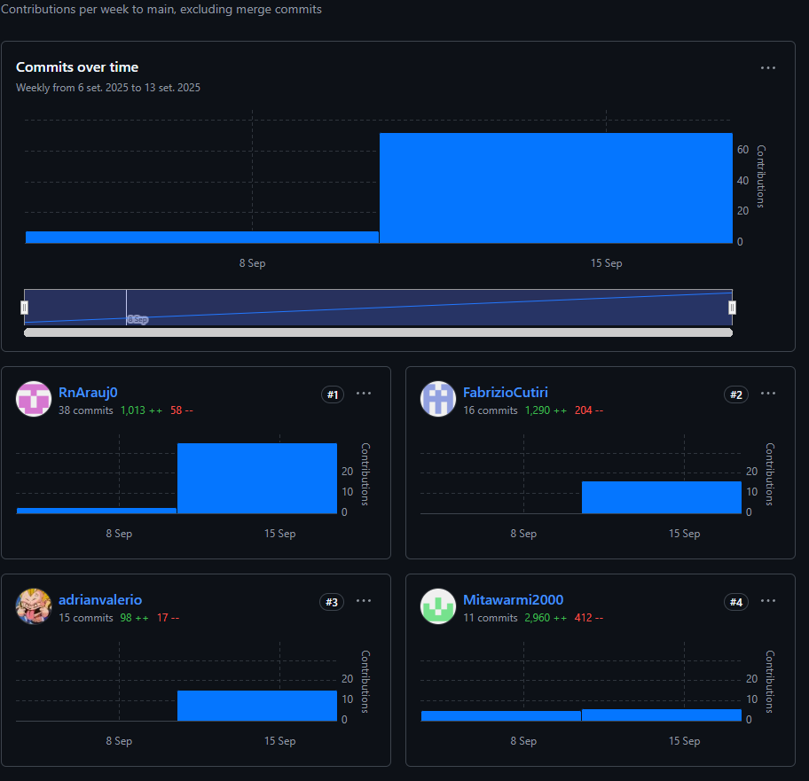
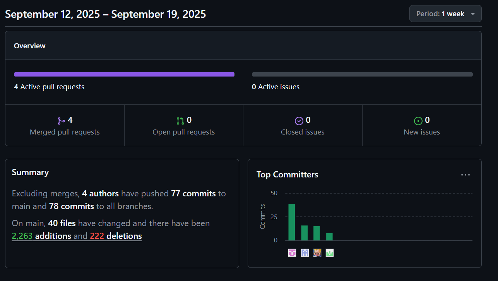

# 
COURSE PROJECT

    <strong>Universidad Peruana de Ciencias Aplicadas</strong> 
    </img> 
    <strong>Ingeniería de Software</strong> 
    <strong>Aplicaciones para Dispositivos Móviles</strong> 
    <strong>Profesor: Jorge Luis Mayta Guillermo </strong> 
     INFORME TRABAJO FINAL

#### Startup: **Frock**
#### Product: **Chapa tu ruta**

### 
Team  Members:

| Member                           | Code       |
|----------------------------------|------------|
| Yasser Rentería Palacios         | U202214130 |
| Adrian Valerio García            | U202210334 |
| Fabrizio Alexander Cutiri Agüero | U201914181 |
| Renzo José Araujo Ingunza        | U202113612 |

  Septiembre 2025 

  

# Registro de Versiones del Informe  

| Version | Fecha      | Autor               | Descripción de Modificación                                                                                   |
|---------|------------|---------------------|---------------------------------------------------------------------------------------------------------------|
| 0.1     | 05/09/2025 | All                 | Desarrollo Capítulo (1)                                                                                       |
| 1.0     | 19/09/2025 | All                 | Desarrollo de Strategic Level Domain-Driven Design    Desarrollo de Tactical-Level Domain-Driven Design |

# Project Report Collaboration Insights  
Analiza cómo la colaboración y la gestión de tareas influyeron en los resultados del proyecto, destacando fortalezas y áreas de mejora para optimizar futuras estrategias.

**Link del Repositorio del Informe:** https://github.com/Mitawarmi2000/GMoviles

## Reporte de Colaboración Entrega TB1

En esta entrega se redactó el informe hasta la sección de Tactical Level Domain Driven Design. Siendo las tareas más releventes el desarrollo del Event Storming, el diseño de los diagramas de Domaing Message Flow Modelling, Bounded Context Canvasses y Context Mapping.
Además, se definio el diagrama de Componentes, Diagrama de Clases y Diagrama de bases de datos de cada Bounded context identificado mediante el Event Storming.

Para evidenciar nuestros avances y que todos los miembros del equipo participaron en la redacción del informe, se presenta a continuación, las capturas obtenidas de los analíticos de colaboración en el repositorio de GitHub del Informe:

**Contributors**

En el analítico de Contributors, se evidencia las contribuciones que hizo cada integrante del equipo para la redacción del informe durante el periodo de esta primera entrega. Se puede observar la cantidad de commits que realizó cada integrante, asi como la cantidad de addiciones y eliminaciones que se realizaron en el informe.

**Pulse**

En el analítico de Pulse se evidencian los commits que realizó cada integrante del equipo durante el periodo definido para esta primera entrega

# Student Outcome 

El curso contribuye al cumplimiento del **Student Outcome ABET:ABET – EAC - Student Outcome 7** 

**Criterio:** La capacidad de adquirir y aplicar nuevos conocimientos según sea necesario, utilizando estrategias de aprendizaje apropiadas.

| Criterio Específico                                                                                                                     | Acciones Realizadas                                                                                                                                                                                                                                                                                                                                                                                              | Conclusiones |
|-----------------------------------------------------------------------------------------------------------------------------------------|------------------------------------------------------------------------------------------------------------------------------------------------------------------------------------------------------------------------------------------------------------------------------------------------------------------------------------------------------------------------------------------------------------------|--------------|
| Actualiza conceptos y conocimientos necesarios para su desarrollo profesional y en especial para su proyecto en soluciones de software. | **TB1:** **Yasser Rentería Palacios:**   **Adrian Valerio García:**   **Fabrizio Alexander Cutiri Agüero:**  Al realizar los Message Flow Mapping y Bounded Context Canvases, reforce los conocimientos que habia adquirido en cursos pasados y ahora puedo comprender con más detalle como es que se forman los bounded context de un producto software.  **Renzo José Araujo Ingunza:**   |              |
| Reconoce la necesidad del aprendizaje permanente para el desempeño profesional y el desarrollo de proyectos en soluciones de software.  | **TB1:** **Yasser Rentería Palacios:**  **Adrian Valerio García:**  **Fabrizio Alexander Cutiri Agüero:** Tuve que investigar sobre como se realizaba el Context Mapping y algunos detalles respecto al Bounded Context Canvasses y Message Flow Modelling, lo cual me mostró lo importante que es el aprendizaje permanente para mi desempeño profesional   **Renzo José Araujo Ingunza:**    |              |

## Table of Contents

- [Registro de Versiones del Informe](#registro-de-versiones-del-informe)
- [Project Report Collaboration Insights](#project-report-collaboration-insights)
- [Student Outcome](#student-outcome)

- [Capítulo I: Introducción](Chapter-I.md#capítulo-i-introducción)
  - [1.1. Startup Profile](Chapter-I.md#11-startup-profile)
    - [1.1.1. Descripción de la Startup](Chapter-I.md#111-descripción-de-la-startup)
    - [1.1.2. Perfiles de integrantes del equipo](Chapter-I.md#112-perfiles-de-integrantes-del-equipo)
  - [1.2. Solution Profile](Chapter-I.md#12-solution-profile)
    - [1.2.1. Antecedentes y problemática](Chapter-I.md#121-antecedentes-y-problemática)
    - [1.2.2. Lean UX Process](Chapter-I.md#122-lean-ux-process)
      - [1.2.2.1. Lean UX Problem Statements](Chapter-I.md#1221-lean-ux-problem-statements)
      - [1.2.2.2. Lean UX Assumptions](Chapter-I.md#1222-lean-ux-assumptions)
      - [1.2.2.3. Lean UX Hypothesis Statements](Chapter-I.md#1223-lean-ux-hypothesis-statements)
      - [1.2.2.4. Lean UX Canvas](Chapter-I.md#1224-lean-ux-canvas)
  - [1.3. Segmentos objetivo](Chapter-I.md#13-segmentos-objetivo)

- [Capítulo II: Requirements Elicitation & Analysis](Chapter-II.md#capítulo-ii-requirements-elicitation-analysis)
  - [2.1. Competidores](Chapter-II.md#21-competidores)
    - [2.1.1. Análisis competitivo](Chapter-II.md#211-análisis-competitivo)
    - [2.1.2. Estrategias y tácticas frente a competidores](Chapter-II.md#212-estrategias-y-tácticas-frente-a-competidores)
  - [2.2. Entrevistas](Chapter-II.md#22-entrevistas)
    - [2.2.1. Diseño de entrevistas](Chapter-II.md#221-diseño-de-entrevistas)
    - [2.2.2. Registro de entrevistas](Chapter-II.md#222-registro-de-entrevistas)
    - [2.2.3. Análisis de entrevistas](Chapter-II.md#223-análisis-de-entrevistas)
  - [2.3. Needfinding](Chapter-II.md#23-needfinding)
    - [2.3.1. User Personas](Chapter-II.md#231-user-personas)
    - [2.3.2. User Task Matrix](Chapter-II.md#232-user-task-matrix)
    - [2.3.3. User Journey Mapping](Chapter-II.md#233-user-journey-mapping)
    - [2.3.4. Empathy Mapping](Chapter-II.md#234-empathy-mapping)
    - [2.3.5. Ubiquitous Language](Chapter-II.md#24-ubiquitous-language)
  - [2.4. Requirements specification]()
    - [2.4.1. User Stories]()
    - [2.4.2. Impact Mapping]()
    - [2.4.3. Product Backlog]()
  - [2.5. Strategic-Level Domain-Driven Design]()
    - [2.5.1. EventStorming]()
        - [2.5.1.1. Candidate Context Discovery]()
        - [2.5.1.2. Domain Message Flows Modeling]()
        - [2.5.1.3. Bounded Context Canvases]()
    - [2.5.2. Context Mapping]()
    - [2.5.3. Software Architecture]()
        - [2.5.3.1. Software Architecture Context Level Diagrams]()
        - [2.5.3.2. Software Architecture Container Level Diagrams]()
        - [2.5.3.3. Software Architecture Deployment Diagrams]()
  - [2.6. Tactical-Level Domain-Driven Design]()
    - [2.6.1. Bounded Context: IAM]()
        - [2.6.1.1. Domain Layer]()
        - [2.6.1.2. Interface Layer]()
        - [2.6.1.3. Application Layer]()
        - [2.6.1.4 Infrastructure Layer]()
        - [2.6.1.5. Bounded Context Software Architecture Component Level Diagrams]()
        - [2.6.1.6. Bounded Context Software Architecture Code Level Diagrams]()
            - [2.6.1.6.1. Bounded Context Domain Layer Class Diagrams]()
            - [2.6.1.6.2. Bounded Context Database Design Diagram]()
    - [2.6.2. Bounded Context: Profile]()
        - [2.6.2.1. Domain Layer]()
        - [2.6.2.2. Interface Layer]()
        - [2.6.2.3. Application Layer]()
        - [2.6.2.4 Infrastructure Layer]()
        - [2.6.2.5. Bounded Context Software Architecture Component Level Diagrams]()
        - [2.6.2.6. Bounded Context Software Architecture Code Level Diagrams]()
            - [2.6.2.6.1. Bounded Context Domain Layer Class Diagrams]()
            - [2.6.2.6.2. Bounded Context Database Design Diagram]()
    - [2.6.3. Bounded Context: Stops]()
        - [2.6.3.1. Domain Layer]()
        - [2.6.3.2. Interface Layer]()
        - [2.6.3.3. Application Layer]()
        - [2.6.3.4 Infrastructure Layer]()
        - [2.6.3.5. Bounded Context Software Architecture Component Level Diagrams]()
        - [2.6.3.6. Bounded Context Software Architecture Code Level Diagrams]()
            - [2.6.3.6.1. Bounded Context Domain Layer Class Diagrams]()
            - [2.6.3.6.2. Bounded Context Database Design Diagram]()
    - [2.6.4. Bounded Context: Routes]()
        - [2.6.4.1. Domain Layer]()
        - [2.6.4.2. Interface Layer]()
        - [2.6.4.3. Application Layer]()
        - [2.6.4.4 Infrastructure Layer]()
        - [2.6.4.5. Bounded Context Software Architecture Component Level Diagrams]()
        - [2.6.4.6. Bounded Context Software Architecture Code Level Diagrams]()
            - [2.6.4.6.1. Bounded Context Domain Layer Class Diagrams]()
            - [2.6.4.6.2. Bounded Context Database Design Diagram]()