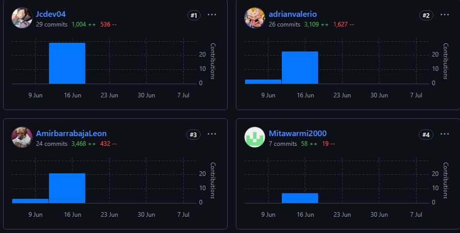

# 
COURSE PROJECT

    <strong>Universidad Peruana de Ciencias Aplicadas</strong> 
    </img> 
    <strong>Ingeniería de Software</strong> 
    <strong>Aplicaciones Web</strong> 
    <strong>Profesor: Oscar Ivan Villafuerte Bazan </strong> 
     INFORME TRABAJO FINAL

#### Startup: **Frock**
#### Product: **Chapa tu ruta**

### 
Team  Members:

| Member                        | Code       |
|-------------------------------|------------|
| Yasser Rentería Palacios      | U202214130 |
| Adrian Valerio García         | U202210334 |
| Amir Gabriel Castro Sanchez   | U202310680 |
| Jesús Iván Castillo Vidal     | U202322952 |

  ABRIL 2025 

  

# Registro de Versiones del Informe  

| Version | Fecha      | Autor                           | Descripción de Modificación                                                    |
|---------|------------|---------------------------------|--------------------------------------------------------------------------------|
| 0.0.1   | 10/04/2025 | All | Desarrollo Capítulo (1)                               |
| 0.0.2   | 22/04/2025 | All | Desarrollo Capítulo (2)                            |
| 0.0.3   | 22/04/2025 | Adrián, Yasser, Amir | Desarrollo Capítulo (3)                       |
| 0.0.4   | 25/04/2025| Adrían, Amir, Jesús    | Desarrollo Capítulo (4)  |
| 0.0.5   | 26/04/2025 | Yasser, Amir              | Desarrollo Capítulo (5)                             | 

# Project Report Collaboration Insights  
Analiza cómo la colaboración y la gestión de tareas influyeron en los resultados del proyecto, destacando fortalezas y áreas de mejora para optimizar futuras estrategias.

Reporte: https://github.com/Frock-WEB/Report

Organización: https://github.com/orgs/Frock-WEB/repositories

Landing Page: https://frock-web.github.io/LandingFrock/

FrontEnd: https://github.com/Frock-WEB/Frock-FrontEnd

Backend: https://github.com/Frock-WEB/Frock-back-end

TF: El equipo completo participó activamente en la consolidación final del sistema, conectando de forma integral el frontend con el backend. Las tareas se distribuyeron equitativamente, permitiendo avanzar en paralelo en la implementación de los endpoints restantes y la mejora visual del frontend. Esta colaboración coordinada fue clave para asegurar la funcionalidad y cohesión del producto final.

Cada integrante aportó al desarrollo realizando commits constantes, manteniendo la documentación en formato Markdown organizada y actualizada en el repositorio.

Se implementaron todos los endpoints necesarios para el correcto funcionamiento del sistema, validando su conexión con los componentes del frontend.

Se realizaron ajustes visuales y estructurales en el frontend para mejorar la experiencia del usuario y reflejar los cambios del backend.

Se programaron reuniones periódicas para coordinar el despliegue y revisar los avances finales del proyecto, garantizando una entrega de calidad al cierre del Sprint 4.

# Student Outcome 

El curso contribuye al cumplimiento del **Student Outcome ABET:ABET – EAC - Student Outcome 5** 

**Criterio:** La capacidad de funcionar efectivamente en un equipo cuyos miembros juntos proporcionan liderazgo, crean un entorno de colaboración e inclusivo, establecen objetivos, planifican tareas y cumplen objetivos.

| Criterio Específico | Acciones Realizadas | Conclusiones |
|---------------------|---------------------|--------------|
| Trabaja en equipo para proporcionar liderazgo en forma conjunta | **TB2:** **Yasser Rentería Palacios:** Coordinó las reuniones del equipo, lideró la implementación del frontend con Vue y estableció los estándares de desarrollo para la interfaz de usuario. **Adrian Valerio García:** Propuso soluciones técnicas para la arquitectura del sistema, lideró el diseño de la base de datos y coordinó la integración entre frontend y backend. **Amir Gabriel Castro Sanchez:** Lideró la implementación del backend con .NET Core, estableció la arquitectura de APIs RESTful y supervisó la implementación de los patrones de diseño. **Jesús Iván Castillo Vidal:** Supervisó el progreso técnico del proyecto, coordinó las pruebas de integración y lideró las revisiones de código para mantener la calidad del desarrollo.  **TF:** **Yasser Rentería Palacios:** Finalizó la integración del frontend con todos los endpoints del backend, refinó componentes visuales en Vue y lideró las pruebas de usabilidad del sistema. **Adrian Valerio García:** Consolidó la lógica de integración del sistema completo, resolviendo conflictos entre capas y lideró el despliegue del backend en ambiente productivo. **Amir Gabriel Castro Sanchez:** Completó todos los endpoints REST, garantizó la validación de datos y lideró el aseguramiento de calidad del backend. **Jesús Iván Castillo Vidal:** Coordinó los últimos ajustes técnicos del sistema, gestionó las pruebas de extremo a extremo y consolidó la documentación técnica final. | Se logró establecer un liderazgo técnico compartido entre los miembros del equipo, donde cada integrante lideró aspectos específicos del desarrollo (frontend, backend, base de datos, testing), facilitando la coordinación de tareas técnicas complejas. |
| Crea un entorno colaborativo e inclusivo, establece metas, planifica tareas y cumple objetivos | **TB2:** **Yasser Rentería Palacios:** Implementó las funcionalidades del frontend de manera colaborativa, estableció metas de desarrollo por sprints y promovió la revisión conjunta del código Vue. **Adrian Valerio García:** Fomentó un ambiente inclusivo en las decisiones de arquitectura, planificó la estructura de la base de datos considerando las necesidades de todos los módulos y estableció objetivos de rendimiento. **Amir Gabriel Castro Sanchez:** Planificó y desarrolló los endpoints del backend de forma modular, estableció metas de desarrollo de APIs y ajustó tareas para cumplir con los requerimientos funcionales. **Jesús Iván Castillo Vidal:** Motivó al equipo durante el desarrollo, estableció objetivos de calidad de código, planificó las pruebas de integración y aseguró el cumplimiento de los plazos de entrega técnica.  **TF:** **Yasser Rentería Palacios:** Promovió sesiones de revisión colaborativa del código, organizó tareas de ajuste visual y gestionó el cierre de tareas del frontend en el tablero de trabajo. **Adrian Valerio García:** Coordinó la planificación final de tareas técnicas, ajustó las metas para cumplir con el cierre del proyecto e impulsó la colaboración continua entre todos los miembros. **Amir Gabriel Castro Sanchez:** Documentó todos los endpoints en Swagger, adaptó tareas backend según retroalimentación del equipo y mantuvo sincronización con el frontend. **Jesús Iván Castillo Vidal:** Consolidó el cronograma de cierre, propuso soluciones a problemas detectados en pruebas y promovió una cultura de mejora continua hasta el final del proyecto. | Se creó un ambiente de colaboración técnica efectiva e inclusiva, donde cada miembro contribuyó desde su expertise (desarrollo frontend, backend, base de datos, testing), cumpliendo las metas técnicas planteadas para cada sprint y logrando la integración exitosa de todos los componentes del sistema. |

## Table of Contents

- [Registro de Versiones del Informe](#registro-de-versiones-del-informe)
- [Project Report Collaboration Insights](#project-report-collaboration-insights)
- [Student Outcome](#student-outcome)

- [Capítulo I: Introducción](Chapter-I.md#capítulo-i-introducción)
  - [1.1. Startup Profile](Chapter-I.md#11-startup-profile)
    - [1.1.1. Descripción de la Startup](Chapter-I.md#111-descripción-de-la-startup)
    - [1.1.2. Perfiles de integrantes del equipo](Chapter-I.md#112-perfiles-de-integrantes-del-equipo)
  - [1.2. Solution Profile](Chapter-I.md#12-solution-profile)
    - [1.2.1. Antecedentes y problemática](Chapter-I.md#121-antecedentes-y-problemática)
    - [1.2.2. Lean UX Process](Chapter-I.md#122-lean-ux-process)
      - [1.2.2.1. Lean UX Problem Statements](Chapter-I.md#1221-lean-ux-problem-statements)
      - [1.2.2.2. Lean UX Assumptions](Chapter-I.md#1222-lean-ux-assumptions)
      - [1.2.2.3. Lean UX Hypothesis Statements](Chapter-I.md#1223-lean-ux-hypothesis-statements)
      - [1.2.2.4. Lean UX Canvas](Chapter-I.md#1224-lean-ux-canvas)
  - [1.3. Segmentos objetivo](Chapter-I.md#13-segmentos-objetivo)

- [Capítulo II: Requirements Elicitation & Analysis](Chapter-II.md#capítulo-ii-requirements-elicitation-analysis)
  - [2.1. Competidores](Chapter-II.md#21-competidores)
    - [2.1.1. Análisis competitivo](Chapter-II.md#211-análisis-competitivo)
    - [2.1.2. Estrategias y tácticas frente a competidores](Chapter-II.md#212-estrategias-y-tácticas-frente-a-competidores)
  - [2.2. Entrevistas](Chapter-II.md#22-entrevistas)
    - [2.2.1. Diseño de entrevistas](Chapter-II.md#221-diseño-de-entrevistas)
    - [2.2.2. Registro de entrevistas](Chapter-II.md#222-registro-de-entrevistas)
    - [2.2.3. Análisis de entrevistas](Chapter-II.md#223-análisis-de-entrevistas)
  - [2.3. Needfinding](Chapter-II.md#23-needfinding)
    - [2.3.1. User Personas](Chapter-II.md#231-user-personas)
    - [2.3.2. User Task Matrix](Chapter-II.md#232-user-task-matrix)
    - [2.3.3. User Journey Mapping](Chapter-II.md#233-user-journey-mapping)
    - [2.3.4. Empathy Mapping](Chapter-II.md#234-empathy-mapping)
    - [2.3.5. As-is Scenario Mapping](Chapter-II.md#235-as-is-scenario-mapping)
  - [2.4. Ubiquitous Language](Chapter-II.md#24-ubiquitous-language)

- [Capítulo III: Requirements Specification](Chapter-III.md#capítulo-iii-requirements-specification)
  - [3.1. To-Be Scenario Mapping](Chapter-III.md#31-to-be-scenario-mapping)
  - [3.2. User Stories](Chapter-III.md#32-user-stories)
  - [3.3. Impact Mapping](Chapter-III.md#33-impact-mapping)
  - [3.4. Product Backlog](Chapter-III.md#34-product-backlog)

- [Capítulo IV: Product Design](Chapter-IV.md#capítulo-iv-product-design)
  - [4.1. Style Guidelines](Chapter-IV.md#41-style-guidelines)
    - [4.1.1. General Style Guidelines](Chapter-IV.md#411-general-style-guidelines)
    - [4.1.2. Web Style Guidelines](Chapter-IV.md#412-web-style-guidelines)
  - [4.2. Information Architecture](Chapter-IV.md#42-information-architecture)
    - [4.2.1. Organization Systems](Chapter-IV.md#421-organization-systems)
    - [4.2.2. Labeling Systems](Chapter-IV.md#422-labeling-systems)
    - [4.2.3. SEO Tags and Meta Tags](Chapter-IV.md#423-seo-tags-and-meta-tags)
    - [4.2.4. Searching Systems](Chapter-IV.md#424-searching-systems)
    - [4.2.5. Navigation Systems](Chapter-IV.md#425-navigation-systems)
  - [4.3. Landing Page UI Design](Chapter-IV.md#43-landing-page-ui-design)
    - [4.3.1. Landing Page Wireframe](Chapter-IV.md#431-landing-page-wireframe)
    - [4.3.2. Landing Page Mock-up](Chapter-IV.md#432-landing-page-mock-up)
  - [4.4. Web Applications UX/UI Design](Chapter-IV.md#44-web-applications-uxui-design)
    - [4.4.1. Web Applications Wireframes](Chapter-IV.md#441-web-applications-wireframes)
    -  [4.1.2. Web Style Guidelines](/Chapter-IV.md#412-web-style-guidelines)
- [4.2. Information Architecture](/Chapter-IV.md#42-information-architecture)
    - [4.2.1. Organization Systems](/Chapter-IV.md#421-organization-systems)
    - [4.2.2. Labeling Systems](/Chapter-IV.md#422-labeling-systems)
    - [4.2.3. SEO Tags and Meta Tags](/Chapter-IV.md#423-seo-tags-and-meta-tags)
    - [4.2.4. Searching Systems](/Chapter-IV.md#424-searching-systems)
    - [4.2.5. Navigation Systems](/Chapter-IV.md#425-navigation-systems)
- [4.3. Landing Page UI Design](/Chapter-IV.md#43-landing-page-ui-design)
    - [4.3.1. Landing Page Wireframe](/Chapter-IV.md#431-landing-page-wireframe)
    - [4.3.2. Landing Page Mock-up](/Chapter-IV.md#432-landing-page-mock-up)
- [4.4. Web Applications UX/UI Design](/Chapter-IV.md#44-web-applications-uxui-design)
    - [4.4.1. Web Applications Wireframes](/Chapter-IV.md#441-web-applications-wireframes)
    - [4.4.2. Web Applications Wireflow Diagrams](/Chapter-IV.md#442-web-applications-mock-ups)
    - [4.4.3. Web Applications Mock-ups](/Chapter-IV.md#443-web-applications-user-flow-diagrams)
    - [4.4.4. Web Applications User Flow Diagrams](/Chapter-IV.md)
- [4.5. Web Applications Prototyping](/Chapter-IV.md#45-web-applications-prototyping)
- [4.6. Domain-Driven Software Architecture](/Chapter-IV.md#46-domain-driven-software-architecture)
    - [4.6.1. Software Architecture Context Diagram](/Chapter-IV.md#461-software-architecture-context-diagram)
    - [4.6.2. Software Architecture Container Diagrams](/Chapter-IV.md#462-software-architecture-container-diagrams)
    - [4.6.3. Software Architecture Components Diagrams](/Chapter-IV.md#463-software-architecture-components-diagrams)
- [4.7. Software Object-Oriented Design](/Chapter-IV.md#47-software-object-oriented-design)
    - [4.7.1. Class Diagrams](/Chapter-IV.md#471-class-diagrams)
    - [4.7.2. Class Dictionary](/Chapter-IV.md#472-class-dictionary)
- [4.8. Database Design](/Chapter-IV.md#48-database-design)
    - [4.8.1. Database Diagram](/Chapter-IV.md#481-database-diagram)
### [Capítulo V: Product Implementation, Validation & Deployment](/Chapter-V.md)
- [5.1. Software Configuration Management](/Chapter-V.md#51-software-configuration-management)
    - [5.1.1. Software Development Environment Configuration](/Chapter-V.md#511-software-development-environment-configuration)
    - [5.1.2. Source Code Management](/Chapter-V.md#512-source-code-management)
    - [5.1.3. Source Code Style Guide & Conventions](/Chapter-V.md#513-source-code-style-guide--conventions)
    - [5.1.4. Software Deployment Configuration](/Chapter-V.md#514-software-deployment-configuration)
- [5.2. Landing Page, Services & Applications Implementation](/Chapter-V.md#52-landing-page-services--applications-implementation)
    - [5.2.1. Sprint 1](/Chapter-V.md#521-sprint-1)
        - [5.2.1.1. Sprint Planning 1](/Chapter-V.md#5211-sprint-planning-1)
        - [5.2.1.2. Sprint Backlog 1](/Chapter-V.md#5212-sprint-backlog-1)
        - [5.2.1.3. Development Evidence for Sprint Review](/Chapter-V.md#5213-development-evidence-for-sprint-review)
        - [5.2.1.4. Testing Suite Evidence for Sprint Review](/Chapter-V.md#5214-testing-suite-evidence-for-sprint-review)
        - [5.2.1.5. Execution Evidence for Sprint Review](/Chapter-V.md#5215-execution-evidence-for-sprint-review)
        - [5.2.1.6. Services Documentation Evidence for Sprint Review](/Chapter-V.md#5216-services-documentation-evidence-for-sprint-review)
        - [5.2.1.7. Software Deployment Evidence for Sprint Review](/Chapter-V.md#5217-software-deployment-evidence-for-sprint-review)
        - [5.2.1.8. Team Collaboration Insights during Sprint](/Chapter-V.md#5218-team-collaboration-insights-during-sprint)
    - [5.2.2. Sprint 2](./Chapter-V.md#522-sprint-2)
        - [5.2.2.1. Sprint Planning 2](./Chapter-V.md#5221-sprint-planning-2)
        - [5.2.2.2. Sprint Backlog 2](./Chapter-V.md#5222-sprint-backlog-2)
        - [5.2.2.3. Development Evidence for Sprint Review](./Chapter-V.md#5223-development-evidence-for-sprint-2)
        - [5.2.2.4. Testing Suite Evidence for Sprint Review](./Chapter-V.md#5224-testing-suite-evidence-for-sprint-2)
        - [5.2.2.5. Execution Evidence for Sprint Review](./Chapter-V.md#5225-execution-evidence-for-sprint-2)
        - [5.2.2.6. Services Documentation Evidence for Sprint Review](./Chapter-V.md#5226-services-documentation-evidence-for-sprint-2)
        - [5.2.2.7. Software Deployment Evidence for Sprint Review](./Chapter-V.md#5227-software-deployment-evidence-for-sprint-2)
        - [5.2.2.8. Team Collaboration Insights during Sprint](./Chapter-V.md#5228-team-collaboration-insights-during-sprint)
     - [5.3.3. Sprint 3](./Chapter-V.md#533-sprint-3)
        - [5.3.3.1. Sprint Planning 3](./Chapter-V.md#5331-sprint-planning-3)
        - [5.3.3.2. Sprint Backlog 3](./Chapter-V.md#5332-sprint-backlog-3)
        - [5.3.3.3. Development Evidence for Sprint Review](./Chapter-V.md#5333-development-evidence-for-sprint-3)
        - [5.3.3.4. Testing Suite Evidence for Sprint Review](./Chapter-V.md#5334-testing-suite-evidence-for-sprint-3)
        - [5.3.3.5. Execution Evidence for Sprint Review](./Chapter-V.md#5335-execution-evidence-for-sprint-3)
        - [5.3.3.6. Services Documentation Evidence for Sprint Review](./Chapter-V.md#5336-services-documentation-evidence-for-sprint-3)
        - [5.3.3.7. Software Deployment Evidence for Sprint Review](./Chapter-V.md#5337-software-deployment-evidence-for-sprint-3)
        - [5.3.3.8. Team Collaboration Insights during Sprint](./Chapter-V.md#5338-team-collaboration-insights-during-sprint)
     - [5.2.4. Sprint 4](./Chapter-V.md#524-sprint-4)
        - [5.2.4.1. Sprint Planning 4](./Chapter-V.md#5241-sprint-planning-4)
        - [5.2.4.2. Sprint Backlog 4](./Chapter-V.md#5242-sprint-backlog-4)
        - [5.2.4.3. Development Evidence for Sprint Review](./Chapter-V.md#5243-development-evidence-for-sprint-4)
        - [5.2.4.4. Testing Suite Evidence for Sprint Review](./Chapter-V.md#5244-testing-suite-evidence-for-sprint-4)
        - [5.2.4.5. Execution Evidence for Sprint Review](./Chapter-V.md#5245-execution-evidence-for-sprint-4)
        - [5.2.4.6. Services Documentation Evidence for Sprint Review](./Chapter-V.md#5246-services-documentation-evidence-for-sprint-4)
        - [5.2.4.7. Software Deployment Evidence for Sprint Review](./Chapter-V.md#5247-software-deployment-evidence-for-sprint-4)
        - [5.2.4.8. Team Collaboration Insights during Sprint](./Chapter-V.md#5248-team-collaboration-insights-during-sprint)
      

